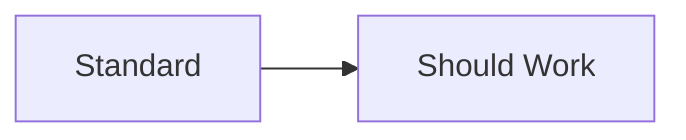
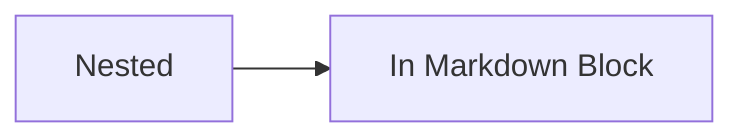
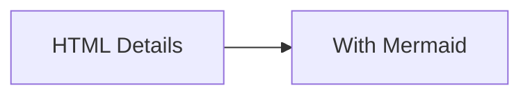
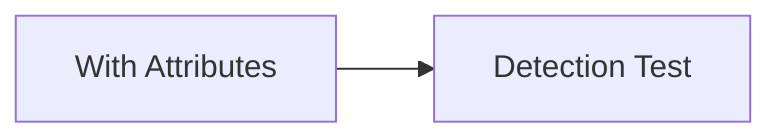

# GitHub Mermaid Detection Experiment

Testing how GitHub detects and renders Mermaid diagrams in different scenarios.

## Test 1: Standard Mermaid Block (Expected: ✅ WORKS)



## Test 2: No Language Identifier (Expected: ❓ UNKNOWN)

```
graph LR  
    A[No Identifier] --> B[Will GitHub Detect?]
```

## Test 3: Plain Text Block (Expected: ❌ FAILS)

```text
graph LR
    A[Text Block] --> B[Should Not Render]
```

## Test 4: Code Block with 'diagram' (Expected: ❓ UNKNOWN)

```diagram
graph LR
    A[Diagram Tag] --> B[Detection Test]
```

## Test 5: Nested in Markdown Block (Expected: ❌ FAILS)

````markdown

````

## Test 6: Raw Mermaid (No Code Block) (Expected: ❌ FAILS)

graph LR
    A[Raw Mermaid] --> B[No Wrapper]

## Test 7: HTML Details with Mermaid (Expected: ❓ UNKNOWN)

<details>
<summary>Hidden Diagram</summary>



</details>

## Test 8: Mermaid in Quote Block (Expected: ❌ FAILS)

> ```mermaid
> graph LR
>     A[Quote Block] --> B[Mermaid Test]
> ```

## Test 9: Mermaid with Extra Attributes (Expected: ❓ UNKNOWN)



## Test 10: Auto-Detection Based on Content (Expected: ❓ UNKNOWN)

```
flowchart TD
    A[Auto Detection] --> B{Does GitHub}
    B -->|Yes| C[Smart Detection]
    B -->|No| D[Manual Tags Only]
```

---

**Hypothesis**: GitHub requires explicit `mermaid` language identifier and cannot auto-detect Mermaid syntax without it.
