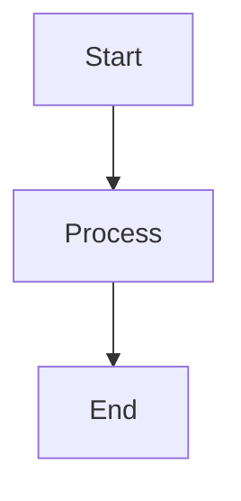
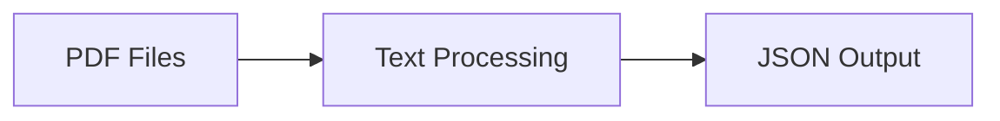
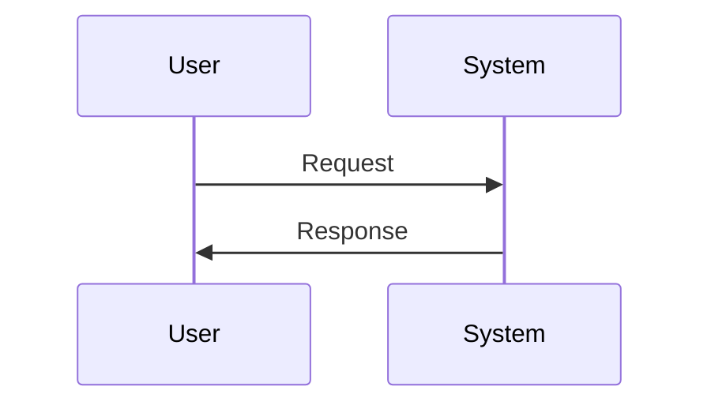
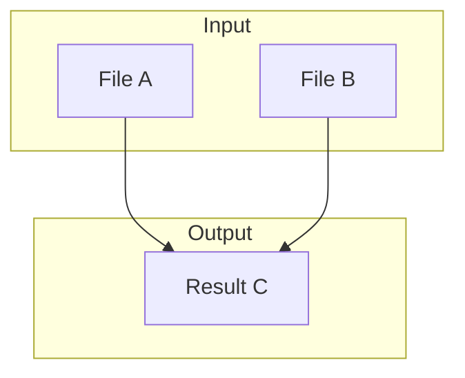
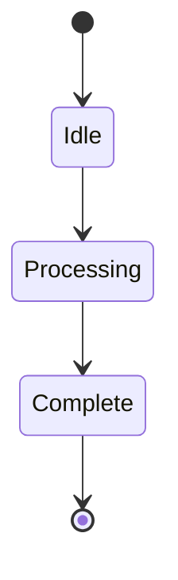
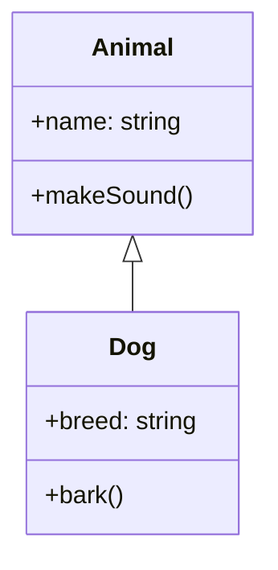
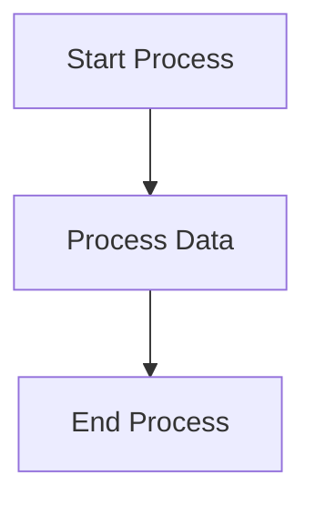
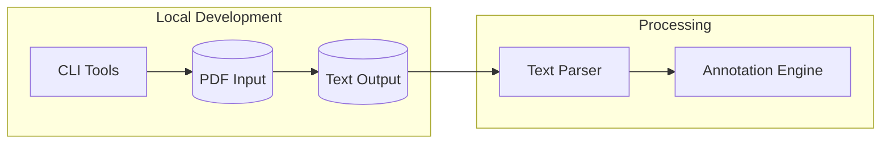

# Mermaid Test File

Testing different Mermaid syntax variations to see what renders on GitHub.

## Test 1: Basic Flowchart (No Emoji)

## Test 2: Flowchart with Simple Text Labels

## Test 3: Sequence Diagram

## Test 4: Graph with Subgraphs (Simple)

## Test 5: State Diagram

## Test 6: Class Diagram

## Test 7: With Quotes in Labels

## Test 8: Complex Flowchart (Our Architecture Style)

---

**Test Results**: Check which of these render properly on GitHub and which show "Error rendering embedded code".
