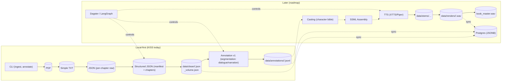

# Audio Book Maker – Deterministic Ingestion → Rich Annotation → Multi‑Voice Rendering

> Multi‑agent, local‑first audiobook production pipeline. Current focus: rock‑solid deterministic ingestion + prototype annotation flow (LangFlow) as a stepping stone to CrewAI then LangChain/LangGraph orchestration.


> KISS branch scope
>
> This branch is documentation‑first. Keep it simple: only set up a local Python `.venv` and minimal dev tools. Sections below that mention Docker, Postgres, LangGraph runtime, or API endpoints are roadmap/design notes, not required to get started on this branch. See `docs/KISS.md`.

## KISS Quickstart (this branch)

This branch is documentation-first. Keep it simple:

- Use Python 3.11 with a local `.venv`.
- Install only minimal dev tooling; no app/runtime deps yet.

Quick setup

```bash
python3.11 -m venv .venv || python3 -m venv .venv
source .venv/bin/activate
pip install -U pip
pip install -r requirements-dev.txt
```

Or with Make:

```bash
make dev_setup
source .venv/bin/activate
```

See `docs/KISS.md` for the policy and guardrails.

## High-Level Architecture

The KISS slice today is a local-first CLI that produces deterministic file artifacts. The diagram below shows today and the forward path.

Source: `docs/diagrams/high_level_architecture.mmd`



See more in `docs/ARCHITECTURE.md`.

Structured JSON schema: `docs/STRUCTURED_JSON_SCHEMA.md`.

## Status Snapshot (2025-08-14)

| Layer | State | Notes |
|-------|-------|-------|
| Ingestion | Stable + deterministic | Structured TOC only; per‑chapter JSON + volume manifest; hash regression tests. |
| Annotation (LangFlow prototype) | Loader → Segmenter → Writer | Produces dialogue/narration utterances JSONL. |
| LangGraph Graph | Minimal sample | Will be replaced by chapter annotation / casting graph. |
| Casting | Planned | Character bible + voice mapping next phase. |
| TTS Rendering | Prototype stubs | Real XTTS/Piper integration upcoming. |
| Dagster Orchestration | Partial | Ingestion + preliminary rendering assets. |
| Roadmap Docs | Added | `docs/MULTI_AGENT_ROADMAP.md` & updated `docs/CONTEXT.md`. |

## Multi‑Agent Migration Path

1. LangFlow (rapid prototyping / visual wiring of segmentation + writer) – CURRENT
2. CrewAI (role / task abstraction for speaker attribution & QA agents)
3. LangChain + LangGraph (deterministic state machine orchestration, resumability, devtools)

See `docs/MULTI_AGENT_ROADMAP.md` for detailed phase goals, exit criteria, and risk controls.

## Getting Started (Development)

<!--
Setup instruction auto-generated by `langgraph template lock`. DO NOT EDIT MANUALLY.
-->

<!--
End setup instructions
-->

1. Install dependencies, along with the [LangGraph CLI](https://langchain-ai.github.io/langgraph/concepts/langgraph_cli/), which will be used to run the server.

  Note: On this KISS branch, you only need the minimal dev tools above. The steps below are future‑leaning; follow them later when the executable graph/API land.

```bash
git clone <repo>
cd agent-audiobook-maker
make install_dev  # creates .venv + installs editable dev deps
source .venv/bin/activate
pip install "langgraph-cli[inmem]"
```

1. (Optional) Customize the code and project as needed. Create a `.env` file if you need to use secrets.

```bash
cp .env.example .env
```

If you want to enable LangSmith tracing, add your LangSmith API key to the `.env` file.

```text
# .env
LANGSMITH_API_KEY=lsv2...
```

1. Start Postgres (dev) and API + Dagster (optional).

  Option A: docker-compose (recommended)

  ```bash
  docker compose up -d db
  ```

  Verify DB:

  ```bash
  docker compose logs db | head
  ```

  Optionally start API:

  ```bash
  docker compose up -d api
  ```

1. Run tests (uses Postgres if running, falls back to sqlite if configured otherwise):

  ```bash
  pytest -q
  ```

1. Ingest PDFs (structured TOC only) via API:

  Single stored PDF (already placed under `data/books/<book_id>` or `data/books/<book_id>/source_pdfs`):

  ```bash
  curl -X POST -F book_id=<book_id> -F pdf_name=<file.pdf> -F verbose=1 http://localhost:8000/ingest
  ```

  Batch (all PDFs for the book):

  ```bash
  curl -X POST -F book_id=<book_id> http://localhost:8000/ingest
  ```

  Background job:

  ```bash
  curl -X POST -F book_id=<book_id> http://localhost:8000/ingest_job
  ```

  Artifacts (structured-only):

- `data/clean/<book_id>/<chapter_id>.json` (per chapter)
- `data/clean/<book_id>/<pdf_stem>_volume.json` (volume metadata + chapter list, schema_version=1.0)
- `data/processed/<book_id>/<pdf_stem>/extracted_full.txt` and `pages.jsonl` (raw extraction provenance)

  Batch ingest response returns a comma‑separated list of volume JSON paths (consider parsing client‑side into an array).

  Note: Previous fallback parsers (advanced/heading/simple) have been removed— ingestion now fails gracefully (0 chapters) if a structured Table of Contents with at least 2 chapters cannot be detected.

```bash
langgraph dev
```

For LangFlow component prototyping (custom components under `lf_components/`):

```bash
scripts/run_langflow.sh
```

Import the sample flow (`examples/langflow/sample_volume_segmentation_flow.json`) and adjust the `book_id` + manifest path fields.

## Prototype LangFlow Components

| Component | Purpose | Key Inputs | Outputs |
|-----------|---------|------------|---------|
| ChapterVolumeLoader | Load volume manifest + selected chapter JSON | data_root, book_id, pdf_stem, chapter_index | chapters_index (list), selected_chapter (dict) |
| SegmentDialogueNarration | Heuristic sentence split + dialogue detection | selected_chapter | utterances_payload (dict) |
| UtteranceJSONLWriter | Persist utterances + header | utterances_payload | paths (dict) |
| PayloadLogger (debug) | Inspect payload structure | any | passthrough |

All outputs are plain Python (dict/list) for interop with future CrewAI / LangGraph nodes.

### Planned Near-Term Components

- SpeakerAttributionAgent (LLM + heuristics)
- EmotionProsodyClassifier (HF local + rules)
- CharacterBibleBuilder
- SSMLAssembler
- TTSRenderer (XTTS v2 + Piper fallback)

## Environment Variables (Ingestion & Annotation)

| Variable | Default | Effect |
|----------|---------|--------|
| INGEST_FORCE_PYMUPDF | unset | Force PyMuPDF backend for extraction when =1. |
| INGEST_HYPHEN_FIX | 1 | Disable hyphen line‑wrap repair when =0. |
| INGEST_SPLIT_CAMEL | unset | Enable optional camelCase splitting when =1. |
| INGEST_TOKEN_WARN_AVG_LEN | 18 | Avg token length warning threshold. |
| INGEST_TOKEN_WARN_LONG_RATIO | 0.02 | Ratio of very long tokens to trigger warning. |
| INGEST_DEBUG_STRUCTURE | unset | Emit structured TOC debug info when set. |
| (Annotation flags via API params) enable_coref | True | Skip coref step when false. |
| enable_emotion | True | Skip emotion classification when false. |
| enable_qa | True | Skip QA flagging when false. |
| max_segments | 200 | Truncate segmentation for fast tests. |

Future config consolidation will migrate these into a typed settings module.

## How to customize

1. **Define configurable parameters**: Modify the `Configuration` class in the `graph.py` file to expose the arguments you want to configure. For example, in a chatbot application you may want to define a dynamic system prompt or LLM to use. For more information on configurations in LangGraph, [see here](https://langchain-ai.github.io/langgraph/concepts/low_level/?h=configuration#configuration).

2. **Extend the graph**: The core logic of the application is defined in [graph.py](./src/agent/graph.py). You can modify this file to add new nodes, edges, or change the flow of information.

## Development Notes

Requires Python 3.11. Virtual env: `.venv` (see Makefile targets).

### Virtual Environment Enforcement

All local dev commands enforce usage of the repository-local virtual environment (`.venv`).

Mechanism:

- `scripts/require_venv.sh` now hard-fails unless `VIRTUAL_ENV` exactly matches the project `./.venv` (no PATH heuristics).
- `Makefile` test / lint / format / run targets call this guard.
- Git hooks (e.g. `.githooks/pre-push`) create & activate `.venv` automatically if missing.

Quick activation helper adds wrapper scripts (preferred):

```bash
source scripts/activate_dev.sh
```

This prepends `scripts/dev-bin` to PATH so calling `ruff`, `pytest`, `mypy`, etc. automatically enforces the venv. A strict PATH allowlist is now applied (project shims, venv bin, and core system bins only) via `.envrc` / VS Code settings to prevent accidental usage of globally installed Python tooling.

Optional auto-activation (direnv) is already configured in `.envrc`. To disable strict PATH temporarily (e.g., debugging), comment out the `ALLOWED_PATHS` export lines and re-run `direnv allow`.

Override (temporary / CI debug only):

```bash
ALLOW_SYSTEM_PY=1 make test
```

If you see a `[venv-guard]` error, activate with:

```bash
source .venv/bin/activate
```

If using pyenv, `.python-version` pins the Python patch version (3.11.9).

Database URL env var defaults to Postgres; set `DATABASE_URL=sqlite:///./dev.db` for lightweight local usage without docker.

While iterating on your graph in LangGraph Studio, you can edit past state and rerun your app from previous states to debug specific nodes. Local changes will be automatically applied via hot reload.

Follow-up requests extend the same thread. You can create an entirely new thread, clearing previous history, using the `+` button in the top right.

### Deterministic Snapshot Notes (2025-08-14)

Previous internal MVP work used a private long-form novel to validate deterministic extraction (stable word ordering, spacing repairs, and hash reproducibility). That private content has been fully removed from history. The current open test assets (synthetic sample PDF + derived chapters) serve as the public regression baseline. If normalization changes intentionally alter synthetic chapter text, update the fixture and document rationale here (date + summary) in a single commit to preserve auditability.

## MVP Scope (Initial Focus)

The initial prototype targeted a single long-form book to harden deterministic extraction and chapter hashing before generalizing. That private source has been replaced by an open synthetic sample (intro + 10 chapters). Assumptions retained for early MVP validation:

- Single-book ingestion path optimized first (general multi-book scaling deferred).
- Structured TOC parser as the authoritative strategy (failures surface warnings and yield 0 chapters instead of heuristic fallbacks introducing nondeterminism).
- Tests rely on deterministic synthetic assets (`synthetic_sample.pdf`).

### TODO (Post-MVP / Future Expansion)

The following items are intentionally deferred until we broaden beyond the single-book focus:

1. Multi-book management UI & listing endpoints hardening (pagination, metadata summaries).
2. Robust validation of mixed PDF sources per book and conflict resolution (duplicate chapter titles across volumes).
3. Advanced / hybrid parsing strategies (heading-based, semantic segmentation) to supplement structured TOC failures.
4. Incremental re‑ingest & diffing (detect modified pages / partial chapter rewrites).
5. Parallel ingest & concurrency controls for large multi-volume series.
6. Pluggable normalization for inconsistent chapter numbering schemes (e.g., prologues, interludes, side stories).
7. Internationalization / Unicode edge cases (full‑width numerals, non‑Latin scripts in TOC detection).
8. Quality metrics & scoring: chapter length outlier detection, missing chapter gap detection.
9. Storage abstraction (S3 / object store) and streaming ingest for very large PDFs.
10. Persistent job history querying & retention policies.
11. Authentication / authorization & multi-tenant isolation.
12. Configurable warning thresholds that escalate to errors (e.g., if chapter_count < N).
13. Automatic synthetic TOC generation when structured parse fails but headings are present.
14. Coverage for edge PDFs: scanned images (OCR integration), encrypted PDFs, very large page counts (>5k pages).
15. CLI tooling for batch maintenance tasks (rebuild volume JSONs, verify checksums).
16. Rich chapter metadata enrichment (entity counts, reading time, audio duration estimates).
17. End-to-end audio rendering pipeline QA (voice casting heuristics, retry policies).
18. Caching layer for parsed TOC / extraction results to speed repeated operations.
19. Telemetry & tracing dashboards (OpenTelemetry / Prometheus) for ingestion timing breakdown.
20. Pluggable plugin architecture for custom chapter filters / transforms.

These are documented here to set clear boundaries: the MVP will ship once the single target book is fully processed with reliable structured TOC extraction and stored metadata artifacts.

## Migration Roadmap (Condensed)

| Phase | Exit Criteria | Risks Controlled |
|-------|---------------|------------------|
| LangFlow Prototype | Deterministic segmentation → JSONL | Scope creep; enforce hash guardrails |
| CrewAI Layer | Role agents (Speaker, QA) produce enriched utterances | Non‑deterministic LLM drift – snapshot key fields |
| LangGraph Orchestration | Graph executes multi-stage annotation + TTS with resume | State divergence – typed state + version pinning |
| Full Rendering | XTTS/Piper stems + loudness normalized chapters | GPU saturation – queued TTS jobs |
| Mastering & QA | Automated loudness + QA flags gating release | False positives – triage workflow |

Details: `docs/MULTI_AGENT_ROADMAP.md`.

## Annotation Schema Evolution

Canonical utterance schema (rich) is defined in `docs/ANNOTATION_SCHEMA.md`. Current prototype only emits: `book_id, chapter_id, utterance_idx, text, is_dialogue`. Migration will layer in speaker, emotion, prosody, SSML, TTS artifact linkage. Version each expansion to preserve reproducibility.

## Contributing

Internal project (learning / portfolio). PRs should keep deterministic ingestion guarantees (run regression tests) and update snapshot notes when changing text transforms.

## References

- LangGraph: <https://github.com/langchain-ai/langgraph>
- CrewAI: <https://www.crewai.com/>
- XTTS v2: <https://github.com/coqui-ai/TTS>
- Piper TTS: <https://github.com/rhasspy/piper>
- EBU R128: <https://tech.ebu.ch/loudness>

<!--
Configuration auto-generated by `langgraph template lock`. DO NOT EDIT MANUALLY.
{
  "config_schemas": {
    "agent": {
      "type": "object",
      "properties": {}
    }
  }
}
-->
