# Audio Book Maker – Deterministic Ingestion → Rich Annotation → Multi‑Voice Rendering

> AI‑generated, Copilot‑assisted project
> This repo is an experiment in co‑creating software with GitHub Copilot to force‑multiply design and development. Most content is AI‑generated and evolves quickly—expect rapid iteration and rough edges.
> Multi‑agent, local‑first audiobook production pipeline. New direction: deterministic ingestion feeding a script writing & revision workflow (LLM‑assisted), deprecating prior LangFlow prototype components.
> KISS branch scope
> This branch is documentation‑first. Keep it simple: only set up a local Python `.venv` and minimal dev tools. Sections below that mention Docker, Postgres, LangGraph runtime, or API endpoints are roadmap/design notes, not required to get started on this branch. See `docs/KISS.md`.

## 🔎 SME Seed (Stable Links)
- Manifest (latest): `seed_pack/latest/index.json` (raw: `https://raw.githubusercontent.com/<YOUR_GH_USER>/agent-audiobook-maker/main/seed_pack/latest/index.json`)
- MIN zip: `seed_pack/chat_min.zip` (raw: `https://raw.githubusercontent.com/<YOUR_GH_USER>/agent-audiobook-maker/main/seed_pack/chat_min.zip`)
- FULL zip: `seed_pack/latest.zip` (raw: `https://raw.githubusercontent.com/<YOUR_GH_USER>/agent-audiobook-maker/main/seed_pack/latest.zip`)
See: `docs/chat_seed/BOOTSTRAP.md` for copy–paste instructions.

## KISS Quickstart (this branch)

This branch is documentation-first. Keep it simple:

- Use Python 3.11 with a local `.venv`.
- Install only minimal dev tooling; no app/runtime deps yet.

Quick setup

```bash
python3.11 -m venv .venv || python3 -m venv .venv
source .venv/bin/activate
pip install -U pip
pip install -r requirements-dev.txt
```

Or with Make:

```bash
make dev_setup
source .venv/bin/activate
```

See `docs/KISS.md` for the policy and guardrails.

## High-Level Architecture

The KISS slice today is a local-first CLI that produces deterministic file artifacts. The diagram below shows today and the forward path.

Source: [docs/04-diagrams/architecture/high_level_architecture.mmd](docs/04-diagrams/architecture/high_level_architecture.mmd)

Full documentation index: [docs/README.md](docs/README.md)

```mermaid
flowchart LR
  subgraph Dev["Local-first (KISS today)"]
    CLI["CLI (ingest, annotate)"]
    PDF[("PDF")]
    TXT[("Simple TXT")]
    JSONRaw[("JSON (per-chapter raw)")]
    JSONStruct[("Structured JSON (manifest + chapters)")]
    Annot["Annotation v1 (segmentation: dialogue/narration)"]
  Artifacts[("data/clean/<book>/<chapter>.json\n<pdf_stem>_volume.json")]
    Annos[("data/annotations/<book>/<chapter>.jsonl")]
  end

  CLI --> PDF --> TXT --> JSONRaw --> JSONStruct --> Artifacts
  Artifacts --> Annot --> Annos

  subgraph Later["Later (roadmap)"]
    Casting["Casting (character bible)"]
    SSML["SSML Assembly"]
    TTS["TTS (XTTS/Piper)"]
    Stems[("data/stems/…")]
    Renders[("data/renders/<book>/<chapter>.wav")]
    Master[("book_master.wav")]
    Orchestrator["Dagster / LangGraph"]
    DB[("Postgres (JSONB)")]
  end

  Annos -.-> Casting -.-> SSML -.-> TTS --> Stems --> Renders --> Master
  Orchestrator -.controls.-> JSONStruct
  Orchestrator -.controls.-> Annot
  Orchestrator -.controls.-> TTS

  Artifacts -.sync.-> DB
  Annos -.sync.-> DB
  Renders -.sync.-> DB
```



See more in [docs/01-project-overview/ARCHITECTURE.md](docs/01-project-overview/ARCHITECTURE.md).

Structured JSON schema: [docs/02-specifications/data-schemas/STRUCTURED_JSON_SCHEMA.md](docs/02-specifications/data-schemas/STRUCTURED_JSON_SCHEMA.md).

## Character Bible Builder

This repo now ships a lightweight character bible generator that scans chapter JSON, extracts canonical evidence, and prompts an LLM to draft production-ready voice briefs. The tool lives under the `character_bible` package and exposes a CLI with three entry points: `scan`, `draft`, and `all`.

### Quickstart

```bash
python -m venv .venv && source .venv/bin/activate
pip install -e .
# Scan counts
python -m character_bible.cli scan --chapters data/chapters_pt1.json --chapters data/chapters_pt2.json --names data/top_names.txt --out scan_counts.json
# Build character bible (LLM)
export LLM_API_KEY=... ; export LLM_BASE_URL=... ; export LLM_MODEL=gpt-4o-mini
python -m character_bible.cli all --chapters data/chapters_pt1.json --chapters data/chapters_pt2.json --names data/top_names.txt --out character_bible.json
```

You can also use the convenience `Makefile` in `character_bible/` (`make -f character_bible/Makefile scan` and `make -f character_bible/Makefile draft`).

### CLI overview

| Command | Purpose | Key flags |
| --- | --- | --- |
| `scan` | Count mentions for a candidate list and preview first-evidence snippets. | `--chapters`, `--names` / repeated `--name`, `--out`, `--max-hits`, `--window` |
| `draft` | Generate bible entries for an explicit set of characters using the configured LLM. | All `scan` flags plus `--llm-base-url`, `--llm-model`, `--temperature`, `--seed`, `--api-key-env` |
| `all` | End-to-end run using a names file, optional mention threshold filter, and LLM drafting. | Same as `draft` plus `--threshold` |

Chapter inputs can be either `[ {"title": ..., "text": ...}, ... ]` or `{ "chapters": [ ... ] }`. Name lists accept inline aliases separated by `|` (e.g., `Elizabeth Bennet|Lizzy`).

### Character profile schema

Each generated entry conforms to the `CharacterProfile` model and is written to `character_bible.json` as a list of JSON objects:

```json
{
  "name": "...",
  "gender": "unknown | evidence-backed string",
  "approx_age": "unknown | evidence-backed string",
  "nationality_or_accent_hint": "unknown | evidence-backed string",
  "role_in_story": "unknown | evidence-backed string",
  "traits_dialogue": ["neutral, evidence-only bullet strings"],
  "pacing": "unknown | evidence-backed string",
  "energy": "unknown | evidence-backed string",
  "voice_register": "unknown | evidence-backed string",
  "consistency_notes": "Keep timbre consistent across segments",
  "first_mentions_evidence": [
    {
      "chapter": "Chapter title",
      "location": "ch_0001: sentence 3",
      "text": "Sentence window with canonical evidence"
    }
  ],
  "notes": {}
}
```

The LLM output is always grounded in the collected snippets; fields without strong support are set to the literal string `"unknown"`.

## Status Snapshot (2025-08-14)

| Layer                           | State                       | Notes                                                                           |
| ------------------------------- | --------------------------- | ------------------------------------------------------------------------------- |
| Ingestion                       | Stable + deterministic      | Structured TOC only; per‑chapter JSON + volume manifest; hash regression tests. |
| Annotation (prototype) | Loader → Segmenter → Writer | Produces dialogue/narration utterances JSONL. (Former LangFlow UI removed)      |
| LangGraph Graph                 | Minimal sample              | Will be replaced by chapter annotation / casting graph.                         |
| Casting                         | Planned                     | Character bible + voice mapping next phase.                                     |
| TTS Rendering                   | Prototype stubs             | Real XTTS/Piper integration upcoming.                                           |
| Dagster Orchestration           | Partial                     | Ingestion + preliminary rendering assets.                                       |
| Roadmap Docs                    | Added                       | `docs/MULTI_AGENT_ROADMAP.md` & updated `docs/CONTEXT.md`.                      |

## Multi‑Agent Migration Path

1. Script Authoring Loop (LLM‑assisted scene + dialogue drafting) – CURRENT
1. CrewAI (role / task abstraction for speaker attribution & QA agents)
1. LangChain + LangGraph (deterministic state machine orchestration, resumability, devtools)

See `docs/05-development/planning/MULTI_AGENT_ROADMAP.md` for detailed phase goals, exit criteria, and risk controls.

## Getting Started (Development)

<!--
Setup instruction auto-generated by `langgraph template lock`. DO NOT EDIT MANUALLY.
-->

<!--
End setup instructions
-->

1. Install dependencies, along with the [LangGraph CLI](https://langchain-ai.github.io/langgraph/concepts/langgraph_cli/), which will be used to run the server.

Note: On this KISS branch, you only need the minimal dev tools above. The steps below are future‑leaning; follow them later when the executable graph/API land.

```bash
git clone <repo>
cd agent-audiobook-maker
make install_dev  # creates .venv + installs editable dev deps
source .venv/bin/activate
pip install "langgraph-cli[inmem]"
```

1. (Optional) Customize the code and project as needed. Create a `.env` file if you need to use secrets.

```bash
cp .env.example .env
```

If you want to enable LangSmith tracing, add your LangSmith API key to the `.env` file.

```text
# .env
LANGSMITH_API_KEY=lsv2...
```

1. Start Postgres (dev) and API + Dagster (optional).

Option A: docker-compose (recommended)

```bash
docker compose up -d db
```

Verify DB:

```bash
docker compose logs db | head
```

Optionally start API:

```bash
docker compose up -d api
```

1. Run tests (uses Postgres if running, falls back to sqlite if configured otherwise):

```bash
pytest -q
```

## Dependencies

This repo keeps the base runtime light and pushes heavier/optional features into extras. Use Python 3.11.

- Base (required to run the ingestion/annotation CLIs): installed via `requirements.txt` and included in `requirements-dev.txt`.
- Dev tools: linters, tests, docs formatters via `requirements-dev.txt`.
- Optional features (install as needed):
  - Coref: `pip install -e .[coref]`
  - spaCy Transformers: `pip install -e .[spacy-trf]`
  - UI niceties (rich/tqdm): `pip install -e .[ui]`
  - Metrics (psutil/pynvml): `pip install -e .[metrics]`
  - Database (psycopg[binary]): `pip install -e .[db]`
  - BookNLP sidecar: `pip install -e .[booknlp]`
  - TTS stack (XTTS/Piper helpers): `pip install -e .[tts]`
  - All optional (convenience): `pip install -e .[all-optional]`

Quick dev install:

```bash
python3.11 -m venv .venv && source .venv/bin/activate
pip install -U pip
pip install -r requirements-dev.txt  # brings in base + tooling
# optionally add extras, e.g.:
pip install -e .[spacy-trf,coref,ui]
```

Alternative: a flat list is provided in `requirements-optional.txt` to mirror common optional packages for non-editable installs.

### spaCy model note

If you run annotation with the transformer pipeline, install a compatible English model:

```bash
python -m spacy download en_core_web_trf
```

Or point `--spacy-model` to another compatible model. For CPU-only machines, consider `en_core_web_md` and disable `--coref` unless installed with `[coref]`.

### Optional: Local private-book dev flow (kept out of git)

You can run the pipeline locally against your own private PDF content; keep any inputs and derived artifacts out of git. The repo includes strict ignore rules and pre-commit guards to prevent accidental commits of private data.

```bash
# Example (pseudocode):
make ingest_pdf PDF=path/to/your.pdf OUT_DIR=data/clean/private_book MODE=dev
make classify_well_done OUT_DIR=data/clean/private_book
```

Artifacts are written under `data/clean/<your_book>/`. The entire `data/**` tree remains ignored except for explicitly allowlisted public samples.

1. Ingest PDFs (structured TOC only) via API:

Single stored PDF (already placed under `data/books/<book_id>` or `data/books/<book_id>/source_pdfs`):

```bash
curl -X POST -F book_id=<book_id> -F pdf_name=<file.pdf> -F verbose=1 http://localhost:8000/ingest
```

Batch (all PDFs for the book):

```bash
curl -X POST -F book_id=<book_id> http://localhost:8000/ingest
```

Background job:

```bash
curl -X POST -F book_id=<book_id> http://localhost:8000/ingest_job
```

Artifacts (structured-only):

- `data/clean/<book_id>/<chapter_id>.json` (per chapter)

- `data/clean/<book_id>/<pdf_stem>_volume.json` (volume metadata + chapter list, schema_version=1.0)

- `data/processed/<book_id>/<pdf_stem>/extracted_full.txt` and `pages.jsonl` (raw extraction provenance)

  Batch ingest response returns a comma‑separated list of volume JSON paths (consider parsing client‑side into an array).

  Note: Previous fallback parsers (advanced/heading/simple) have been removed— ingestion now fails gracefully (0 chapters) if a structured Table of Contents with at least 2 chapters cannot be detected.

```bash
langgraph dev
```

Previous LangFlow visual prototype has been fully removed (components, sample flows, and diagrams). The pipeline now progresses via CLI + forthcoming script authoring modules.

## Script Authoring (New Direction)

Upcoming modules:

| Module                | Purpose                                             | Status   |
| --------------------- | --------------------------------------------------- | -------- |
| SceneSegmenter        | Coarse scene boundary detection from chapters       | Planned  |
| SceneOutlineGenerator | Summarize + outline scenes                          | Planned  |
| DialogueDraftAgent    | Draft multi‑speaker dialogue with style controls    | Planned  |
| AttributionRefiner    | Assign / refine speakers in drafted dialogue        | Planned  |
| RevisionLoopCLI       | Iterative accept / regenerate lines via CLI prompts | Planned  |

All modules will expose pure Python functions + CLI entry points (no visual builder).

### Planned Near-Term Components

- SpeakerAttributionAgent (LLM + heuristics)
- EmotionProsodyClassifier (HF local + rules)
- CharacterBibleBuilder
- SSMLAssembler
- TTSRenderer (XTTS v2 + Piper fallback)

## Environment Variables (Ingestion & Annotation)

| Variable                                       | Default | Effect                                        |
| ---------------------------------------------- | ------- | --------------------------------------------- |
| INGEST_FORCE_PYMUPDF                           | unset   | Force PyMuPDF backend for extraction when =1. |
| INGEST_HYPHEN_FIX                              | 1       | Disable hyphen line‑wrap repair when =0.      |
| INGEST_SPLIT_CAMEL                             | unset   | Enable optional camelCase splitting when =1.  |
| INGEST_TOKEN_WARN_AVG_LEN                      | 18      | Avg token length warning threshold.           |
| INGEST_TOKEN_WARN_LONG_RATIO                   | 0.02    | Ratio of very long tokens to trigger warning. |
| INGEST_DEBUG_STRUCTURE                         | unset   | Emit structured TOC debug info when set.      |
| (Annotation flags via API params) enable_coref | True    | Skip coref step when false.                   |
| enable_emotion                                 | True    | Skip emotion classification when false.       |
| enable_qa                                      | True    | Skip QA flagging when false.                  |
| max_segments                                   | 200     | Truncate segmentation for fast tests.         |

Future config consolidation will migrate these into a typed settings module.

## How to customize

1. **Define configurable parameters**: Modify the `Configuration` class in the `graph.py` file to expose the arguments you want to configure. For example, in a chatbot application you may want to define a dynamic system prompt or LLM to use. For more information on configurations in LangGraph, [see here](https://langchain-ai.github.io/langgraph/concepts/low_level/?h=configuration#configuration).

1. **Extend the graph**: The core logic of the application is defined in [graph.py](./src/agent/graph.py). You can modify this file to add new nodes, edges, or change the flow of information.

## Development Notes

Requires Python 3.11. Virtual env: `.venv` (see Makefile targets).

### Virtual Environment Enforcement

All local dev commands enforce usage of the repository-local virtual environment (`.venv`).

Mechanism:

- `scripts/require_venv.sh` now hard-fails unless `VIRTUAL_ENV` exactly matches the project `./.venv` (no PATH heuristics).
- `Makefile` test / lint / format / run targets call this guard.
- Git hooks (e.g. `.githooks/pre-push`) create & activate `.venv` automatically if missing.

Quick activation helper adds wrapper scripts (preferred):

```bash
source scripts/activate_dev.sh
```

This prepends `scripts/dev-bin` to PATH so calling `ruff`, `pytest`, `mypy`, etc. automatically enforces the venv. A strict PATH allowlist is now applied (project shims, venv bin, and core system bins only) via `.envrc` / VS Code settings to prevent accidental usage of globally installed Python tooling.

Optional auto-activation (direnv) is already configured in `.envrc`. To disable strict PATH temporarily (e.g., debugging), comment out the `ALLOWED_PATHS` export lines and re-run `direnv allow`.

Override (temporary / CI debug only):

```bash
ALLOW_SYSTEM_PY=1 make test
```

If you see a `[venv-guard]` error, activate with:

```bash
source .venv/bin/activate
```

If using pyenv, `.python-version` pins the Python patch version (3.11.9).

Database URL env var defaults to Postgres; set `DATABASE_URL=sqlite:///./dev.db` for lightweight local usage without docker.

While iterating on your graph in LangGraph Studio, you can edit past state and rerun your app from previous states to debug specific nodes. Local changes will be automatically applied via hot reload.

Follow-up requests extend the same thread. You can create an entirely new thread, clearing previous history, using the `+` button in the top right.

### Deterministic Snapshot Notes (2025-08-14)

Previous internal MVP work used a private long-form novel to validate deterministic extraction (stable word ordering, spacing repairs, and hash reproducibility). That private content has been fully removed from history. The current open test assets (synthetic sample PDF + derived chapters) serve as the public regression baseline. If normalization changes intentionally alter synthetic chapter text, update the fixture and document rationale here (date + summary) in a single commit to preserve auditability.

## MVP Scope (Initial Focus)

The initial prototype targeted a single long-form book to harden deterministic extraction and chapter hashing before generalizing. That private source has been replaced by an open synthetic sample (intro + 10 chapters). Assumptions retained for early MVP validation:

- Single-book ingestion path optimized first (general multi-book scaling deferred).
- Structured TOC parser as the authoritative strategy (failures surface warnings and yield 0 chapters instead of heuristic fallbacks introducing nondeterminism).
- Tests rely on deterministic synthetic assets (`synthetic_sample.pdf`).

### TODO (Post-MVP / Future Expansion)

The following items are intentionally deferred until we broaden beyond the single-book focus:

1. Multi-book management UI & listing endpoints hardening (pagination, metadata summaries).
1. Robust validation of mixed PDF sources per book and conflict resolution (duplicate chapter titles across volumes).
1. Advanced / hybrid parsing strategies (heading-based, semantic segmentation) to supplement structured TOC failures.
1. Incremental re‑ingest & diffing (detect modified pages / partial chapter rewrites).
1. Parallel ingest & concurrency controls for large multi-volume series.
1. Pluggable normalization for inconsistent chapter numbering schemes (e.g., prologues, interludes, side stories).
1. Internationalization / Unicode edge cases (full‑width numerals, non‑Latin scripts in TOC detection).
1. Quality metrics & scoring: chapter length outlier detection, missing chapter gap detection.
1. Storage abstraction (S3 / object store) and streaming ingest for very large PDFs.
1. Persistent job history querying & retention policies.
1. Authentication / authorization & multi-tenant isolation.
1. Configurable warning thresholds that escalate to errors (e.g., if chapter_count < N).
1. Automatic synthetic TOC generation when structured parse fails but headings are present.
1. Coverage for edge PDFs: scanned images (OCR integration), encrypted PDFs, very large page counts (>5k pages).
1. CLI tooling for batch maintenance tasks (rebuild volume JSONs, verify checksums).
1. Rich chapter metadata enrichment (entity counts, reading time, audio duration estimates).
1. End-to-end audio rendering pipeline QA (voice casting heuristics, retry policies).
1. Caching layer for parsed TOC / extraction results to speed repeated operations.
1. Telemetry & tracing dashboards (OpenTelemetry / Prometheus) for ingestion timing breakdown.
1. Pluggable plugin architecture for custom chapter filters / transforms.

These are documented here to set clear boundaries: the MVP will ship once the single target book is fully processed with reliable structured TOC extraction and stored metadata artifacts.

## Migration Roadmap (Condensed)

| Phase                   | Exit Criteria                                           | Risks Controlled                                  |
| ----------------------- | ------------------------------------------------------- | ------------------------------------------------- |
| Ingestion Prototype     | Deterministic segmentation → JSONL                      | Scope creep; enforce hash guardrails              |
| CrewAI Layer            | Role agents (Speaker, QA) produce enriched utterances   | Non‑deterministic LLM drift – snapshot key fields |
| LangGraph Orchestration | Graph executes multi-stage annotation + TTS with resume | State divergence – typed state + version pinning  |
| Full Rendering          | XTTS/Piper stems + loudness normalized chapters         | GPU saturation – queued TTS jobs                  |
| Mastering & QA          | Automated loudness + QA flags gating release            | False positives – triage workflow                 |

Details: `docs/05-development/planning/MULTI_AGENT_ROADMAP.md`.

## Annotation Schema Evolution

Canonical utterance schema (rich) is defined in `docs/02-specifications/data-schemas/ANNOTATION_SCHEMA.md`. Current prototype only emits: `book_id, chapter_id, utterance_idx, text, is_dialogue`. Migration will layer in speaker, emotion, prosody, SSML, TTS artifact linkage. Version each expansion to preserve reproducibility.

## Built-in TTS engines

- **Piper** – CPU-friendly CLI synthesizer. Set `ABM_PIPER_BIN` to point to the
  binary. Use `ABM_PIPER_DRYRUN=1` to write a short silence WAV instead of
  invoking Piper (useful for tests).
- **XTTS v2** – Coqui's neural TTS with speaker cloning. Enable dry-run via
  `ABM_XTTS_DRYRUN=1`. Override device/model with `ABM_XTTS_DEVICE` and
  `ABM_XTTS_MODEL`.

Chunking defaults are ~700 characters for Piper and ~500 for XTTS. Override via
`Chunker.split(..., max_chars=...)`.

## Contributing

Internal project (learning / portfolio). PRs should keep deterministic ingestion guarantees (run regression tests) and update snapshot notes when changing text transforms.

## Authors / Co‑authors

- GitHub Copilot (AI pair programmer)

## References

- LangGraph: <https://github.com/langchain-ai/langgraph>
- CrewAI: <https://www.crewai.com/>
- XTTS v2: <https://github.com/coqui-ai/TTS>
- Piper TTS: <https://github.com/rhasspy/piper>
- EBU R128: <https://tech.ebu.ch/loudness>

<!--
Configuration auto-generated by `langgraph template lock`. DO NOT EDIT MANUALLY.
{
  "config_schemas": {
    "agent": {
      "type": "object",
      "properties": {}
    }
  }
}
-->
