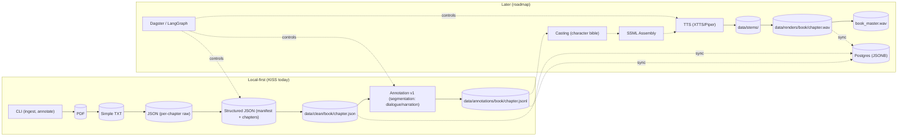

# High-Level Architecture

KISS today: local CLI + deterministic ingestion and simple annotation to files. Later: multi-agent enrichment, orchestration, TTS, and optional DB.

Source: [docs/diagrams/high_level_architecture.mmd](../04-diagrams/architecture/high_level_architecture.mmd)

## Legend

- **Solid nodes/edges**: implemented in the KISS slice (today)
- **Dashed edges/nodes**: future roadmap components

## Key Components

### Current Implementation (KISS)

- **CLI Interface**: Simple command-line tools for ingestion and annotation
- **PDF Processing**: Direct conversion to clean text files
- **JSON Structure**: Per-chapter JSON files with volume manifests
- **Basic Annotation**: Dialogue/narration segmentation

### Future Roadmap

- **Multi-Agent Orchestra**: Dagster/LangGraph coordination
- **Character Casting**: Speaker identification and voice assignment
- **TTS Integration**: Text-to-speech with XTTS/Piper
- **Database Layer**: PostgreSQL with JSONB for structured data
- **Audio Pipeline**: Stem generation and final rendering

## Design Principles

1. **KISS Today**: Start simple, build incrementally
2. **Local-First**: No cloud dependencies for core functionality
3. **File-Based**: Explicit artifact storage for reproducibility
4. **Deterministic**: Consistent outputs for same inputs
5. **Extensible**: Architecture supports future enhancements
