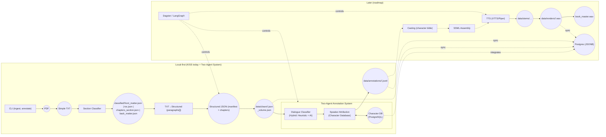

# High-Level Architecture

KISS today: local CLI + deterministic ingestion transitioning to a sophisticated two-agent annotation system. The new architecture features hybrid dialogue classification and speaker attribution with PostgreSQL character database integration. Later: multi-agent enrichment, orchestration, TTS, and optional DB.

Source: [docs/diagrams/high_level_architecture.mmd](diagrams/high_level_architecture.mmd)

**Two-Agent System Integration**: The annotation pipeline now incorporates a two-agent system for advanced dialogue processing and character tracking. See [Two-Agent System Specification](../02-specifications/components/two-agent-dialogue-speaker-system.md) for complete details.

Legend

- Solid nodes/edges: implemented in the KISS slice (today)
- Dashed edges/nodes: future roadmap components

Notes

- Upstream source of truth for the two-agent system is the chapters_section.json produced by Section Classifier; TXT→Structured consumes chapter spans directly; paragraphs and blank lines are preserved for downstream fidelity.
