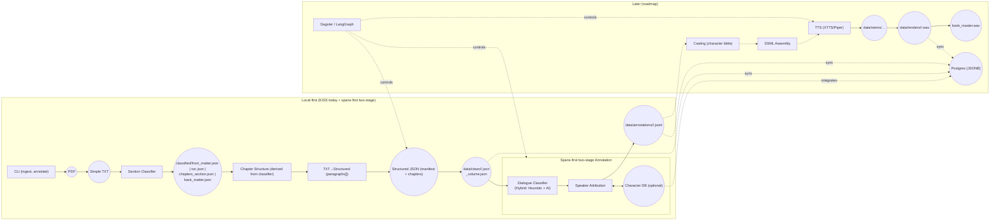

# High-Level Architecture

KISS today: local CLI + deterministic ingestion transitioning to a spans-first two-stage annotation system. The architecture features hybrid dialogue classification and deterministic speaker attribution. A character database may be added later as an optional enhancement. Later: multi-agent enrichment, orchestration, TTS, and optional DB.

Source: See diagrams index: [04-diagrams/README.md](../04-diagrams/README.md)

Annotation integration: The annotation pipeline incorporates a two-stage flow (dialogue classification → speaker attribution).

Legend

- Solid nodes/edges: implemented in the KISS slice (today)
- Dashed edges/nodes: future roadmap components

Notes

- Upstream source of truth for the annotation system is the chapters_section.json produced by Section Classifier; chapter structure is derived directly from this span (legacy Chapterizer removed); TXT→Structured preserves paragraphs and blank lines for downstream fidelity.
