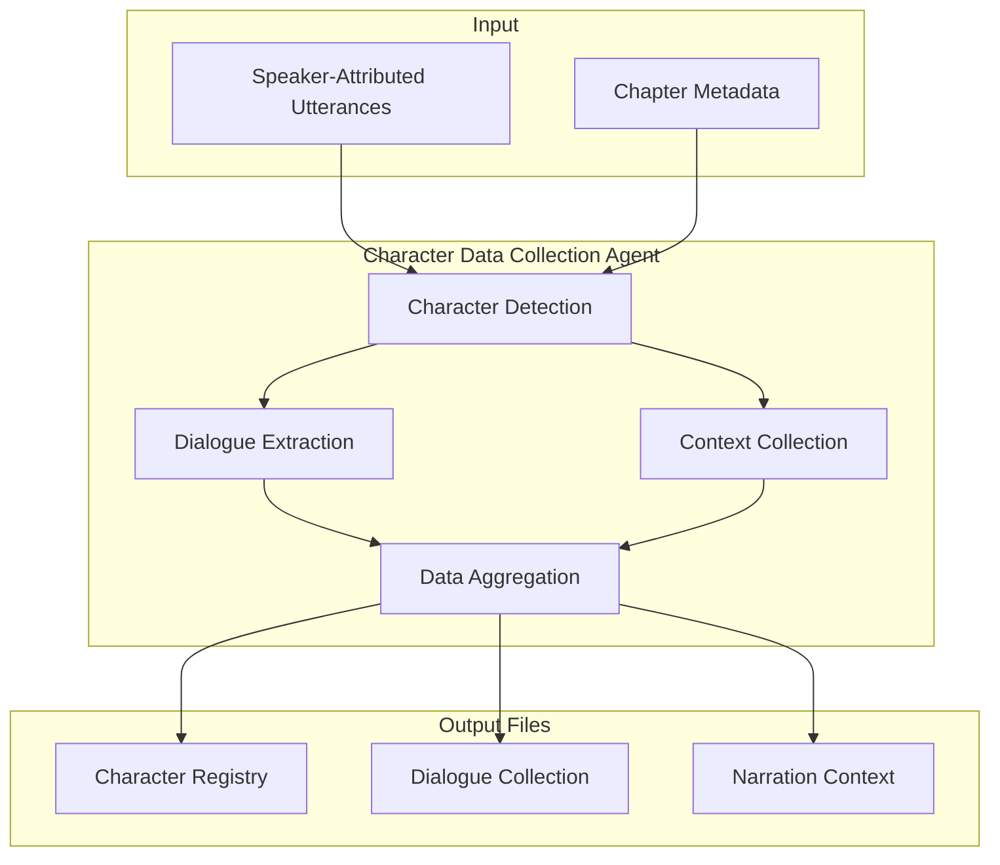
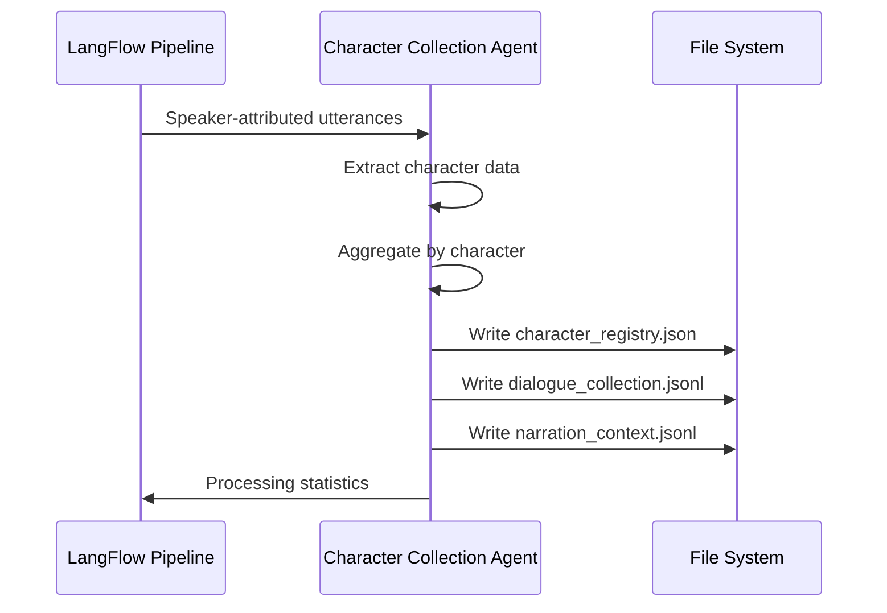

# Character Data Collection Agent - Design Specification

**Version**: 1.0  
**Date**: 2025-08-23  
**Status**: Draft  

## Purpose

Create a LangFlow component that collects and stores character dialogue and narration context for later voice casting analysis. This agent focuses on data mining and storage rather than sophisticated analysis.

## Architecture Diagram



## Data Flow Diagram



## Component Interface

### Inputs

- **utterances_data** (DataInput): Speaker-attributed utterances from previous agent
- **book_id** (StrInput): Book identifier for file organization
- **output_directory** (StrInput): Base directory for character data files

### Outputs

- **collection_stats** (Output): Statistics about collected character data

## Data Structures

### Character Registry Schema

**File**: `data/characters/{book_id}/character_registry.json`

```jsonc
{
  "schema_version": "1.0",
  "book_id": "mvs",
  "created_at": "2025-08-23T18:30:00Z",
  "last_updated": "2025-08-23T18:30:00Z",
  "processing_stats": {
    "chapters_processed": 3,
    "total_utterances": 245,
    "characters_found": 8
  },
  "characters": [
    {
      "character_id": "quinn_talen",
      "canonical_name": "Quinn Talen",
      "aliases": ["Quinn", "he", "the boy"],
      "first_seen": {
        "chapter_id": "mvs_ch001",
        "utterance_idx": 12
      },
      "stats": {
        "dialogue_count": 45,
        "chapters_appeared": ["mvs_ch001", "mvs_ch002", "mvs_ch003"],
        "total_words": 1247
      }
    }
  ]
}
```

### Dialogue Collection Schema

**File**: `data/characters/{book_id}/dialogue_collection.jsonl`

```jsonc
{
  "character_id": "quinn_talen",
  "book_id": "mvs",
  "chapter_id": "mvs_ch001",
  "chapter_title": "Chapter 1: Just an old Book",
  "utterance_idx": 45,
  "text": "I bet you don't even know how many fingers I'm holding up!",
  "word_count": 12,
  "context_before": "He then turned around and immediately raised his middle finger",
  "context_after": "Upon hearing the taunt, the boy clenched his fist",
  "attribution_confidence": 0.95,
  "collected_at": "2025-08-23T18:30:00Z"
}
```

### Narration Context Schema  

**File**: `data/characters/{book_id}/narration_context.jsonl`

```jsonc
{
  "character_focus": "quinn_talen",
  "book_id": "mvs", 
  "chapter_id": "mvs_ch001",
  "chapter_title": "Chapter 1: Just an old Book",
  "utterance_idx": 44,
  "text": "He then turned around and immediately raised his middle finger, responding to the slander",
  "word_count": 15,
  "narration_type": "action_description",
  "character_mentioned": true,
  "collected_at": "2025-08-23T18:30:00Z"
}
```

## Requirements

### Functional Requirements

**FR1**: The agent SHALL accept speaker-attributed utterances as input  
**FR2**: The agent SHALL create a character registry with basic statistics  
**FR3**: The agent SHALL collect all dialogue utterances by character  
**FR4**: The agent SHALL collect narration that mentions or describes characters  
**FR5**: The agent SHALL write data to structured JSON/JSONL files  
**FR6**: The agent SHALL create output directory structure if it doesn't exist  
**FR7**: The agent SHALL append to existing files to support incremental processing  

### Data Quality Requirements

**DQ1**: Character names SHALL be normalized to consistent identifiers  
**DQ2**: Dialogue text SHALL be stored exactly as received  
**DQ3**: Context windows SHALL capture 50 characters before/after dialogue  
**DQ4**: All records SHALL include timestamps for audit trails  
**DQ5**: File writes SHALL be atomic to prevent corruption  

### Performance Requirements  

**PR1**: The agent SHALL process 1000 utterances in under 10 seconds  
**PR2**: Memory usage SHALL not exceed 100MB for typical chapter processing  
**PR3**: File I/O operations SHALL use buffered writes for efficiency  

## Error Modes and Edge Cases

### Error Handling

**E1**: **Missing speaker attribution** - Skip utterance, log warning  
**E2**: **Invalid file paths** - Create directory structure, log info  
**E3**: **Duplicate character names** - Use first occurrence, log warning  
**E4**: **Malformed input data** - Skip record, log error with details  
**E5**: **File write failures** - Retry once, then fail with clear error message  

### Edge Cases

**EC1**: **NARRATOR as speaker** - Collect as character for consistency  
**EC2**: **UNKNOWN speakers** - Create character entry for later resolution  
**EC3**: **Very long utterances** - Truncate context windows but preserve full text  
**EC4**: **Empty utterances** - Skip but log for debugging  
**EC5**: **Special characters in names** - Sanitize for file system compatibility  

## Implementation Plan

### Phase 1: Core Data Collection (Week 1)

1. Create `ABMCharacterDataCollector` component class
2. Implement input validation and normalization  
3. Create basic character registry logic
4. Add dialogue collection functionality
5. Write unit tests for core logic

### Phase 2: File Operations (Week 1)

6. Implement atomic file writing operations
7. Add directory creation and path handling
8. Create narration context collection
9. Add incremental update support
10. Write integration tests with sample data

### Phase 3: LangFlow Integration (Week 1)

11. Add LangFlow component interface
12. Create component metadata and documentation  
13. Test with existing pipeline components
14. Add error handling and logging
15. Create example workflow

### Phase 4: Testing and Documentation (Week 1)

16. Comprehensive testing with MVS sample data
17. Performance testing and optimization
18. Create component documentation
19. Add usage examples
20. Integration testing with full pipeline

## File Organization

```text
data/characters/{book_id}/
├── character_registry.json      # Master character list
├── dialogue_collection.jsonl    # All dialogue by character
├── narration_context.jsonl      # Character-focused narration
└── collection_metadata.json     # Processing logs and stats
```

## Integration Points

### Input Requirements

- Expects utterances from `ABMSpeakerAttributionAgent`
- Requires `speaker` field with character identification
- Uses `role` field to distinguish dialogue vs narration

### Output Usage

- Files can be processed by future casting analysis tools
- Data structure supports data mining and ML training
- Compatible with existing annotation schema evolution

## Success Criteria

### Acceptance Tests

**AT1**: Given 100 utterances with speaker attribution, collect all dialogue by character  
**AT2**: Given mixed dialogue/narration, separate into appropriate files  
**AT3**: Given incremental processing, append new data without duplicates  
**AT4**: Given malformed input, handle gracefully with appropriate logging  
**AT5**: Given large chapter (1000+ utterances), process within performance limits  

### Quality Gates

**QG1**: All character names must be consistently normalized  
**QG2**: No data loss during collection process  
**QG3**: Files must be valid JSON/JSONL format  
**QG4**: Character statistics must accurately reflect collected data  
**QG5**: Memory usage must remain within specified limits  

## Future Enhancements (Out of Scope)

- Character personality analysis
- Voice casting recommendations  
- Relationship mapping between characters
- Emotional context classification
- Advanced alias resolution

## Dependencies

- **Input**: `ABMSpeakerAttributionAgent` component
- **Python Libraries**: json, pathlib, logging, datetime
- **File System**: Read/write access to data directory
- **LangFlow**: Component framework and data types

---

**Status**: Ready for implementation following TDD approach
**Next Step**: Create unit tests for core data collection logic
**Estimated Effort**: 1 week for complete implementation and testing
