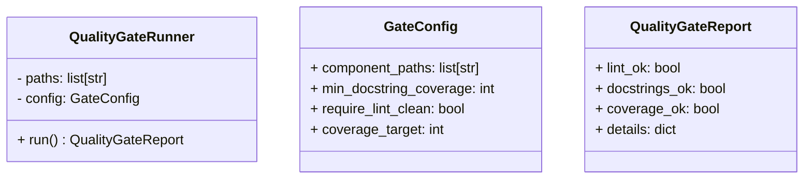

# Quality Gate — Full Design Spec

Status: Draft
Owner: OWNER
Last updated: 2025-08-21

## Overview

- Purpose and scope: Define a standard, automated gate that enforces code quality before merge or release.
- Assumptions and constraints: Local-first; runs via pre-commit and CI without external services.

## Diagrams

- Architecture (Mermaid)

```mermaid
flowchart LR
  Dev["Developer/CI"]  GateRunner["Quality Gate Runner (pre-commit/CI)"]
  GateRunner  Ruff["Ruff (format + lint)"]
  GateRunner  Docs["Docstring Coverage (interrogate)"]
  GateRunner  Cov["Test Coverage (pytest-cov)"]

  Ruff  Report["Aggregate Report"]
  Docs  Report
  Cov  Report

  Report |all pass| Pass[("Gate Pass")]
  Report |any fail| Fail[("Gate Fail")]
```

Source: docs/diagrams/quality_gate_architecture.mmd

- UML (class)



Source: docs/diagrams/quality_gate_uml.mmd

- FSM (if applicable)


Source: docs/diagrams/quality_gate_fsm.mmd

## Contracts

- Inputs
  - component_paths: list of file/dir globs included in the gate (e.g., src/, tests/, specific package)
- Outputs
  - QualityGateReport JSON (optional): { lint_ok, docstrings_ok, coverage_ok, details }
  - Exit code: 0 (pass) / non-zero (fail)
- Invariants and guarantees
  - No network calls required; all checks run locally.
  - Re-runnable without side effects.
- Error modes and edge cases
  - Missing tools: fails with actionable message (install ruff/pytest-cov/interrogate).
  - Empty component path: treated as config error; fail fast.
  - Flaky tests: out of scope; tests must be deterministic for the gate.

## Requirements

1. R-QUALITY-GATE: Component passes the quality gate (ruff clean, 100% Google-style docstrings, 100% test coverage for the component path).

## Task Plan

- [ ] Add Make target `quality_gate` to run ruff, interrogate, and pytest-cov over the component paths
- [ ] Add/confirm pre-commit hook entries for ruff and a fast test subset; CI runs full coverage
- [ ] Document configuration in CONTRIBUTING and reference from KISS

## Test Plan (pytest)

- Map tests 1:1 to Requirements (happy path + at least one edge case)
- Fixture/data strategy: create a tiny sample module under a temp dir and simulate pass/fail cases
- Coverage: enforce 100% for the component path (pytest-cov), and validate docstring coverage at 100%

## Out of Scope

- Performance optimization of checks
- Advanced static analysis beyond ruff/mypy baseline

## Open Questions

- Should mypy strict be part of the gate for all components, or remain a repo-wide gate only?
