# Two-Agent Character System – Design Spec

> **Purpose**: Multi-agent pipeline for dialogue/narration classification and speaker attribution with database-backed character profile building.

Last updated: 2025-08-23

## Overview

This specification defines a two-agent system that processes text utterances to:

1. **Agent 1 (Dialogue Classifier)**: Distinguish and tag narration vs. dialogue segments
2. **Agent 2 (Speaker Attribution)**: Determine which character is speaking for dialogue segments

Each new character discovered gets a dedicated database table where all related text (dialogue + surrounding narration context) is collected to build comprehensive character profiles for voice casting.

## Architecture

```mermaid
flowchart LR
    Input[📖 Utterance Text] --> Agent1[🤖 Dialogue Classifier]
    Agent1 --> Decision{Dialogue?}
    
    Decision -->|Yes| Agent2[🎭 Speaker Attribution]
    Decision -->|No| Narrator[📝 Narration Handler]
    
    Agent2 --> CharDiscovery[👤 Character Discovery]
    CharDiscovery --> CharDB[(🗄️ Character Tables)]
    
    Narrator --> Context[📋 Context Collector]
    Context --> CharDB
    
    CharDB --> Profile[👥 Character Profile Building]
```



## Database Schema Extension

### Core Character Management

Building on existing schema from `docs/01-project-overview/CONTEXT.md`:

```sql
-- Existing characters table (enhanced)
characters(
    id UUID PRIMARY KEY,
    book_id TEXT NOT NULL REFERENCES books(id),
    name TEXT NOT NULL,
    canonical_name TEXT NOT NULL,  -- normalized version for matching
    aliases JSONB DEFAULT '[]',    -- alternative names/spellings
    profile JSONB DEFAULT '{}',    -- character attributes
    first_mentioned_chapter_id TEXT,
    first_mentioned_utterance_idx INTEGER,
    stats JSONB DEFAULT '{}',      -- dialogue count, mention frequency, etc.
    created_at TIMESTAMP DEFAULT NOW(),
    updated_at TIMESTAMP DEFAULT NOW()
);

-- New: Character utterances collection
character_utterances(
    id UUID PRIMARY KEY,
    character_id UUID NOT NULL REFERENCES characters(id),
    book_id TEXT NOT NULL,
    chapter_id TEXT NOT NULL,
    utterance_idx INTEGER NOT NULL,
    utterance_type TEXT NOT NULL CHECK (utterance_type IN ('dialogue', 'mention', 'description', 'context')),
    text TEXT NOT NULL,
    context_before TEXT,           -- preceding narration for context
    context_after TEXT,           -- following narration for context
    speaker_confidence FLOAT,     -- Agent 2 confidence score
    attributed_by TEXT,           -- 'agent_2', 'rule_based', 'manual'
    tags JSONB DEFAULT '[]',      -- emotion, scene_type, relationship markers
    created_at TIMESTAMP DEFAULT NOW()
);

-- New: Character relationships (discovered from dialogue patterns)
character_relationships(
    id UUID PRIMARY KEY,
    book_id TEXT NOT NULL,
    character1_id UUID NOT NULL REFERENCES characters(id),
    character2_id UUID NOT NULL REFERENCES characters(id),
    relationship_type TEXT,       -- 'dialogue_partner', 'mentioned_by', 'described_together'
    frequency INTEGER DEFAULT 1, -- how often they interact/are mentioned together
    first_chapter_id TEXT,
    examples JSONB DEFAULT '[]',  -- sample interactions
    created_at TIMESTAMP DEFAULT NOW(),
    UNIQUE(character1_id, character2_id, relationship_type)
);

-- Indexes for performance
CREATE INDEX idx_char_utterances_character_id ON character_utterances(character_id);
CREATE INDEX idx_char_utterances_book_chapter ON character_utterances(book_id, chapter_id);
CREATE INDEX idx_char_utterances_type ON character_utterances(utterance_type);
CREATE INDEX idx_characters_book_canonical ON characters(book_id, canonical_name);
```

## Agent 1: Dialogue Classifier

### Purpose

Analyze each utterance and classify as dialogue vs. narration using multiple detection strategies.

### Input Schema

```json
{
  "book_id": "SAMPLE_BOOK",
  "chapter_id": "SAMPLE_BOOK_CH0001", 
  "utterance_idx": 42,
  "text": "\"Hello there,\" said Anna warmly.",
  "context_before": "Anna walked into the room and noticed...",
  "context_after": "She waited for a response while..."
}
```

### Processing Logic

1. **Heuristic Detection** (fast first-pass):
   - Quote patterns: `"..."`, `'...'`, `"..."`
   - Dialogue tags: "said", "replied", "whispered", "exclaimed"
   - Action interruptions: `"Hello," she said, "how are you?"`

2. **LLM Classification** (when heuristics uncertain):
   - Context-aware prompt with surrounding utterances
   - Confidence scoring
   - Rationale generation for debugging

3. **Rule Refinement**:
   - Book-specific quote style detection
   - Nested dialogue handling
   - Internal monologue vs. spoken dialogue

### Dialogue Classifier Output Schema

```json
{
  "book_id": "SAMPLE_BOOK",
  "chapter_id": "SAMPLE_BOOK_CH0001",
  "utterance_idx": 42,
  "text": "\"Hello there,\" said Anna warmly.",
  "classification": "dialogue",
  "confidence": 0.95,
  "method": "heuristic_quotes",
  "dialogue_text": "Hello there",
  "attribution_clues": ["said Anna"],
  "context_before": "Anna walked into the room and noticed...",
  "context_after": "She waited for a response while..."
}
```

## Agent 2: Speaker Attribution

### Attribution Purpose

For dialogue utterances, determine which character is speaking and collect comprehensive character data.

### Attribution Input Schema

Output from Agent 1 (dialogue only)

### Attribution Processing Logic

1. **Attribution Pattern Matching**:
   - Direct tags: `"Hello," said Anna` → Anna
   - Pronoun resolution: `"Yes," she replied` → last mentioned female character
   - Context clues: `Anna turned to face him. "I agree."` → Anna

2. **Character Registry Management**:
   - Name normalization: "Anna", "Anna Smith", "Ms. Smith" → canonical "Anna Smith"
   - Alias tracking: Store all encountered name variations
   - First appearance recording

3. **Context Collection**:
   - Capture surrounding narration for character description
   - Tag emotional context, scene setting
   - Relationship inference from dialogue patterns

### Character Data Collection Strategy

For each character utterance, collect:

```json
{
  "character_name": "Anna Smith",
  "utterance_type": "dialogue",
  "text": "Hello there",
  "full_context": "Anna walked into the room and noticed the mess. \"Hello there,\" said Anna warmly. She waited for a response while...",
  "attribution_method": "dialogue_tag",
  "confidence": 0.95,
  "scene_context": {
    "location": "room",
    "action": "entering",
    "emotion": "warm"
  },
  "dialogue_partners": ["unknown_recipient"],
  "chapter_position": 42,
  "tags": ["greeting", "warm_tone"]
}
```

### Speaker Attribution Output Schema

```json
{
  "book_id": "SAMPLE_BOOK", 
  "chapter_id": "SAMPLE_BOOK_CH0001",
  "utterance_idx": 42,
  "text": "\"Hello there,\" said Anna warmly.",
  "classification": "dialogue",
  "speaker": "Anna Smith",
  "speaker_confidence": 0.95,
  "attribution_method": "dialogue_tag",
  "character_id": "char_anna_smith_uuid",
  "dialogue_text": "Hello there",
  "context_data": {
    "emotional_tone": "warm",
    "scene_setting": "room_entry",
    "dialogue_partners": []
  }
}
```

## Character Profile Building

### Automatic Data Mining

As utterances are processed, automatically extract and store:

1. **Direct Speech Patterns**:
   - Vocabulary preferences
   - Sentence structure
   - Emotional expressions
   - Topics they discuss

2. **Character Descriptions** (from narration):
   - Physical descriptions when mentioned
   - Actions and behaviors
   - Others' reactions to them

3. **Relationship Mapping**:
   - Who they talk to most
   - Tone variations by dialogue partner
   - Power dynamics (formal vs. casual speech)

### Profile Schema in `characters.profile` JSONB

```json
{
  "appearance": {
    "descriptions": [
      "tall woman with brown hair",
      "wearing a blue dress"
    ],
    "mentioned_chapters": ["CH0001", "CH0003"]
  },
  "personality": {
    "traits_inferred": ["warm", "curious", "decisive"],
    "evidence": [
      {"trait": "warm", "example": "\"Hello there,\" said Anna warmly", "chapter": "CH0001"}
    ]
  },
  "speech_patterns": {
    "common_words": ["wonderful", "indeed", "rather"],
    "formality_level": "medium",
    "avg_utterance_length": 12.3,
    "emotion_distribution": {"neutral": 0.6, "happy": 0.3, "concerned": 0.1}
  },
  "relationships": {
    "primary_contacts": ["John", "Mary"],
    "power_dynamics": {"speaks_formally_to": ["Mr. Williams"], "casual_with": ["John"]}
  },
  "story_role": {
    "first_appearance": "CH0001",
    "dialogue_frequency": 0.23,
    "chapters_active": ["CH0001", "CH0003", "CH0007"],
    "plot_significance": "secondary"
  }
}
```

## Integration with Existing Pipeline

### LangFlow Components

1. **ABMDialogueClassifier** (Agent 1):
   - Input: Segmented utterances from existing pipeline
   - Output: Classified utterances with dialogue/narration tags

2. **ABMSpeakerAttributor** (Agent 2):
   - Input: Dialogue utterances from Agent 1
   - Output: Speaker-attributed utterances + character data collection

3. **ABMCharacterProfileBuilder**:
   - Background process to analyze collected character data
   - Updates character profiles periodically
   - Generates voice casting recommendations

### Pipeline Flow

```text
Existing Pipeline:
PDF → Structured JSON → Utterance Segmentation

New Two-Agent Extension:
Utterances → Agent 1 (Dialogue Classifier) → Agent 2 (Speaker Attribution) 
         → Character Data Collection → Database Storage
         
Background Process:
Character Data → Profile Analysis → Voice Casting Profiles
```

## Implementation Phases

### Phase 1: Foundation (Week 1-2)

- [ ] Database schema updates
- [ ] Agent 1 (Dialogue Classifier) implementation
- [ ] Basic character registry
- [ ] LangFlow component integration

### Phase 2: Speaker Attribution (Week 3-4)

- [ ] Agent 2 (Speaker Attribution) implementation
- [ ] Character data collection system
- [ ] Name normalization and alias handling
- [ ] Relationship detection basics

### Phase 3: Profile Building (Week 5-6)

- [ ] Automated profile analysis
- [ ] Character trait inference
- [ ] Speech pattern analysis
- [ ] Voice casting recommendation system

## Quality Assurance

### Validation Checks

- Speaker attribution confidence thresholds
- Character name consistency validation
- Missing context detection
- Relationship inference accuracy

### Metrics to Track

- Dialogue classification accuracy
- Speaker attribution confidence distribution
- Character discovery completeness
- Profile data richness scores

## Future Enhancements

- **Multi-book character tracking**: Link characters across series
- **Emotion detection integration**: Enhanced character emotional profiles
- **Voice similarity matching**: Automatic TTS voice recommendations
- **Interactive character browser**: UI for reviewing/editing character profiles

## Related Documents

- [Annotation Schema](../data-schemas/ANNOTATION_SCHEMA.md) - Core utterance format
- [Character Data Collector Spec](CHARACTER_DATA_COLLECTOR_SPEC.md) - Original file-based approach
- [Context Documentation](../../01-project-overview/CONTEXT.md) - Database schema reference

---

*Part of [Component Specifications](README.md) | [Documentation Index](../../README.md)*
