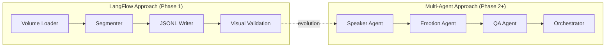

# Implementation

> **Purpose**: Practical guides, working code examples, and implementation strategies for the Agent Audiobook Maker system.

This section bridges the gap between specifications and working code. It provides concrete implementation guidance, working examples, and architectural patterns for building the multi-agent audiobook generation system.

## Implementation Approaches

### 🎨 [LangFlow Implementation](langflow/README.md)

**Visual workflow prototyping for annotation pipeline**

Current focus for Phase 1 - rapid prototyping of the annotation pipeline using visual workflows:

- Custom LangFlow components for audiobook processing
- Visual workflow design and testing
- Component integration and data flow validation
- Transition strategy to production multi-agent system

**Status**: Active development (Phase 1) **Use Cases**: Rapid prototyping, visual debugging, stakeholder demos

### 🤖 [Multi-Agent Implementation](multi-agent/README.md)

**Sophisticated multi-agent system for production use**

Future implementation approach for Phases 2-3 using specialized AI agents:

- CrewAI-based agent coordination
- LangChain/LangGraph orchestration patterns
- Agent role definitions and interaction protocols
- Scalability and performance optimization strategies

**Status**: Planning and design (Phase 2+) **Use Cases**: Production deployment, complex reasoning, quality assurance

## Code Examples & Patterns

### 📁 [Examples](examples/)

**Working code samples and integration patterns**

Real-world examples demonstrating:

- Component integration patterns
- Data transformation examples
- Error handling and recovery
- Testing and validation approaches

Current examples include:

- Classifier output samples (front matter, TOC, chapters, back matter)
- LangFlow workflow definitions
- Integration test scenarios

## Architecture Patterns

### Component Integration

### Data Flow Patterns

- **Stream processing** for large documents
- **Batch processing** for chapter-level operations
- **Event-driven** updates for real-time feedback
- **Cache-first** strategies for expensive operations

### Error Handling Patterns

- **Circuit breaker** for external service calls
- **Retry with backoff** for transient failures
- **Graceful degradation** when components fail
- **Dead letter queues** for failed processing

## Technology Stack

### Current Stack (Phase 1)

- **LangFlow**: Visual workflow design and prototyping
- **Python**: Core processing logic and components
- **PyMuPDF**: PDF text extraction
- **JSON Schema**: Data validation and contracts

### Future Stack (Phase 2+)  

- **CrewAI**: Multi-agent orchestration
- **LangChain/LangGraph**: Agent workflow management
- **Ollama**: Local LLM inference
- **HuggingFace**: ML models for NLP tasks
- **Redis**: Caching and job queuing
- **MLflow**: Experiment tracking and model management

## Development Workflow

### Phase 1 - LangFlow Prototyping

1. **Design workflows** visually in LangFlow UI
2. **Create custom components** for domain-specific processing
3. **Test data flow** with real PDF samples
4. **Validate outputs** against expected schemas
5. **Document lessons learned** for production transition

### Phase 2+ - Multi-Agent Development

1. **Define agent roles** and responsibilities
2. **Implement agent communication** protocols
3. **Build orchestration layer** for workflow management
4. **Add observability** and monitoring capabilities
5. **Optimize performance** for production workloads

## Quality Assurance

### Testing Strategies

- **Unit tests** for individual components
- **Integration tests** for workflow validation
- **End-to-end tests** with real PDF samples
- **Performance tests** for scalability validation
- **Regression tests** using content hashes

### Code Quality

- **Type hints** throughout codebase
- **Docstring coverage** for all public APIs
- **Linting** with ruff and mypy
- **Code formatting** with consistent style
- **Dependency management** with clear version constraints

## Related Sections

- 📝 [Specifications](../02-specifications/README.md) - What these implementations should achieve
- 🎨 [Diagrams](../04-diagrams/README.md) - Visual representations of implementation architecture
- 📈 [Development Journey](../05-development/README.md) - How these implementations evolved
- 📚 [Contributing Guide](../05-development/guides/CONTRIBUTING.md) - How to contribute to implementations

---

*Part of [Documentation Index](../README.md)*
