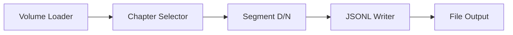
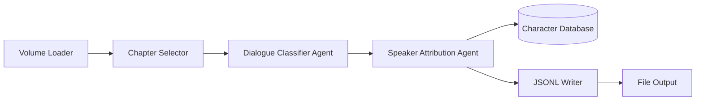
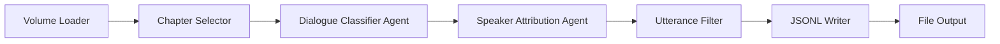

# LangFlow Implementation

> **Purpose**: Visual workflow prototyping for the Agent Audiobook Maker annotation pipeline using LangFlow, evolving toward a spans-first two-stage system.

This is our current implementation approach for Phase 1 - using LangFlow's visual interface to rapidly prototype and validate the annotation pipeline. The system is transitioning from basic segmentation to a spans-first two-stage architecture featuring dialogue classification and deterministic speaker attribution before moving to a production multi-agent system.

Annotation system integration: The pipeline now incorporates hybrid dialogue classification (heuristic + AI fallback) and deterministic speaker attribution with optional PostgreSQL character database integration.

## Quick Navigation

| Category                                   | Purpose                                                             | Files                                  |
| ------------------------------------------ | ------------------------------------------------------------------- | -------------------------------------- |
| 📚 **Setup & Usage**                       | Getting started with LangFlow                                       | `SETUP_GUIDE.md`                       |
| 🧩 **Workflows**                           | Pre-built examples and patterns                                     | `WORKFLOWS.md`                         |
| 📊 **Component Results**                   | Testing and validation docs                                         | `COMPONENT_TEST_RESULTS.md`            |
| 🎯 **Success Stories**                     | Implementation milestones                                           | `LANGFLOW_COMPONENT_SUCCESS.md`        |
| 🎤 **Speaker Attribution (Deterministic)** | Controls & behavior (knobs, pronoun blocklist, orchestrator wiring) | `SPEAKER_ATTRIBUTION_DETERMINISTIC.md` |

## Contents

### Setup Guide

Complete setup and configuration guide - see [SETUP_GUIDE.md](SETUP_GUIDE.md)

Everything needed to get LangFlow running with ABM components:

- Environment configuration and prerequisites
- Component discovery and loading
- Step-by-step setup instructions
- Troubleshooting common issues

*Use this when setting up LangFlow for the first time.*

### Workflows

Pre-built workflows and usage examples - see [WORKFLOWS.md](WORKFLOWS.md)

Working examples for different processing scenarios:

- MVP processing workflow (ready to import)
- Sample data processing examples
- Manual workflow building instructions
- Advanced processing patterns

*Use this to understand how components work together.*

### Component Test Results

Validation and testing outcomes - see [COMPONENT_TEST_RESULTS.md](COMPONENT_TEST_RESULTS.md)

Results from component testing and integration:

- Individual component validation
- End-to-end workflow testing
- Performance benchmarks
- Quality metrics

*Use this to understand component reliability and performance.*

### Component Success

Implementation milestones and achievements - see [LANGFLOW_COMPONENT_SUCCESS.md](LANGFLOW_COMPONENT_SUCCESS.md)

Major milestones in LangFlow implementation:

- Component development progress
- Integration breakthroughs
- UI discovery solutions
- Production readiness status

*Use this to understand the implementation journey.*

## Current Components

### Chapter Volume Loader

Loads book chapters from structured JSON or fallback text files

- Input: Book ID and manifest path
- Output: Structured payload with book metadata and chapters
- Features: Automatic fallback to .txt files if JSON unavailable
- Status: ✅ Working and tested

### Segment Dialogue/Narration

**Legacy Component** (being upgraded to spans-first two-stage)

Splits chapter text into dialogue and narration utterances

- Input: Chapter payload with text content
- Output: Utterances array with role classification (dialogue/narration)
- Algorithm: Quote-based heuristic detection
- Status: ✅ Working, transitioning to hybrid dialogue classifier agent
- **Migration**: Will be enhanced with AI classification fallback and confidence scoring

**Future Enhancement**: This component is evolving into the Dialogue Classifier Agent with:

- Hybrid heuristic + AI classification approach
- Context window analysis (5-segment windows)
- Confidence scoring for classification accuracy
- Support for mixed dialogue/narration segments

### Chapter Selector

Selects specific chapter by index for processing

- Input: Multi-chapter payload and chapter index
- Output: Single chapter payload for downstream processing
- Features: Bounds checking and validation
- Status: ✅ Working and tested

### Utterance JSONL Writer

Writes utterances to JSONL files for persistence

- Input: Utterances payload with book/chapter metadata
- Output: File path and processing statistics
- Features: Automatic directory creation, filename templates
- Status: ✅ Working with configurable paths

### Utterance Filter

Filters utterances by role, length, or content criteria

- Input: Utterances payload with filter parameters
- Output: Filtered utterances matching criteria
- Features: Role filtering, length bounds, substring matching
- Status: ✅ Working with multiple filter types

### Speaker Attribution Agent

**New Component** (part of two-agent system)

Associates dialogue segments with specific characters using database-driven lookup

- Input: Dialogue segments from Dialogue Classifier Agent
- Output: Speaker-attributed dialogue with character associations
- Features: Character database integration, alias resolution, confidence scoring
- Database: PostgreSQL with JSONB character profiles
- Status: 🚧 Architecture complete, implementation in progress

Key capabilities:

- Real-time character lookup by name and aliases
- Automatic character record creation for new speakers
- Speaker vs addressee detection in dialogue
- Character profile building for voice casting integration

## Workflow Examples

### Legacy Basic Segmentation Flow

This flow loads a book volume, selects a specific chapter, segments it into dialogue/narration utterances, and writes the results to a JSONL file.

### Two-stage Annotation Flow (New Architecture)

The enhanced flow incorporates the two-stage system with database-driven character tracking and deterministic speaker attribution.

### Filtered Processing Flow

This flow adds filtering capabilities after speaker attribution to remove unwanted utterances before final output.

## Development Status

- **Phase**: Transitioning from rapid prototyping to spans-first two-stage architecture
- **Legacy Components**: 7 custom components available and working
- **New Components**: Two-stage system (dialogue classifier + speaker attribution) designed
- **Database Integration**: PostgreSQL schema complete for character management
- **Status**: Legacy system ready for workflow testing, two-stage system architecture complete
- **Next Steps**: Implementation of hybrid dialogue classifier and speaker attribution agents

## Architecture Evolution

### Current State (Legacy LangFlow)

- Basic heuristic dialogue/narration segmentation
- File-based processing and output
- Limited character awareness

### Target State (Two-stage System)

- Hybrid dialogue classification (heuristic + AI fallback)
- Database-driven character tracking and speaker attribution
- Confidence scoring and quality metrics
- Voice casting preparation capabilities

## Related Documentation

- [LangFlow Components Index](COMPONENTS_INDEX.md) - Catalog of available components
- [Integration Testing](../../../tests/integration/) - End-to-end testing scenarios
- [Development Journey](../../05-development/journey/README.md) - Implementation history and lessons learned
