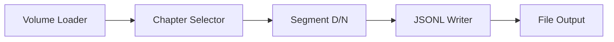
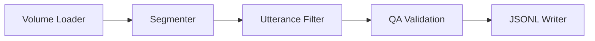

# LangFlow Implementation

> **Purpose**: Visual workflow prototyping for the Agent Audiobook Maker annotation pipeline using LangFlow.

This is our current implementation approach for Phase 1 - using LangFlow's visual interface to rapidly prototype and validate the annotation pipeline before transitioning to a production multi-agent system.

## Why LangFlow?

### Rapid Prototyping

- **Visual design** - Build workflows without code complexity
- **Real-time testing** - Immediate feedback on component integration
- **Stakeholder demos** - Non-technical stakeholders can understand workflows
- **Quick iteration** - Change logic without full rebuild cycles

### Component Reusability

- **Modular design** - Components can be reused across workflows
- **Standard interfaces** - LangFlow enforces consistent data contracts
- **Version control** - Workflows can be exported as JSON and versioned

### Learning Platform  

- **Multi-agent concepts** - Practice agent coordination patterns
- **Data flow validation** - Ensure components work together correctly
- **Error handling** - Debug integration issues visually

## Current Components

### 📚 [Chapter Volume Loader](abm_chapter_volume_loader.py)

**Loads book chapters from structured JSON or fallback text files**

- Input: Book ID and manifest path
- Output: Structured payload with book metadata and chapters
- Features: Automatic fallback to .txt files if JSON unavailable
- Status: ✅ Working and tested

### ✂️ [Segment Dialogue/Narration](abm_segment_dialogue_narration.py)  

**Splits chapter text into dialogue and narration utterances**

- Input: Chapter payload with text content
- Output: Utterances array with role classification (dialogue/narration)
- Algorithm: Quote-based heuristic detection
- Status: ✅ Working, ready for ML enhancement

### 🎯 [Chapter Selector](abm_chapter_selector.py)

**Selects specific chapter by index for processing**

- Input: Multi-chapter payload and chapter index
- Output: Single chapter payload for downstream processing  
- Features: Bounds checking and validation
- Status: ✅ Working and tested

### 🗂️ [Utterance JSONL Writer](abm_utterance_jsonl_writer.py)

**Writes utterances to JSONL files for persistence**

- Input: Utterances payload with book/chapter metadata
- Output: File path and processing statistics
- Features: Automatic directory creation, filename templates
- Status: ✅ Working with configurable paths

### 🔍 [Utterance Filter](abm_utterance_filter.py)

**Filters utterances by role, length, or content criteria**

- Input: Utterances payload with filter parameters
- Output: Filtered utterances matching criteria
- Features: Role filtering, length bounds, substring matching
- Status: ✅ Working with multiple filter types

## Workflow Examples

### Basic Segmentation Flow



1. **Load** book chapters from `data/clean/<book>/chapters.json`
2. **Select** specific chapter for processing
3. **Segment** text into dialogue/narration utterances
4. **Write** results to `data/annotations/<book>/utterances.jsonl`

### Quality Assurance Flow



1. **Segment** chapter text into utterances  
2. **Filter** utterances by quality criteria
3. **Validate** against expected patterns
4. **Write** validated results

## Component Development

### Creating New Components

1. **Inherit from Component**

```python
from langflow.custom import Component
from langflow.io import DataInput, Output
from langflow.schema import Data

class MyComponent(Component):
    display_name = "My Component"
    description = "What this component does"
    icon = "icon-name"  # Lucide icon
    name = "my_component"
```

2. **Define Inputs and Outputs**

```python
inputs = [
    DataInput(
        name="payload",
        display_name="Input Data", 
        info="Description of expected input",
        required=True
    )
]

outputs = [
    Output(
        display_name="Result", 
        name="result",
        method="process"
    )
]
```

3. **Implement Processing Logic**

```python
def process(self) -> Data:
    # Access input data
    input_data = self.payload.data
    
    # Process the data
    result = {"processed": input_data}
    
    # Return as Data object
    return Data(data=result)
```

### Component Testing

- **Unit tests** in `tests/unit_tests/test_langflow_components_optional.py`
- **Integration tests** with real data samples
- **Visual testing** in LangFlow UI with sample inputs

## LangFlow Setup

### Installation

```bash
# Install in your virtual environment
pip install langflow

# Run with custom components
./scripts/run_langflow.sh
```

### Component Discovery

- Components automatically discovered from `src/abm/lf_components/audiobook/`
- Must inherit from `langflow.custom.Component`
- Must be in Python package with `__init__.py`

### UI Usage

1. **Start LangFlow**: `./scripts/run_langflow.sh`
2. **Open browser**: <http://localhost:7860>
3. **Import workflow**: Use JSON files from `examples/langflow/`
4. **Add components**: Drag from "Audiobook" category
5. **Connect workflow**: Link component inputs/outputs
6. **Test execution**: Run workflow with sample data

## Transition to Multi-Agent

### Phase 2 Migration Strategy

1. **Extract core logic** from LangFlow components
2. **Wrap as CrewAI agents** with specialized roles  
3. **Implement coordination** using LangGraph orchestration
4. **Add production features** (error handling, monitoring, caching)
5. **Maintain LangFlow** for rapid prototyping of new features

### Preserved Patterns

- **Component interfaces** will remain similar
- **Data schemas** will be maintained for compatibility
- **Workflow concepts** translate to agent coordination
- **Testing approaches** apply to agent validation

## Success Metrics

### Current Phase 1 Goals

- ✅ All components working in LangFlow UI
- ✅ End-to-end workflow produces valid JSONL
- ✅ Visual debugging and validation possible
- 🚧 Sample workflows documented and versioned

### Phase 2 Transition Goals  

- 🎯 Core logic extracted to reusable modules
- 🎯 Agent roles mapped to component responsibilities
- 🎯 Production orchestration layer designed
- 🎯 Performance benchmarks established

## Related Sections

- 🤖 [Multi-Agent Implementation](../multi-agent/README.md) - Future production approach
- 📝 [Component Specifications](../../02-specifications/components/README.md) - What these components should achieve
- 📈 [Development Journey](../../05-development/journey/README.md) - How this approach evolved

---

*Part of [Implementation](../README.md) | [Documentation Index](../../README.md)*
