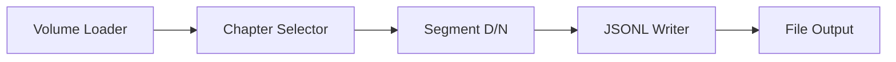
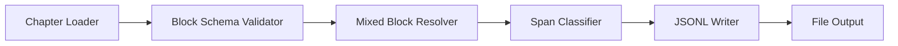
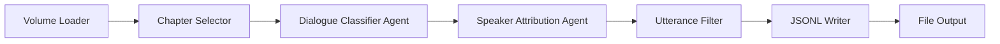

# LangFlow Implementation

> Purpose: Visual workflow prototyping for the Agent Audiobook Maker segmentation pipeline using LangFlow.

This is our current implementation approach for the KISS branch—using LangFlow's visual interface to prototype deterministic segmentation. The focus is on dialogue/narration segmentation and writing JSONL artifacts. Speaker attribution, databases, and multi‑agent systems are out of scope here.

## Quick Navigation

| Category                           | Purpose                                 | Files                             |
| ---------------------------------- | --------------------------------------- | --------------------------------- |
| 📚 **Setup & Usage**               | Getting started with LangFlow           | `SETUP_GUIDE.md`                  |
| 🧩 **Workflows**                   | Pre-built examples and patterns         | `WORKFLOWS.md`                    |
| 📊 **Component Results**           | Testing and validation docs             | `COMPONENT_TEST_RESULTS.md`       |
| 🎯 **Success Stories**             | Implementation milestones               | `LANGFLOW_COMPONENT_SUCCESS.md`   |
| 🧪 **Discovery & Troubleshooting** | Component discovery and launch guidance | `LANGFLOW_COMPONENT_DISCOVERY.md` |

## Contents

### Setup Guide

Complete setup and configuration guide - see [SETUP_GUIDE.md](SETUP_GUIDE.md)

Everything needed to get LangFlow running with ABM components:

- Environment configuration and prerequisites
- Component discovery and loading
- Step-by-step setup instructions
- Troubleshooting common issues

*Use this when setting up LangFlow for the first time.*

### Workflows

Pre-built workflows and usage examples - see [WORKFLOWS.md](WORKFLOWS.md)

Working examples for different processing scenarios:

- MVP processing workflow (ready to import)
- Sample data processing examples
- Manual workflow building instructions
- Advanced processing patterns

*Use this to understand how components work together.*

### Component Test Results

Validation and testing outcomes - see [COMPONENT_TEST_RESULTS.md](COMPONENT_TEST_RESULTS.md)

Results from component testing and integration:

- Individual component validation
- End-to-end workflow testing
- Performance benchmarks
- Quality metrics

*Use this to understand component reliability and performance.*

### Component Success

Implementation milestones and achievements - see [LANGFLOW_COMPONENT_SUCCESS.md](LANGFLOW_COMPONENT_SUCCESS.md)

Major milestones in LangFlow implementation:

- Component development progress
- Integration breakthroughs
- UI discovery solutions
- Production readiness status

*Use this to understand the implementation journey.*

## Current Components

### Chapter Volume Loader

Loads book chapters from structured JSON or fallback text files

- Input: Book ID and manifest path
- Output: Structured payload with book metadata and chapters
- Features: Automatic fallback to .txt files if JSON unavailable
- Status: ✅ Working and tested

### Span Classification (Dialogue/Narration)

Labels spans as dialogue or narration deterministically.

- Input: Spans from the resolver
- Output: spans_cls with role classification (dialogue/narration)
- Algorithm: Quote and hint-based simple rules
- Status: ✅ Working

### Chapter Selector

Selects specific chapter by index for processing

- Input: Multi-chapter payload and chapter index
- Output: Single chapter payload for downstream processing
- Features: Bounds checking and validation
- Status: ✅ Working and tested

### Utterance JSONL Writer

Writes utterances to JSONL files for persistence

- Input: Utterances payload with book/chapter metadata
- Output: File path and processing statistics
- Features: Automatic directory creation, filename templates
- Status: ✅ Working with configurable paths

### Utterance Filter

Filters utterances by role, length, or content criteria

- Input: Utterances payload with filter parameters
- Output: Filtered utterances matching criteria
- Features: Role filtering, length bounds, substring matching
- Status: ✅ Working with multiple filter types

### Out of Scope (KISS)

- Speaker attribution and character databases
- Multi-agent systems
- Orchestration frameworks

## Workflow Examples

### Legacy Basic Segmentation Flow

This flow loads a book volume, selects a specific chapter, segments it into dialogue/narration utterances, and writes the results to a JSONL file.

### Spans-first Segmentation Flow

### Filtered Processing Flow

This flow adds filtering capabilities after speaker attribution to remove unwanted utterances before final output.

## Development Status

- Phase: KISS segmentation prototype
- Custom components: Loader, validator, resolver, classifier, iterator, orchestrator
- Database integration: Out of scope
- Next: Casting design note → SSML → TTS (future)

## Architecture Evolution

### Current State (Legacy LangFlow)

- Basic heuristic dialogue/narration segmentation
- File-based processing and output
- Limited character awareness

### Target State (Later)

- Casting and character bible
- SSML assembly
- TTS rendering

## Related Documentation

- [LangFlow Components Index](COMPONENTS_INDEX.md) - Catalog of available components
- [Integration Testing](../../../tests/integration/) - End-to-end testing scenarios
- [Development Journey](../../05-development/journey/README.md) - Implementation history and lessons learned
