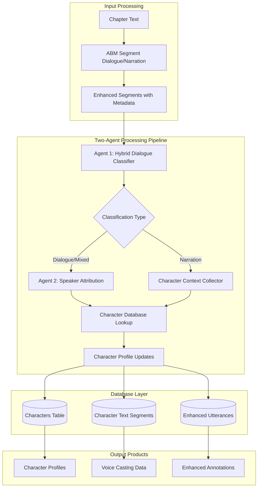
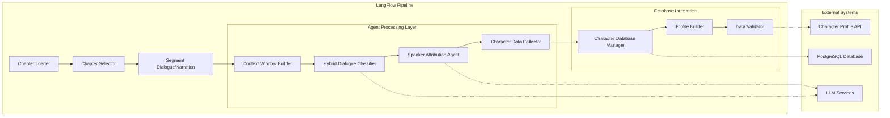
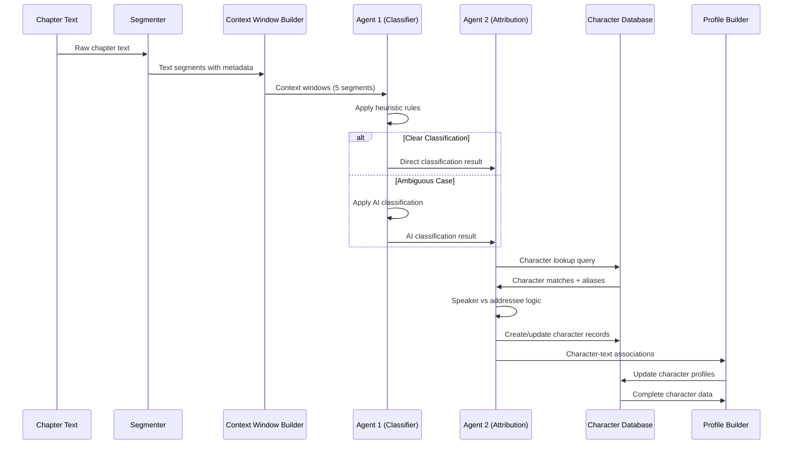
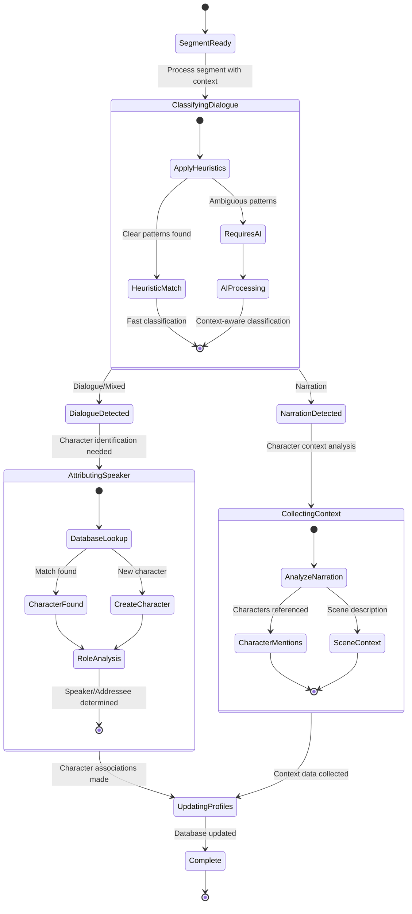
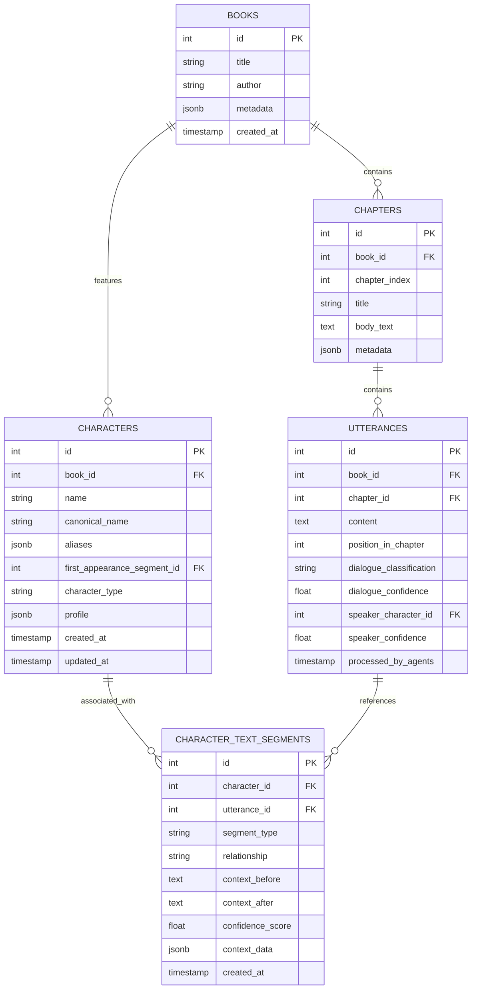
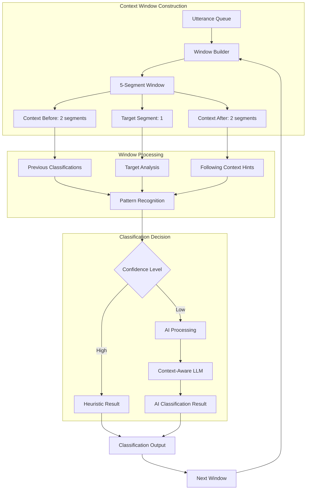
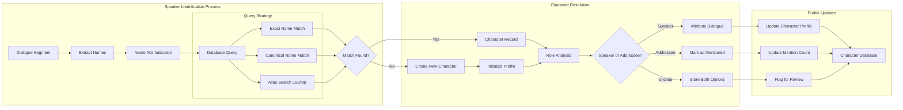
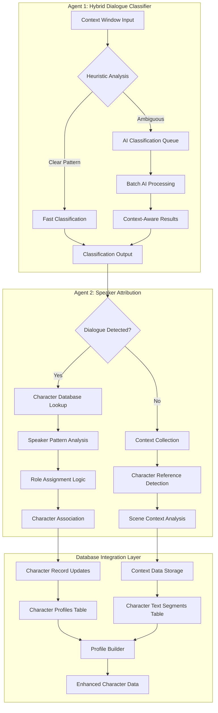
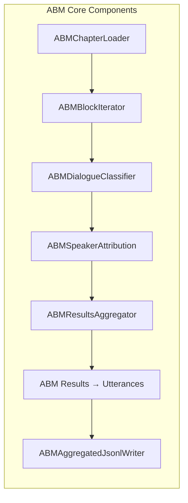
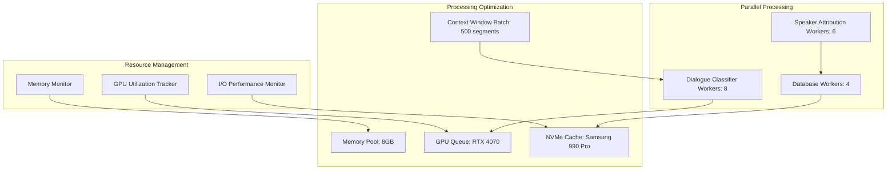

# Two-Agent System Architecture Diagrams

Note: This page retains legacy naming for historical continuity. The current
annotation architecture is described as a spans-first two-stage system
(dialogue classification → deterministic speaker attribution). The diagrams
below remain valid conceptually and will be renamed in a future pass.

## System Architecture Overview

### High-Level System Architecture



### Component Architecture Diagram



### Data Flow Architecture



### Processing State Machine Architecture



### Hybrid Classification Decision Tree

```mermaid
flowchart TD
    A[Text Segment Input] --> B{Contains Quote Marks?}
    B -->|Yes| C{Has Dialogue Tags?}
    B -->|No| D{Has Speech Indicators?}
    
    C -->|"said", "asked", etc.| E[DIALOGUE - Heuristic]
    C -->|No clear tags| F{Context Analysis Needed?}
    
    D -->|"shouted", "whispered"| E
    D -->|No indicators| G{Descriptive Language?}
    
    F -->|Yes| H[Send to AI Agent]
    F -->|No| I[MIXED - Heuristic]
    
    G -->|Action, setting, etc.| J[NARRATION - Heuristic]
    G -->|Unclear| H
    
    H --> K{AI Classification}
    K --> L[DIALOGUE - AI]
    K --> M[NARRATION - AI]
    K --> N[MIXED - AI]
    
    E --> O[High Confidence]
    I --> P[Medium Confidence]
    J --> O
    L --> Q[AI Confidence Score]
    M --> Q
    N --> Q
    
    O --> R[Proceed to Speaker Attribution]
    P --> R
    Q --> R
```

### Database Integration Architecture



### Context Window Processing Architecture



### Character Database Lookup Architecture



### Agent Processing Pipeline Architecture



## Integration Points

### LangFlow Component Integration



### Hardware Optimization Architecture


