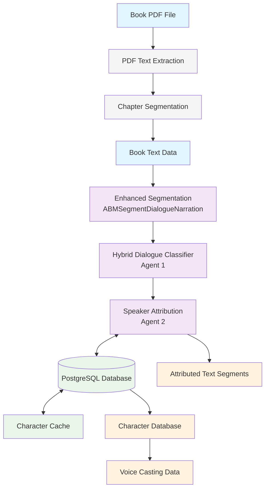
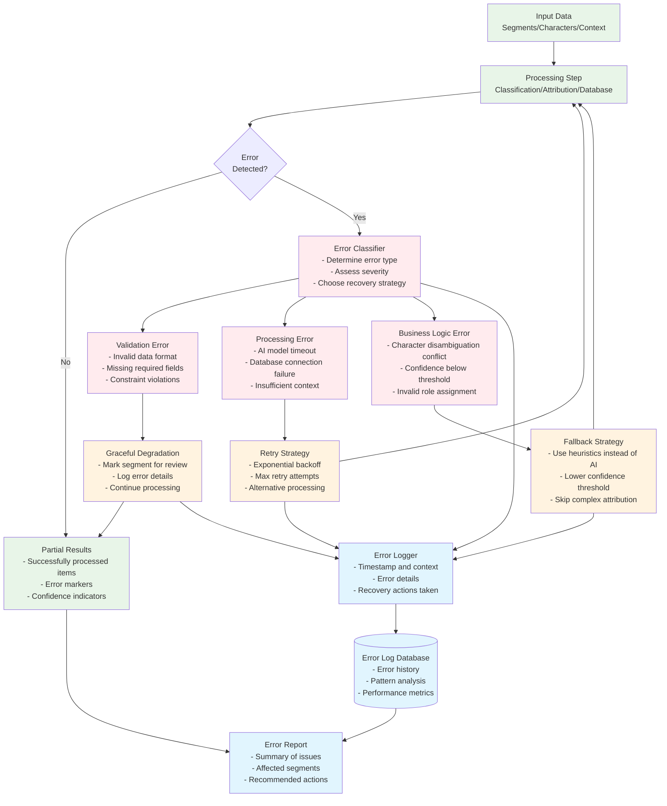
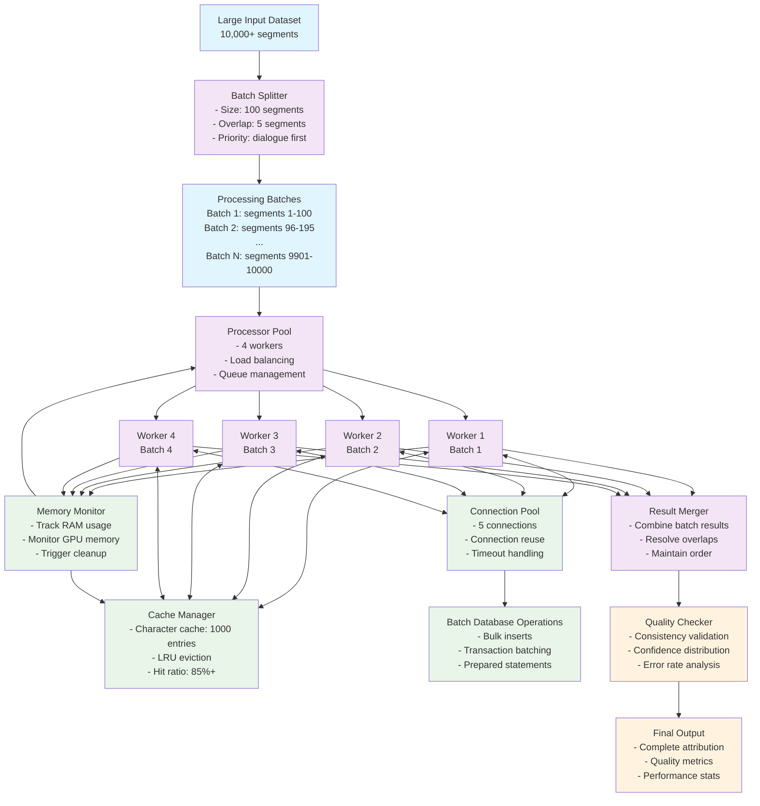

# \[DEPRECATED\] Two-Agent System Data Flow Diagrams

> Deprecated terminology. Refer to the spans-first two-stage data flow. This document is preserved for historical context only.

## High-Level Data Flow Overview



## Detailed Data Processing Flow

### Segmentation Phase Data Flow

```mermaid
flowchart TD
    %% Input
    ChapterData[Chapter Text Data<br/>- title: string<br/>- content: string<br/>- metadata: dict]

    %% Segmentation Process
    TextParser[Text Parser<br/>- Split by blank lines<br/>- Clean whitespace<br/>- Detect encoding]

    SegmentBuilder[Segment Builder<br/>- Generate unique IDs<br/>- Calculate statistics<br/>- Add metadata]

    QualityFilter[Quality Filter<br/>- Remove empty segments<br/>- Validate text structure<br/>- Flag potential issues]

    %% Output Structure
    SegmentedData[Segmented Data<br/>segments: List[Segment]]

    %% Segment Structure Detail
    SegmentStruct[Segment Structure:<br/>- id: string<br/>- text: string<br/>- chapter_id: int<br/>- position: int<br/>- word_count: int<br/>- has_quotes: bool<br/>- metadata: dict]

    %% Flow
    ChapterData --> TextParser
    TextParser --> SegmentBuilder
    SegmentBuilder --> QualityFilter
    QualityFilter --> SegmentedData
    SegmentedData --> SegmentStruct

    %% Metadata Flow
    MetadataEnrich[Metadata Enrichment<br/>- Estimate complexity<br/>- Detect paragraph type<br/>- Calculate processing hints]

    SegmentBuilder --> MetadataEnrich
    MetadataEnrich --> QualityFilter
```

### Classification Phase Data Flow

```mermaid
flowchart TB
    %% Input
    SegmentedData[Segmented Data<br/>List[Segment]]

    %% Context Building
    ContextBuilder[Context Window Builder<br/>- Build 5-segment windows<br/>- Extract previous/following context<br/>- Optimize token usage]

    ContextWindows[Context Windows<br/>- target_segment: Segment<br/>- context_before: List[Segment]<br/>- context_after: List[Segment]<br/>- estimated_tokens: int]

    %% Dual Classification Path
    HeuristicPath[Heuristic Classification Path]
    AIPath[AI Classification Path]

    %% Heuristic Processing
    PatternMatcher[Pattern Matcher<br/>- Quote analysis<br/>- Dialogue tags<br/>- Narrative indicators]

    HeuristicResult[Heuristic Result<br/>- classification: string<br/>- confidence: float<br/>- method: "heuristic"<br/>- reasoning: string]

    %% AI Processing  
    PromptBuilder[Prompt Builder<br/>- Format context<br/>- Add examples<br/>- Set parameters]

    AIModel[AI Model<br/>- Claude-3-Sonnet<br/>- Batch processing<br/>- Timeout handling]

    AIResult[AI Result<br/>- classification: string<br/>- confidence: float<br/>- method: "ai"<br/>- reasoning: string]

    %% Decision Logic
    ConfidenceCheck{Heuristic<br/>Confidence >= 0.85?}
    ResultMerger[Result Merger<br/>- Combine results<br/>- Select best classification<br/>- Update confidence]

    %% Final Output
    ClassifiedSegments[Classified Segments<br/>- segment_id: string<br/>- classification: string<br/>- confidence: float<br/>- dialogue_portions: list<br/>- metadata: dict]

    %% Data Flow
    SegmentedData --> ContextBuilder
    ContextBuilder --> ContextWindows
    ContextWindows --> HeuristicPath
    ContextWindows --> AIPath

    %% Heuristic Path
    HeuristicPath --> PatternMatcher
    PatternMatcher --> HeuristicResult
    HeuristicResult --> ConfidenceCheck

    %% AI Path
    AIPath --> PromptBuilder
    PromptBuilder --> AIModel
    AIModel --> AIResult

    %% Decision Flow
    ConfidenceCheck -->|Yes| ClassifiedSegments
    ConfidenceCheck -->|No| ResultMerger
    AIResult --> ResultMerger
    ResultMerger --> ClassifiedSegments

    %% Styling
    classDef input fill:#e1f5fe
    classDef process fill:#f3e5f5
    classDef decision fill:#fff3e0
    classDef output fill:#e8f5e8

    class SegmentedData,ContextWindows input
    class ContextBuilder,PatternMatcher,PromptBuilder,AIModel,ResultMerger process
    class ConfidenceCheck decision
    class HeuristicResult,AIResult,ClassifiedSegments output
```

### Speaker Attribution Data Flow

```mermaid
flowchart TB
    %% Input
    ClassifiedSegments[Classified Segments<br/>dialogue/narration tagged]
    DBConfig[Database Configuration<br/>connection strings, credentials]

    %% Database Connection
    DBManager[Character Database Manager<br/>- Connection pooling<br/>- Character cache<br/>- Query optimization]

    CharacterCache[Character Cache<br/>- In-memory character data<br/>- Alias lookups<br/>- Performance optimization]

    %% Processing Paths
    DialogueProcessor[Dialogue Segment Processor]
    NarrationProcessor[Narration Segment Processor]

    %% Name Extraction
    NameExtractor[Name Extractor<br/>- NER patterns<br/>- Context analysis<br/>- Confidence scoring]

    ExtractedNames[Extracted Names<br/>- name: string<br/>- confidence: float<br/>- context: string<br/>- position: int]

    %% Character Resolution
    CharacterResolver[Character Resolver<br/>- Database lookup<br/>- Alias matching<br/>- New character detection]

    ResolvedChars[Resolved Characters<br/>- character_id: int<br/>- name: string<br/>- confidence: float<br/>- is_new: bool]

    %% Role Analysis
    RoleAnalyzer[Role Analyzer<br/>- Speaker identification<br/>- Addressee detection<br/>- Context validation]

    RoleAssignments[Role Assignments<br/>- character_id: int<br/>- role: string<br/>- confidence: float<br/>- evidence: string]

    %% Database Operations
    NewCharCreator[New Character Creator<br/>- Character profile initialization<br/>- Alias setup<br/>- Database insertion]

    AssociationCreator[Association Creator<br/>- Link text to characters<br/>- Store context<br/>- Record confidence]

    ProfileUpdater[Profile Updater<br/>- Speech patterns<br/>- Dialogue statistics<br/>- Scene presence]

    %% Output
    AttributedSegments[Attributed Segments<br/>- segment_id: string<br/>- speaker_id: int<br/>- addressee_ids: List[int]<br/>- confidence: float]

    CharacterUpdates[Character Updates<br/>- new_characters: List[Character]<br/>- updated_profiles: List[ProfileUpdate]<br/>- statistics: Dict]

    %% Main Flow
    ClassifiedSegments --> DialogueProcessor
    ClassifiedSegments --> NarrationProcessor
    DBConfig --> DBManager
    DBManager <--> CharacterCache

    %% Dialogue Processing Path
    DialogueProcessor --> NameExtractor
    NameExtractor --> ExtractedNames
    ExtractedNames --> CharacterResolver
    CharacterResolver <--> DBManager
    CharacterResolver --> ResolvedChars
    ResolvedChars --> RoleAnalyzer
    RoleAnalyzer --> RoleAssignments

    %% Database Updates
    ResolvedChars --> NewCharCreator
    NewCharCreator --> DBManager
    RoleAssignments --> AssociationCreator
    AssociationCreator --> DBManager
    RoleAssignments --> ProfileUpdater
    ProfileUpdater --> DBManager

    %% Output Generation
    RoleAssignments --> AttributedSegments
    NewCharCreator --> CharacterUpdates
    ProfileUpdater --> CharacterUpdates

    %% Narration Processing (Simplified)
    NarrationProcessor --> NameExtractor

    %% Styling
    classDef input fill:#e1f5fe
    classDef processor fill:#f3e5f5
    classDef database fill:#e8f5e8
    classDef output fill:#fff3e0

    class ClassifiedSegments,DBConfig input
    class DialogueProcessor,NarrationProcessor,NameExtractor,CharacterResolver,RoleAnalyzer,NewCharCreator,AssociationCreator,ProfileUpdater processor
    class DBManager,CharacterCache database
    class AttributedSegments,CharacterUpdates,ExtractedNames,ResolvedChars,RoleAssignments output
```

## Database Data Flow

### Character Database Schema Data Flow

```mermaid
flowchart LR
    %% Input Data
    TextSegment[Text Segment<br/>- id: string<br/>- text: string<br/>- classification: string<br/>- confidence: float]

    CharacterNames[Character Names<br/>- extracted_names: List[string]<br/>- confidence_scores: List[float]<br/>- contexts: List[string]]

    %% Database Tables
    BooksTable[(books<br/>- id: serial<br/>- title: varchar<br/>- author: varchar<br/>- metadata: jsonb)]

    CharsTable[(characters<br/>- id: serial<br/>- book_id: int<br/>- name: varchar<br/>- canonical_name: varchar<br/>- profile: jsonb)]

    AliasTable[(character_aliases<br/>- id: serial<br/>- character_id: int<br/>- alias_name: varchar<br/>- confidence: float)]

    AssocTable[(character_text_associations<br/>- id: serial<br/>- character_id: int<br/>- utterance_id: varchar<br/>- relationship: varchar<br/>- confidence: float)]

    %% Data Processing
    CharacterLookup[Character Lookup<br/>- Search by name<br/>- Check aliases<br/>- Return matches]

    NewCharacter[New Character Creation<br/>- Generate character record<br/>- Initialize profile<br/>- Create aliases]

    AssociationCreation[Association Creation<br/>- Link character to text<br/>- Store context<br/>- Record confidence]

    ProfileUpdate[Profile Update<br/>- Update speech patterns<br/>- Increment counters<br/>- Store dialogue stats]

    %% Flow
    TextSegment --> CharacterLookup
    CharacterNames --> CharacterLookup

    CharacterLookup --> BooksTable
    CharacterLookup --> CharsTable
    CharacterLookup --> AliasTable

    CharacterNames --> NewCharacter
    NewCharacter --> CharsTable
    NewCharacter --> AliasTable

    TextSegment --> AssociationCreation
    CharsTable --> AssociationCreation
    AssociationCreation --> AssocTable

    AssocTable --> ProfileUpdate
    ProfileUpdate --> CharsTable

    %% Query Patterns
    QueryCache[Query Result Cache<br/>- Character lookups<br/>- Alias mappings<br/>- Recent associations]

    CharacterLookup <--> QueryCache
    ProfileUpdate --> QueryCache
```

### Character Profile Data Evolution

```mermaid
flowchart TB
    %% Initial State
    InitialChar[New Character<br/>- name: string<br/>- book_id: int<br/>- profile: empty JSONB]

    %% Profile Building Process
    FirstDialogue[First Dialogue Association<br/>- Text: "Hello there!"<br/>- Context: Chapter 1, Position 15<br/>- Role: speaker]

    ProfileInit[Profile Initialization<br/>- basic_info: {}<br/>- speech_patterns: {}<br/>- dialogue_statistics: {}<br/>- scene_presence: []]

    %% Continuous Updates
    MoreDialogue[Additional Dialogue<br/>- Multiple text segments<br/>- Various contexts<br/>- Different roles]

    PatternAnalysis[Pattern Analysis<br/>- Common phrases<br/>- Vocabulary level<br/>- Emotional range<br/>- Formality level]

    StatisticsUpdate[Statistics Update<br/>- Word count: +125<br/>- Segment count: +3<br/>- Avg words/segment: 41.7<br/>- Question ratio: 0.15]

    SceneTracking[Scene Presence<br/>- Chapter 1: segments [15, 23, 31]<br/>- Chapter 2: segments [4, 18]<br/>- Total chapters: 2]

    %% Advanced Analysis
    InteractionAnalysis[Interaction Analysis<br/>- Spoke to: [char_id: 2, char_id: 5]<br/>- Addressed by: [char_id: 1]<br/>- Mentioned: [char_id: 3]]

    VoiceHints[Voice Casting Hints<br/>- Age estimate: "young adult"<br/>- Gender: "female"<br/>- Accent: "none detected"<br/>- Formality: "informal"]

    %% Final Profile State
    CompleteProfile[Complete Character Profile<br/>- basic_info: populated<br/>- speech_patterns: detailed<br/>- dialogue_statistics: comprehensive<br/>- scene_presence: tracked<br/>- interactions: mapped<br/>- voice_casting_data: ready]

    %% Flow
    InitialChar --> FirstDialogue
    FirstDialogue --> ProfileInit
    ProfileInit --> MoreDialogue
    MoreDialogue --> PatternAnalysis
    MoreDialogue --> StatisticsUpdate
    MoreDialogue --> SceneTracking
    PatternAnalysis --> InteractionAnalysis
    StatisticsUpdate --> VoiceHints
    SceneTracking --> VoiceHints
    InteractionAnalysis --> CompleteProfile
    VoiceHints --> CompleteProfile

    %% Database Updates
    ProfileDB[(Profile JSONB in Database)]
    ProfileInit --> ProfileDB
    StatisticsUpdate --> ProfileDB
    PatternAnalysis --> ProfileDB
    SceneTracking --> ProfileDB
    InteractionAnalysis --> ProfileDB
    VoiceHints --> ProfileDB
    CompleteProfile --> ProfileDB
```

## Error Handling Data Flow

### Error Processing and Recovery



## Performance Optimization Data Flow

### Batch Processing and Caching



This comprehensive data flow documentation shows how data moves through the entire two-agent system, from initial text segmentation through final character attribution and database storage, including error handling and performance optimization strategies.
