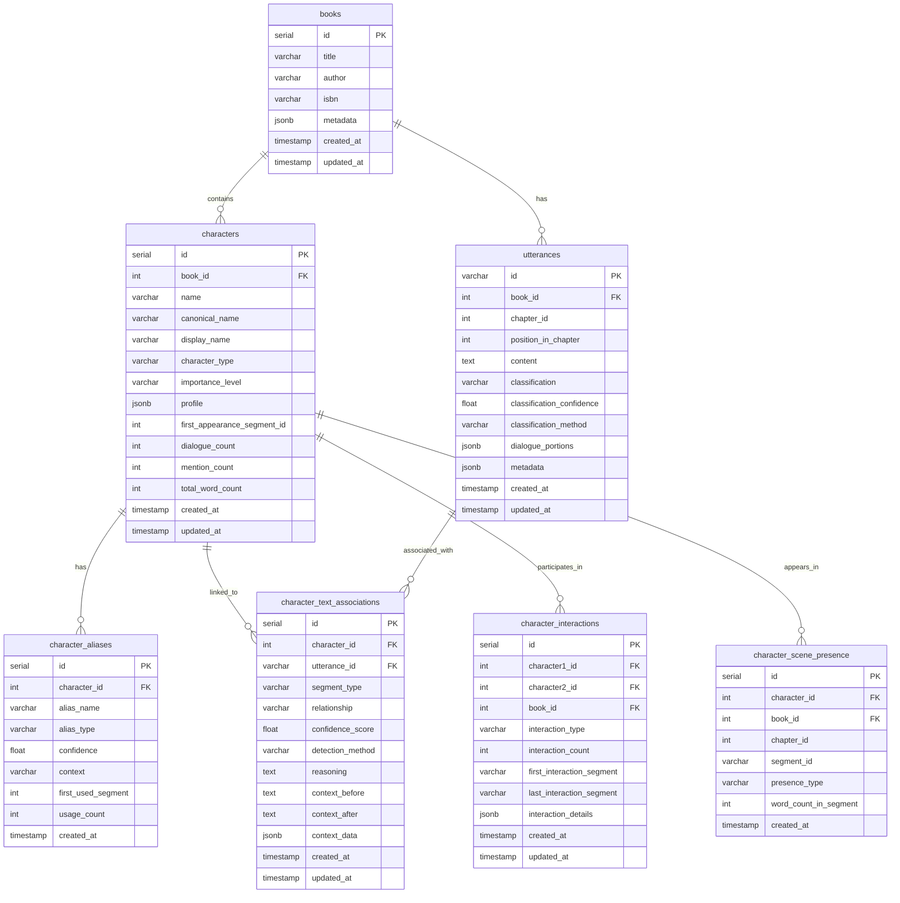
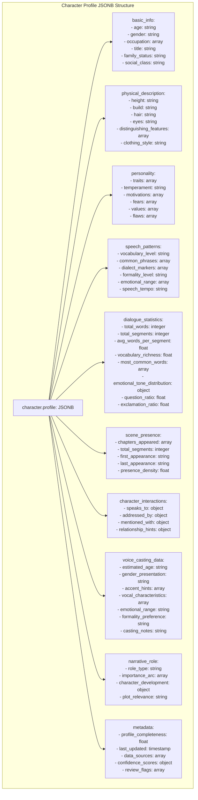
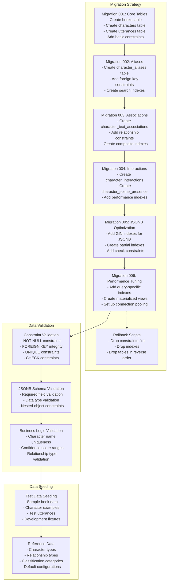
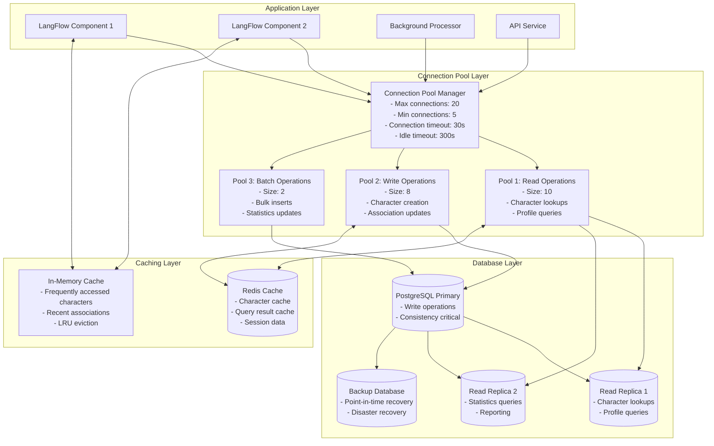

# [DEPRECATED] Two-Agent System Database Schema Diagrams

> Deprecated terminology and scope. Database-backed character tracking is not part of the current spans-first pipeline; this page remains for historical context only.

## Entity Relationship Diagram (ERD)



## Detailed Table Schema Diagrams

### Core Entity Tables

```mermaid
graph TB
    subgraph "Books Table"
        BooksTable[
            <b>books</b><br/>
            ────────────────<br/>
            🔑 id: SERIAL PRIMARY KEY<br/>
            📖 title: VARCHAR(500) NOT NULL<br/>
            ✍️ author: VARCHAR(200)<br/>
            📚 isbn: VARCHAR(20)<br/>
            🏷️ genre: VARCHAR(100)<br/>
            📄 total_pages: INTEGER<br/>
            📊 metadata: JSONB<br/>
            ⏰ created_at: TIMESTAMP DEFAULT NOW()<br/>
            🔄 updated_at: TIMESTAMP DEFAULT NOW()
        ]
    end

    subgraph "Characters Table"  
        CharsTable[
            <b>characters</b><br/>
            ────────────────<br/>
            🔑 id: SERIAL PRIMARY KEY<br/>
            📚 book_id: INTEGER NOT NULL → books(id)<br/>
            👤 name: VARCHAR(200) NOT NULL<br/>
            📝 canonical_name: VARCHAR(200)<br/>
            🎭 display_name: VARCHAR(200)<br/>
            🏷️ character_type: VARCHAR(50) DEFAULT 'person'<br/>
            ⭐ importance_level: VARCHAR(20) DEFAULT 'unknown'<br/>
            👥 profile: JSONB<br/>
            📍 first_appearance_segment_id: INTEGER<br/>
            💬 dialogue_count: INTEGER DEFAULT 0<br/>
            📣 mention_count: INTEGER DEFAULT 0<br/>
            📝 total_word_count: INTEGER DEFAULT 0<br/>
            ⏰ created_at: TIMESTAMP DEFAULT NOW()<br/>
            🔄 updated_at: TIMESTAMP DEFAULT NOW()
        ]
    end

    subgraph "Utterances Table"
        UtterTable[
            <b>utterances</b><br/>
            ────────────────<br/>
            🔑 id: VARCHAR(100) PRIMARY KEY<br/>
            📚 book_id: INTEGER NOT NULL → books(id)<br/>
            📖 chapter_id: INTEGER<br/>
            📍 position_in_chapter: INTEGER<br/>
            📝 content: TEXT NOT NULL<br/>
            🏷️ classification: VARCHAR(20)<br/>
            🎯 classification_confidence: FLOAT<br/>
            🔧 classification_method: VARCHAR(50)<br/>
            💬 dialogue_portions: JSONB<br/>
            📊 metadata: JSONB<br/>
            ⏰ created_at: TIMESTAMP DEFAULT NOW()<br/>
            🔄 updated_at: TIMESTAMP DEFAULT NOW()
        ]
    end

    BooksTable --> CharsTable
    BooksTable --> UtterTable
```

### Association and Relationship Tables

```mermaid
graph TB
    subgraph "Character Aliases Table"
        AliasTable[
            <b>character_aliases</b><br/>
            ────────────────<br/>
            🔑 id: SERIAL PRIMARY KEY<br/>
            👤 character_id: INTEGER NOT NULL → characters(id)<br/>
            📝 alias_name: VARCHAR(200) NOT NULL<br/>
            🏷️ alias_type: VARCHAR(50)<br/>
            🎯 confidence: FLOAT NOT NULL<br/>
            📝 context: TEXT<br/>
            📍 first_used_segment: INTEGER<br/>
            📊 usage_count: INTEGER DEFAULT 0<br/>
            ⏰ created_at: TIMESTAMP DEFAULT NOW()
        ]
    end

    subgraph "Character Text Associations Table"
        AssocTable[
            <b>character_text_associations</b><br/>
            ────────────────<br/>
            🔑 id: SERIAL PRIMARY KEY<br/>
            👤 character_id: INTEGER NOT NULL → characters(id)<br/>
            💬 utterance_id: VARCHAR(100) NOT NULL → utterances(id)<br/>
            📝 segment_type: VARCHAR(20)<br/>
            🔗 relationship: VARCHAR(50) NOT NULL<br/>
            🎯 confidence_score: FLOAT NOT NULL<br/>
            🔧 detection_method: VARCHAR(100)<br/>
            📝 reasoning: TEXT<br/>
            📖 context_before: TEXT<br/>
            📖 context_after: TEXT<br/>
            📊 context_data: JSONB<br/>
            ⏰ created_at: TIMESTAMP DEFAULT NOW()<br/>
            🔄 updated_at: TIMESTAMP DEFAULT NOW()
        ]
    end

    subgraph "Character Interactions Table"
        InteractTable[
            <b>character_interactions</b><br/>
            ────────────────<br/>
            🔑 id: SERIAL PRIMARY KEY<br/>
            👤 character1_id: INTEGER NOT NULL → characters(id)<br/>
            👥 character2_id: INTEGER NOT NULL → characters(id)<br/>
            📚 book_id: INTEGER NOT NULL → books(id)<br/>
            🏷️ interaction_type: VARCHAR(50)<br/>
            📊 interaction_count: INTEGER DEFAULT 1<br/>
            📍 first_interaction_segment: VARCHAR(100)<br/>
            📍 last_interaction_segment: VARCHAR(100)<br/>
            📊 interaction_details: JSONB<br/>
            ⏰ created_at: TIMESTAMP DEFAULT NOW()<br/>
            🔄 updated_at: TIMESTAMP DEFAULT NOW()
        ]
    end

    subgraph "Character Scene Presence Table"
        PresenceTable[
            <b>character_scene_presence</b><br/>
            ────────────────<br/>
            🔑 id: SERIAL PRIMARY KEY<br/>
            👤 character_id: INTEGER NOT NULL → characters(id)<br/>
            📚 book_id: INTEGER NOT NULL → books(id)<br/>
            📖 chapter_id: INTEGER<br/>
            📍 segment_id: VARCHAR(100)<br/>
            👁️ presence_type: VARCHAR(20)<br/>
            📊 word_count_in_segment: INTEGER<br/>
            ⏰ created_at: TIMESTAMP DEFAULT NOW()
        ]
    end
```

## Database Indexes and Performance Schema

```mermaid
graph TD
    subgraph "Primary Indexes"
        PK1[books.id - PRIMARY KEY]
        PK2[characters.id - PRIMARY KEY]
        PK3[utterances.id - PRIMARY KEY]
        PK4[character_aliases.id - PRIMARY KEY]
        PK5[character_text_associations.id - PRIMARY KEY]
    end

    subgraph "Foreign Key Indexes"
        FK1[characters.book_id - INDEX]
        FK2[utterances.book_id - INDEX]
        FK3[character_aliases.character_id - INDEX]
        FK4[character_text_associations.character_id - INDEX]
        FK5[character_text_associations.utterance_id - INDEX]
    end

    subgraph "Search and Query Indexes"
        SI1[characters.name - INDEX]
        SI2[characters.canonical_name - INDEX]
        SI3[character_aliases.alias_name - INDEX]
        SI4[utterances.classification - INDEX]
        SI5[character_text_associations.relationship - INDEX]
        SI6[character_text_associations.confidence_score - INDEX]
    end

    subgraph "Composite Indexes"
        CI1[characters(book_id, name) - UNIQUE]
        CI2[character_aliases(character_id, alias_name) - UNIQUE]
        CI3[utterances(book_id, chapter_id, position_in_chapter) - INDEX]
        CI4[character_text_associations(character_id, relationship) - INDEX]
        CI5[character_interactions(character1_id, character2_id) - UNIQUE]
    end

    subgraph "JSONB Indexes"
        JI1[characters.profile - GIN INDEX]
        JI2[utterances.metadata - GIN INDEX]
        JI3[utterances.dialogue_portions - GIN INDEX]
        JI4[character_text_associations.context_data - GIN INDEX]
    end

    subgraph "Performance Monitoring"
        PM1[Query Execution Stats]
        PM2[Index Usage Statistics]
        PM3[Table Size Monitoring]
        PM4[Connection Pool Metrics]
    end
```

## Character Profile JSONB Schema



## Database Migration Schema



## Database Connection and Pooling Architecture



## Query Performance Analysis Schema

```mermaid
graph TD
    subgraph "Common Query Patterns"
        Q1[Character Lookup by Name<br/>SELECT * FROM characters c<br/>LEFT JOIN character_aliases a<br/>WHERE c.name = ? OR a.alias_name = ?<br/>Index: characters_name_idx, aliases_name_idx]

        Q2[Find Character Associations<br/>SELECT c.*, cta.*<br/>FROM characters c<br/>JOIN character_text_associations cta<br/>WHERE cta.utterance_id = ?<br/>Index: assoc_utterance_idx]

        Q3[Character Profile Query<br/>SELECT profile FROM characters<br/>WHERE id = ?<br/>JSONB operations on profile data<br/>Index: characters_pkey, profile_gin_idx]

        Q4[Batch Association Insert<br/>INSERT INTO character_text_associations<br/>(character_id, utterance_id, relationship, ...)<br/>VALUES (?, ?, ?, ...), ...<br/>Batch size: 100-500 records]

        Q5[Character Statistics<br/>SELECT character_id, COUNT(*), AVG(confidence_score)<br/>FROM character_text_associations<br/>GROUP BY character_id<br/>Index: assoc_char_conf_idx]
    end

    subgraph "Performance Metrics"
        P1[Query Execution Time<br/>- Target: < 50ms for lookups<br/>- Target: < 200ms for complex joins<br/>- Target: < 1s for statistics]

        P2[Index Usage Statistics<br/>- Index hit ratio: > 95%<br/>- Sequential scan ratio: < 5%<br/>- Index cache efficiency: > 90%]

        P3[Connection Pool Metrics<br/>- Active connections: monitored<br/>- Wait time: < 10ms<br/>- Connection lifetime: optimized]

        P4[JSONB Performance<br/>- GIN index usage: monitored<br/>- Query optimization: enabled<br/>- Profile query time: < 100ms]
    end

    subgraph "Optimization Strategies"
        O1[Query Optimization<br/>- Prepared statements<br/>- Query plan analysis<br/>- Index hint usage<br/>- Batch operations]

        O2[Index Strategy<br/>- Composite indexes for common queries<br/>- Partial indexes for filtered data<br/>- GIN indexes for JSONB<br/>- Regular index maintenance]

        O3[Caching Strategy<br/>- Character profile caching<br/>- Query result caching<br/>- Application-level caching<br/>- Cache invalidation strategy]

        O4[Hardware Optimization<br/>- SSD storage utilization<br/>- Memory allocation tuning<br/>- Connection pooling configuration<br/>- CPU core utilization]
    end

    Q1 --> P1
    Q2 --> P1
    Q3 --> P1
    Q4 --> P1
    Q5 --> P1

    P1 --> O1
    P2 --> O2
    P3 --> O1
    P4 --> O3

    O1 --> O4
    O2 --> O4
    O3 --> O4
```

This comprehensive database schema documentation provides detailed table structures, relationships, indexing strategies, and performance considerations for the two-agent dialogue classification and speaker attribution system's PostgreSQL database.
