# Stage 2: Speaker Attribution - Processing Flow

**Component**: ABMSpeakerAttribution\
**Purpose**: Identify speakers in dialogue and build character voice profiles\
**Status**: 🚧 In Development\
**Last Updated**: August 24, 2025

## Overview

The Stage 2 Speaker Attribution system processes dialogue utterances from Stage 1 to identify WHO is speaking and produce evidence-backed attributions. Profile building and character databases are optional future enhancements.

## Processing Flow Diagram

```mermaid
flowchart TD
    %% Input Stage
  INPUT["📝 INPUT STAGE<br/>From Stage 1:<br/>• classified_utterance<br/>• book_id, chapter_id<br/>• dialogue_text<br/>• context_before, context_after"]

    %% Validation Gate
    VALIDATION{"📋 Validation Gate<br/>Is dialogue?<br/>Has dialogue_text?"}
    SKIP["⏭️ Skip Processing<br/>Return with status: skipped"]

  %% Optional Character Memory (Future)
  DB_LOOKUP["🗃️ Optional Character Memory (Future)<br/>• Load chapter characters<br/>• Check character history<br/>• Get conversation context"]

    %% Attribution Analysis Stage
    ATTRIBUTION_ANALYSIS["🎭 ATTRIBUTION ANALYSIS<br/>Multi-Method Speaker Detection"]

    %% Direct Attribution Methods
    DIRECT_METHODS["📍 Direct Attribution<br/>• Explicit tags<br/>• Speaker phrases<br/>• Character titles"]

    %% Contextual Methods  
    CONTEXTUAL_METHODS["🔍 Contextual Analysis<br/>• Conversation flow<br/>• Character presence<br/>• Turn-taking analysis"]

    %% Name Extraction
    NAME_EXTRACTION["📝 Name Extraction<br/>• Extract character names<br/>• Handle name variations<br/>• Detect new characters"]

    %% Attribution Decision Logic
    ATTRIBUTION_DECISION{"🎯 Attribution Decision"}

    %% Direct Attribution Found
    DIRECT_FOUND["✅ Direct Attribution<br/>High confidence (0.9+)<br/>Method: direct"]

    %% Contextual Attribution  
    CONTEXTUAL_FOUND["🔍 Contextual Attribution<br/>Medium confidence (0.7+)<br/>Method: contextual"]

    %% Conversation Flow
    CONVERSATION_FLOW["💬 Conversation Flow<br/>Turn-taking analysis<br/>Method: inferred"]

  %% Low-Confidence Best Guess
  LOW_CONF_GUESS["❓ Low-Confidence Best Guess<br/>Best candidate + QA flag<br/>Confidence < 0.90"]

    %% Character Management
    CHAR_LOOKUP{"🔍 Character Lookup<br/>Known character?"}

    %% New Character Creation
    NEW_CHARACTER["🆕 Create New Character<br/>• Generate character_id<br/>• Set canonical name<br/>• Initialize profile"]

    %% Existing Character Update
    UPDATE_CHARACTER["🔄 Update Character<br/>• Add dialogue sample<br/>• Update profile data<br/>• Track patterns"]

    %% Profile Building
    PROFILE_BUILDER["📊 Profile Builder<br/>• Extract speech patterns<br/>• Analyze vocabulary<br/>• Build voice characteristics"]

    %% Speech Pattern Analysis
    SPEECH_PATTERNS["🗣️ Speech Pattern Analysis<br/>• Formality level detection<br/>• Common phrases<br/>• Emotional indicators"]

    %% Voice Characteristics
    VOICE_CHARS["🎵 Voice Characteristics<br/>• Estimated age/gender<br/>• Social class indicators<br/>• Personality traits"]

    %% Confidence Scoring
    CONFIDENCE_CALC["📈 Confidence Calculation<br/>Combined score from:<br/>• Attribution method<br/>• Context consistency"]

  %% Optional Persistence (Future)
  DB_UPDATES["💾 Optional Persistence (Future)<br/>• Insert/update utterances<br/>• Update character profiles<br/>• Log processing status"]

    %% Output Generation
    OUTPUT_GEN["📦 Output Generation<br/>• Attributed dialogue<br/>• Character metadata<br/>• Confidence metrics"]

    %% Final Output
    OUTPUT["📊 STRUCTURED OUTPUT<br/>• character_id, character_name<br/>• attribution_method, confidence<br/>• dialogue_text, speech_patterns<br/>• processing_metadata"]

    %% Error Handling
    ERROR_HANDLER["⚠️ Error Handler<br/>• Database errors<br/>• Attribution failures<br/>• Graceful degradation"]

    %% Flow Connections - Main Path
    INPUT --> VALIDATION
    VALIDATION -->|No| SKIP
    VALIDATION -->|Yes| DB_LOOKUP

    DB_LOOKUP --> ATTRIBUTION_ANALYSIS

    ATTRIBUTION_ANALYSIS --> DIRECT_METHODS
    ATTRIBUTION_ANALYSIS --> CONTEXTUAL_METHODS
    ATTRIBUTION_ANALYSIS --> NAME_EXTRACTION

    DIRECT_METHODS --> ATTRIBUTION_DECISION
    CONTEXTUAL_METHODS --> ATTRIBUTION_DECISION
    NAME_EXTRACTION --> ATTRIBUTION_DECISION

    %% Attribution Decision Branches
    ATTRIBUTION_DECISION -->|"Direct found"| DIRECT_FOUND
    ATTRIBUTION_DECISION -->|"Context clues"| CONTEXTUAL_FOUND
    ATTRIBUTION_DECISION -->|"Flow inference"| CONVERSATION_FLOW
  ATTRIBUTION_DECISION -->|"No clear speaker"| LOW_CONF_GUESS

    %% Character Management Flow
    DIRECT_FOUND --> CHAR_LOOKUP
    CONTEXTUAL_FOUND --> CHAR_LOOKUP
  CONVERSATION_FLOW --> CHAR_LOOKUP
  LOW_CONF_GUESS --> CHAR_LOOKUP

    CHAR_LOOKUP -->|"New"| NEW_CHARACTER
    CHAR_LOOKUP -->|"Existing"| UPDATE_CHARACTER

    NEW_CHARACTER --> PROFILE_BUILDER
    UPDATE_CHARACTER --> PROFILE_BUILDER

    %% Profile Building Flow
    PROFILE_BUILDER --> SPEECH_PATTERNS
    PROFILE_BUILDER --> VOICE_CHARS

    SPEECH_PATTERNS --> CONFIDENCE_CALC
    VOICE_CHARS --> CONFIDENCE_CALC

    CONFIDENCE_CALC --> DB_UPDATES
    DB_UPDATES --> OUTPUT_GEN
    OUTPUT_GEN --> OUTPUT

    %% Error Handling
    SKIP --> OUTPUT
    ATTRIBUTION_ANALYSIS -.->|"Error"| ERROR_HANDLER
    DB_LOOKUP -.->|"Error"| ERROR_HANDLER
    DB_UPDATES -.->|"Error"| ERROR_HANDLER
    ERROR_HANDLER --> OUTPUT

    %% Styling
    classDef inputNode fill:#e1f5fe,stroke:#01579b,stroke-width:2px
    classDef processNode fill:#f3e5f5,stroke:#4a148c,stroke-width:2px
    classDef decisionNode fill:#fff3e0,stroke:#e65100,stroke-width:2px
    classDef dbNode fill:#e8f5e8,stroke:#1b5e20,stroke-width:2px
    classDef outputNode fill:#fce4ec,stroke:#880e4f,stroke-width:2px
    classDef errorNode fill:#ffebee,stroke:#b71c1c,stroke-width:2px
    classDef characterNode fill:#f1f8e9,stroke:#33691e,stroke-width:2px

    class INPUT inputNode
    class ATTRIBUTION_ANALYSIS,DIRECT_METHODS,CONTEXTUAL_METHODS,NAME_EXTRACTION,OUTPUT_GEN,CONFIDENCE_CALC processNode
    class VALIDATION,ATTRIBUTION_DECISION,CHAR_LOOKUP decisionNode
    class DB_LOOKUP,DB_UPDATES dbNode
  class DIRECT_FOUND,CONTEXTUAL_FOUND,CONVERSATION_FLOW,LOW_CONF_GUESS,OUTPUT outputNode
    class SKIP,ERROR_HANDLER errorNode
    class NEW_CHARACTER,UPDATE_CHARACTER,PROFILE_BUILDER,SPEECH_PATTERNS,VOICE_CHARS characterNode
```



## Attribution Methods

### 📍 Direct Attribution (Highest Confidence: 0.9+)

**Explicit Dialogue Tags:**

```text
Examples:
• "Hello," John said.
• Mary replied, "How are you?"
• Dr. Smith announced, "The results are in."
```

**Speaker Identification Patterns:**

- Character names followed by speech verbs
- Pronoun + speech verb combinations
- Character titles and formal names
- Direct speaker indicators

### 🔍 Contextual Attribution (Medium Confidence: 0.7+)

**Conversation Flow Analysis:**

```text
Turn-taking patterns:
• Speaker A → Speaker B → Speaker A
• Consistent alternation tracking
• Scene character presence
```

**Contextual Clues:**

- Character mentioned in surrounding narration
- Actions attributed to characters before/after dialogue
- Scene setting and character presence
- Speech pattern consistency

### 💬 Conversation Flow Inference (Lower Confidence: 0.4-0.6)

**Turn-Taking Logic:**

```text
Pattern: "Hello," she said. "How are you?" "Fine, thanks."
Result:
• First: Identified speaker (she)
• Second: Inferred opposite speaker
• Third: Back to first speaker
```

### ❓ Low-Confidence Best-Guess Handling (Confidence < 0.90)

**Scenarios:**

- No attribution clues found
- Multiple possible speakers
- Unclear conversation context
- New character introduction

## Character Profile Building

### 🗣️ Speech Pattern Analysis

| Pattern Type    | Detection Method                         | Profile Update      |
| --------------- | ---------------------------------------- | ------------------- |
| Formality Level | Vocabulary analysis, sentence structure  | formal/casual/mixed |
| Common Phrases  | Frequency analysis of multi-word phrases | Top 10 phrases      |
| Dialect Markers | Regional language patterns               | Dialect tags        |
| Emotional Tone  | Sentiment analysis, exclamation usage    | Personality traits  |

### 🎵 Voice Characteristics Extraction

```mermaid
graph LR
    DIALOGUE[Dialogue Text] --> AGE[Age Indicators<br/>• Slang usage<br/>• Cultural references<br/>• Speech complexity]

    DIALOGUE --> GENDER[Gender Markers<br/>• Pronouns used<br/>• Cultural indicators<br/>• Name analysis]

    DIALOGUE --> SOCIAL[Social Class<br/>• Vocabulary level<br/>• Grammar patterns<br/>• Cultural knowledge]

    DIALOGUE --> REGION[Regional Markers<br/>• Dialect words<br/>• Accent indicators<br/>• Local references]

    AGE --> PROFILE[Character Profile]
    GENDER --> PROFILE
    SOCIAL --> PROFILE  
    REGION --> PROFILE

    classDef inputNode fill:#e1f5fe,stroke:#01579b,stroke-width:2px
    classDef processNode fill:#f3e5f5,stroke:#4a148c,stroke-width:2px
    classDef outputNode fill:#fce4ec,stroke:#880e4f,stroke-width:2px

    class DIALOGUE inputNode
    class AGE,GENDER,SOCIAL,REGION processNode
    class PROFILE outputNode
```



## Optional Database Integration (Future)

### Character Tables (Future)

1. **Characters Table**

   - Insert new characters
   - Update character profiles
   - Track first/last appearance

1. **Utterances Table**

   - Link utterances to characters
   - Store attribution confidence
   - Record attribution method

1. **Character_Text_Segments Table**

   - Store dialogue samples
   - Build speech pattern database
   - Enable voice characteristic analysis

## Example Processing Scenarios

### High-Confidence Direct Attribution

```text
Input: "I think we should leave," Sarah said quietly.
  ↓
Direct Method: Finds "Sarah said" → Direct attribution
  ↓
Character Lookup: Sarah exists in chapter characters
  ↓
Profile Update: Add dialogue sample, update speech patterns
  ↓
Output: character_id=42, confidence=0.95, method=direct
```

### Contextual Attribution

```text
Input: Sarah walked to the window. "It's getting dark."
  ↓
Contextual Method: Sarah mentioned just before dialogue
  ↓
Character Lookup: Sarah exists, recent context match
  ↓
Profile Update: Add contextual dialogue
  ↓
Output: character_id=42, confidence=0.8, method=contextual
```

### Conversation Flow Inference

```text
Previous: John said, "Where are you going?"
Current: "To the store."
  ↓
Flow Analysis: Response to John's question
  ↓
Inference: Previous non-John speaker or new participant
  ↓
Output: character_id=inferred, confidence=0.5, method=inferred
```

### New Character Detection

```text
Input: "Hello there," called a voice from the shadows.
  ↓
Name Extraction: No specific name found
  ↓
Character Lookup: No clear attribution
  ↓
New Character: Create provisional character (e.g., "Speaker #3")
  ↓
Output: character_id=best_candidate, confidence=0.62, method=best_guess, qa_flags=["MANDATORY_REVIEW_LLM"]
```

## Performance Characteristics

### Speed

- **Database Lookup**: ~5-10ms per query
- **Attribution Analysis**: ~10-20ms per utterance
- **Profile Updates**: ~5ms per character update
- **Total Processing**: ~20-35ms per dialogue utterance

### Accuracy Targets

- **Direct Attribution**: 95%+ accuracy
- **Contextual Attribution**: 80%+ accuracy
- **Flow Inference**: 60%+ accuracy
- **Overall System**: 85%+ accuracy across all methods

### Resource Usage

- **Memory**: ~100MB for character database cache
- **CPU**: Moderate for pattern matching and analysis
- **Database**: Read-heavy with periodic writes for updates

## Integration Points

### Input Sources

- Stage 1 (Dialogue Classifier) classified utterances
- Chapter processing workflows

### Output Destinations

- Voice casting profile generation
- Character relationship mapping
- TTS speaker assignment
- Quality assurance workflows

### Dependencies

- Stage 1 output format compatibility
- LangFlow runtime environment

## Configuration

### Environment Variables

- `CHARACTER_DB_URL`: Character database connection (optional; future)
- `ATTRIBUTION_CONFIDENCE_MIN`: Minimum confidence threshold (default: 0.3)
- `NEW_CHARACTER_THRESHOLD`: Threshold for creating new characters (default: 0.5)
- `PROFILE_UPDATE_BATCH_SIZE`: Database batch size (default: 100)

### Component Parameters

- `attribution_method`: "all" | "direct_only" | "contextual_only"
- `min_confidence`: Minimum confidence for attribution (0.0-1.0)
- `create_new_characters`: Enable/disable new character creation
- `update_profiles`: Enable/disable profile building

## Error Handling

### Graceful Degradation

1. **Database Unavailable**: Process in memory, queue for later persistence
1. **Attribution Failure**: Return best candidate with QA flag and error details
1. **Character Creation Error**: Log error, continue with temp character ID
1. **Profile Update Failure**: Continue processing, log for retry

### Logging

- Character attribution decisions at INFO level
- New character creation at INFO level
- Profile updates at DEBUG level
- Errors at ERROR level with full context and recovery actions

______________________________________________________________________

**Related Documentation**:

- [Stage 1 Dialogue Classifier Flow](agent-1-dialogue-classifier-flow.md)
