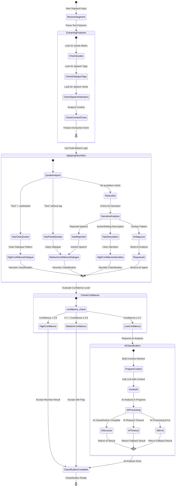
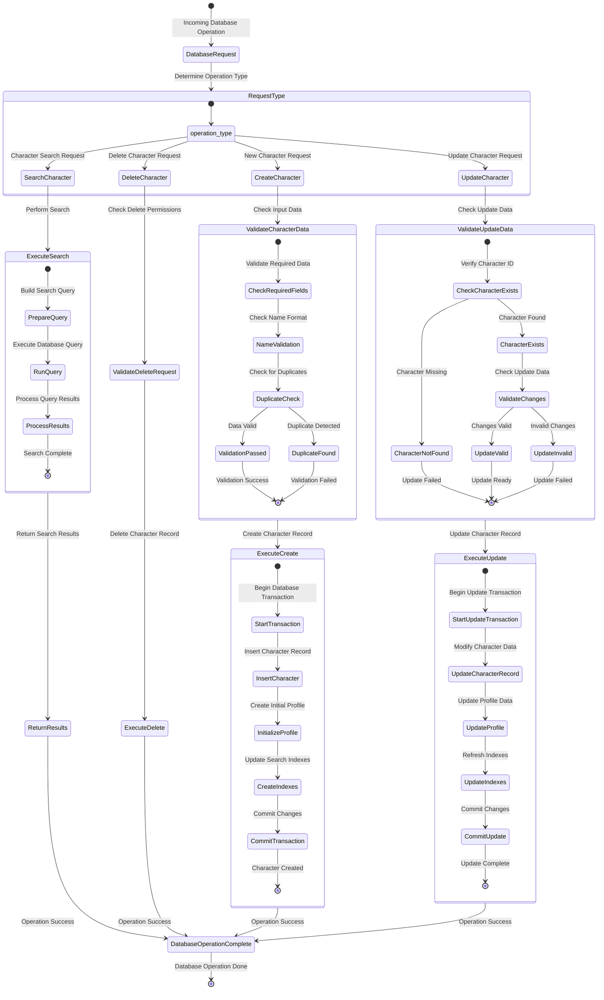
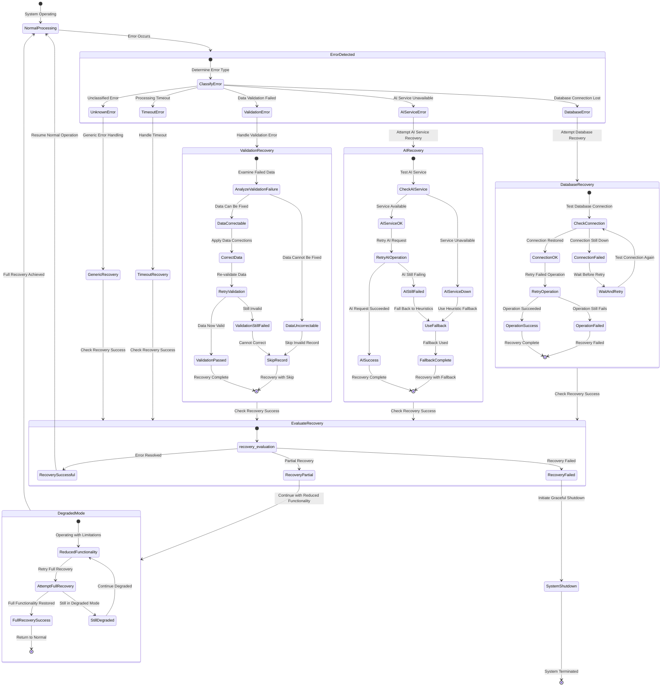

# Two-Agent System Finite State Machine Specifications

## Processing State Machine Overview

The two-agent system operates through a series of well-defined states that govern dialogue classification, speaker attribution, and character database management.

## Main Processing FSM

```mermaid
stateDiagram-v2
    [*] --> Initializing : Start Processing
    
    Initializing --> LoadingSegments : System Ready
    LoadingSegments --> SegmentReady : Segments Loaded
    LoadingSegments --> LoadError : Loading Failed
    
    LoadError --> [*] : Abort Processing
    
    SegmentReady --> BuildingContext : Create Context Window
    BuildingContext --> ContextReady : Window Built
    BuildingContext --> ContextError : Window Build Failed
    
    ContextError --> SegmentReady : Retry with Next Segment
    
    ContextReady --> ClassifyingDialogue : Begin Classification
    
    state ClassifyingDialogue {
        [*] --> HeuristicAnalysis
        
        HeuristicAnalysis --> ClearDialogue : Quote + Dialogue Tag
        HeuristicAnalysis --> ClearNarration : Descriptive Text
        HeuristicAnalysis --> RequiresAI : Ambiguous Pattern
        
        ClearDialogue --> [*] : Heuristic Result
        ClearNarration --> [*] : Heuristic Result
        
        RequiresAI --> AIProcessing : Context Analysis Needed
        AIProcessing --> AIComplete : AI Classification Done
        AIProcessing --> AIError : AI Processing Failed
        
        AIComplete --> [*] : AI Result
        AIError --> [*] : Fallback Result
    }
    
    ClassifyingDialogue --> DialogueClassified : Classification Complete
    
    DialogueClassified --> CheckDialogueType : Evaluate Result
    
    state CheckDialogueType {
        [*] --> choice_state
        choice_state --> DialogueDetected : Dialogue/Mixed
        choice_state --> NarrationDetected : Narration Only
    }
    
    DialogueDetected --> AttributingSpeaker : Speaker Attribution Needed
    NarrationDetected --> CollectingContext : Context Collection
    
    state AttributingSpeaker {
        [*] --> DatabaseLookup
        
        DatabaseLookup --> CharacterFound : Match in Database
        DatabaseLookup --> NoCharacterMatch : No Match Found
        
        CharacterFound --> AnalyzingRole : Determine Speaker/Addressee
        NoCharacterMatch --> CreatingCharacter : New Character Detected
        
        CreatingCharacter --> CharacterCreated : Character Record Created
        CharacterCreated --> AnalyzingRole : Proceed with Role Analysis
        
        AnalyzingRole --> SpeakerIdentified : Speaker Role Confirmed
        AnalyzingRole --> AddresseeIdentified : Addressee Role Confirmed
        AnalyzingRole --> AmbiguousRole : Role Unclear
        
        SpeakerIdentified --> [*] : Attribution Complete
        AddresseeIdentified --> [*] : Attribution Complete
        AmbiguousRole --> [*] : Store Multiple Options
    }
    
    state CollectingContext {
        [*] --> AnalyzingNarration
        
        AnalyzingNarration --> CharacterMentions : Characters Referenced
        AnalyzingNarration --> SceneDescription : Scene Context
        AnalyzingNarration --> ActionDescription : Character Actions
        
        CharacterMentions --> LinkingMentions : Associate with Characters
        SceneDescription --> StoringContext : Store Scene Data
        ActionDescription --> LinkingActions : Associate Actions
        
        LinkingMentions --> [*] : Mentions Linked
        StoringContext --> [*] : Context Stored
        LinkingActions --> [*] : Actions Linked
    }
    
    AttributingSpeaker --> UpdatingDatabase : Update Character Records
    CollectingContext --> UpdatingDatabase : Update Context Data
    
    state UpdatingDatabase {
        [*] --> UpdatingCharacterTable : Update Character Records
        UpdatingCharacterTable --> UpdatingTextSegments : Create Text Associations
        UpdatingTextSegments --> UpdatingUtterances : Update Utterance Records
        UpdatingUtterances --> UpdatingProfiles : Update Character Profiles
        UpdatingProfiles --> [*] : Database Update Complete
    }
    
    UpdatingDatabase --> ProcessingComplete : Segment Processing Done
    ProcessingComplete --> CheckMoreSegments : Check Processing Queue
    
    state CheckMoreSegments {
        [*] --> choice_more
        choice_more --> SegmentReady : More Segments Available
        choice_more --> AllComplete : No More Segments
    }
    
    AllComplete --> [*] : Processing Finished
```

## Dialogue Classification FSM Detail

## Speaker Attribution FSM Detail

```mermaid
stateDiagram-v2
    [*] --> ReceiveDialogue : Dialogue Segment Input
    
    ReceiveDialogue --> ExtractingNames : Parse Character Names
    
    state ExtractingNames {
        [*] --> TokenizeText : Split into Tokens
        TokenizeText --> IdentifyNames : Find Potential Names
        IdentifyNames --> NormalizeNames : Standardize Name Forms
        NormalizeNames --> [*] : Names Extracted
    }
    
    ExtractingNames --> DatabaseLookup : Query Character Database
    
    state DatabaseLookup {
        [*] --> ExactNameSearch : Search by Exact Name
        
        ExactNameSearch --> NameFound : Direct Match
        ExactNameSearch --> NoExactMatch : No Direct Match
        
        NoExactMatch --> AliasSearch : Search Aliases
        AliasSearch --> AliasFound : Alias Match
        AliasSearch --> NoAliasMatch : No Alias Match
        
        NoAliasMatch --> FuzzySearch : Fuzzy Name Matching
        FuzzySearch --> FuzzyFound : Similar Name Found
        FuzzySearch --> NoMatch : No Similar Names
        
        NameFound --> [*] : Character Located
        AliasFound --> [*] : Character Located
        FuzzyFound --> [*] : Character Located
        NoMatch --> [*] : No Character Found
    }
    
    DatabaseLookup --> EvaluateMatches : Process Search Results
    
    state EvaluateMatches {
        [*] --> match_evaluation
        match_evaluation --> SingleMatch : One Character Found
        match_evaluation --> MultipleMatches : Multiple Candidates
        match_evaluation --> NoMatches : No Character Found
    }
    
    SingleMatch --> AnalyzeRole : Determine Speaker Role
    MultipleMatches --> DisambiguateCharacters : Resolve Ambiguity
    NoMatches --> CreateNewCharacter : Add New Character
    
    state DisambiguateCharacters {
        [*] --> ContextAnalysis : Analyze Surrounding Context
        ContextAnalysis --> ScenePresence : Check Scene Context
        ScenePresence --> SelectBestMatch : Choose Most Likely
        SelectBestMatch --> [*] : Character Resolved
    }
    
    state CreateNewCharacter {
        [*] --> ExtractCharacterInfo : Gather Character Data
        ExtractCharacterInfo --> CreateRecord : Add to Database
        CreateRecord --> InitializeProfile : Set Up Profile
        InitializeProfile --> [*] : Character Created
    }
    
    DisambiguateCharacters --> AnalyzeRole : Character Resolved
    CreateNewCharacter --> AnalyzeRole : New Character Ready
    
    state AnalyzeRole {
        [*] --> ParseDialogueStructure : Analyze Text Structure
        
        ParseDialogueStructure --> IdentifySpeakerTags : Look for "said X"
        ParseDialogueStructure --> AnalyzeQuotePosition : Check Quote Placement
        ParseDialogueStructure --> ExamineAddressing : Look for "Hey X"
        
        IdentifySpeakerTags --> SpeakerTagFound : Tag Indicates Speaker
        IdentifySpeakerTags --> NoSpeakerTag : No Clear Tag
        
        AnalyzeQuotePosition --> NameAfterQuote : Name follows quote
        AnalyzeQuotePosition --> NameInQuote : Name within quote
        AnalyzeQuotePosition --> NameBeforeQuote : Name precedes quote
        
        ExamineAddressing --> DirectAddress : "Hey [Name]"
        ExamineAddressing --> NoDirectAddress : No Addressing Found
        
        SpeakerTagFound --> ConfirmSpeaker : High Confidence Speaker
        NameAfterQuote --> ConfirmSpeaker : Likely Speaker
        NameBeforeQuote --> ConfirmSpeaker : Possible Speaker
        
        NameInQuote --> ConfirmAddressee : Likely Addressee
        DirectAddress --> ConfirmAddressee : Clear Addressee
        
        NoSpeakerTag --> ContextualAnalysis : Need Context
        NoDirectAddress --> ContextualAnalysis : Need Context
        
        ContextualAnalysis --> InferFromContext : Use Conversation Flow
        InferFromContext --> ProbableSpeaker : Context Suggests Speaker
        InferFromContext --> ProbableAddressee : Context Suggests Addressee
        InferFromContext --> AmbiguousRole : Role Unclear
        
        ConfirmSpeaker --> [*] : Speaker Identified
        ConfirmAddressee --> [*] : Addressee Identified
        ProbableSpeaker --> [*] : Speaker Probable
        ProbableAddressee --> [*] : Addressee Probable
        AmbiguousRole --> [*] : Role Ambiguous
    }
    
    AnalyzeRole --> UpdateAssociations : Create Character-Text Links
    
    state UpdateAssociations {
        [*] --> CreateTextSegmentLink : Link Character to Text
        CreateTextSegmentLink --> UpdateCharacterStats : Update Statistics
        UpdateCharacterStats --> UpdateCharacterProfile : Enhance Profile
        UpdateCharacterProfile --> [*] : Associations Updated
    }
    
    UpdateAssociations --> [*] : Attribution Complete
```

## Character Database Management FSM

## Error Handling FSM

## State Transition Conditions

### Classification State Transitions

| From State | To State | Condition | Action |
|------------|----------|-----------|---------|
| SegmentReady | ClassifyingDialogue | Segment has text content | Initialize context window |
| HeuristicAnalysis | ClearDialogue | Quotes + dialogue tags detected | Set confidence > 0.9 |
| HeuristicAnalysis | RequiresAI | No clear patterns | Queue for AI processing |
| AIProcessing | AIComplete | LLM returns result | Store AI confidence score |
| DialogueClassified | AttributingSpeaker | Classification = dialogue/mixed | Extract character names |
| DialogueClassified | CollectingContext | Classification = narration | Analyze character mentions |

### Attribution State Transitions

| From State | To State | Condition | Action |
|------------|----------|-----------|---------|
| DatabaseLookup | CharacterFound | Exact/alias match found | Load character record |
| DatabaseLookup | NoCharacterMatch | No matches in database | Prepare character creation |
| AnalyzingRole | SpeakerIdentified | "said [Name]" pattern | Create speaker association |
| AnalyzingRole | AddresseeIdentified | "[Name]," within quotes | Create addressee association |
| AnalyzingRole | AmbiguousRole | Multiple role indicators | Store all possibilities |

### Database State Transitions

| From State | To State | Condition | Action |
|------------|----------|-----------|---------|
| ValidateCharacterData | ExecuteCreate | All validations pass | Begin database transaction |
| ValidateCharacterData | ValidationFailed | Required fields missing | Return validation errors |
| ExecuteCreate | DatabaseOperationComplete | Transaction commits successfully | Update indexes |
| ExecuteUpdate | DatabaseOperationComplete | Update transaction succeeds | Refresh character cache |

### Error Recovery Conditions

| Error Type | Recovery Action | Success Condition | Fallback Action |
|------------|----------------|-------------------|-----------------|
| Database Connection | Retry connection | Connection restored | Use local cache |
| AI Service Timeout | Retry with smaller batch | Response received | Use heuristic classification |
| Validation Failure | Correct data format | Data passes validation | Skip invalid record |
| Memory Exhaustion | Clear processing cache | Memory usage normal | Reduce batch size |

## Performance Considerations

### State Machine Optimization

1. **Batch State Transitions**: Group similar operations to reduce state machine overhead
2. **Parallel FSM Execution**: Run multiple FSMs concurrently for different segments
3. **State Caching**: Cache frequently accessed states to reduce computation
4. **Early Exit Conditions**: Implement fast paths for common scenarios

### Memory Management

1. **State Cleanup**: Ensure proper cleanup when exiting states
2. **Context Window Limits**: Restrict context window size to prevent memory bloat
3. **Profile Data Pruning**: Limit character profile data growth
4. **Error State Recovery**: Implement memory recovery in error states

This FSM specification provides comprehensive state management for the two-agent dialogue classification and speaker attribution system, ensuring robust and predictable operation under all conditions.
