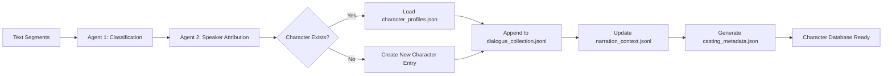
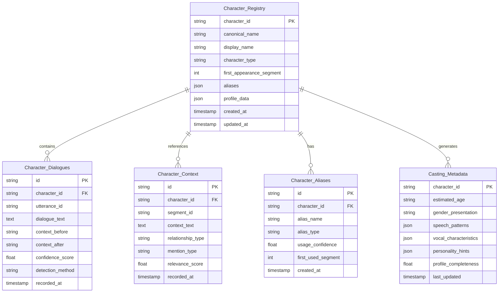
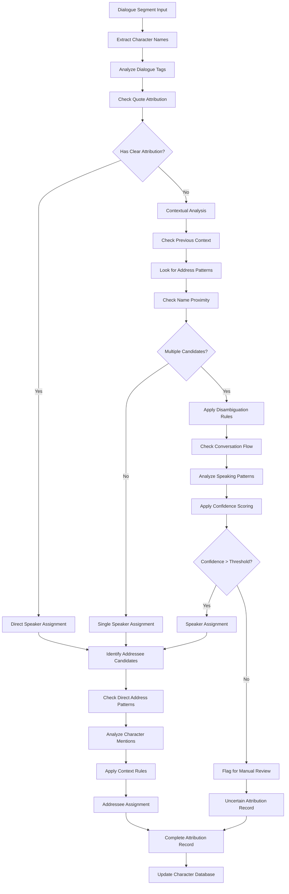
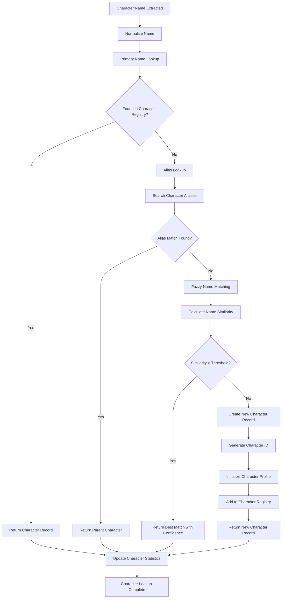
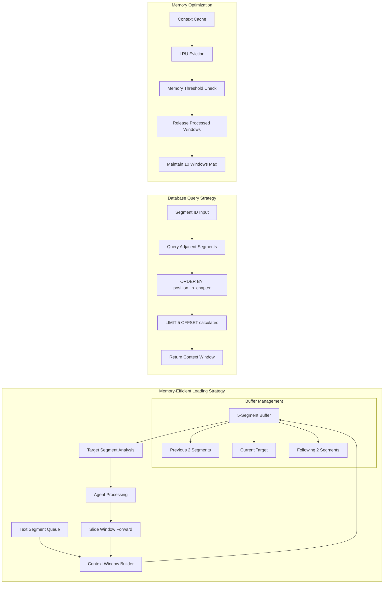
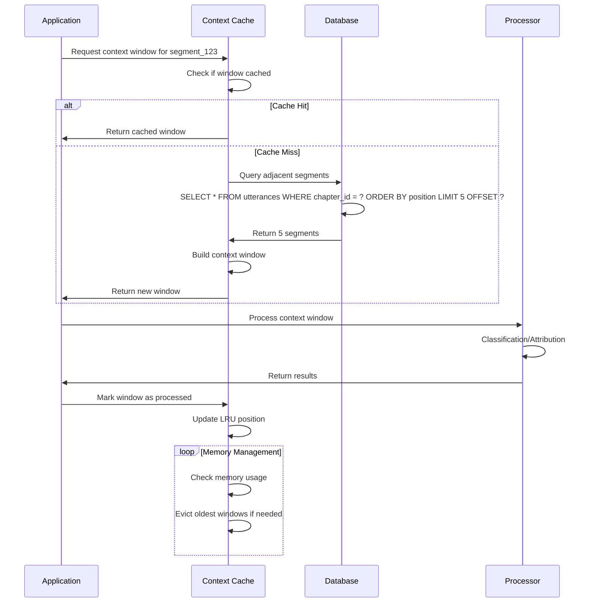
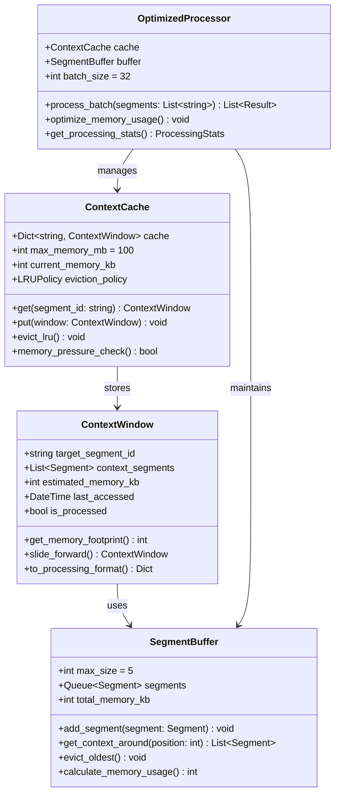
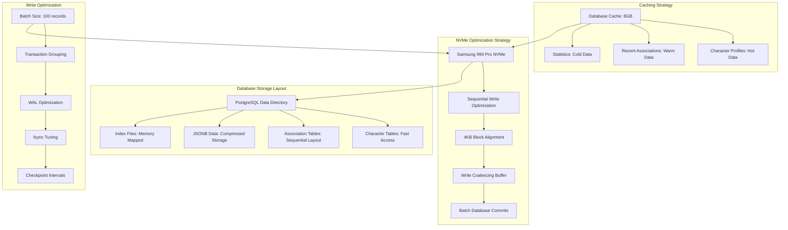
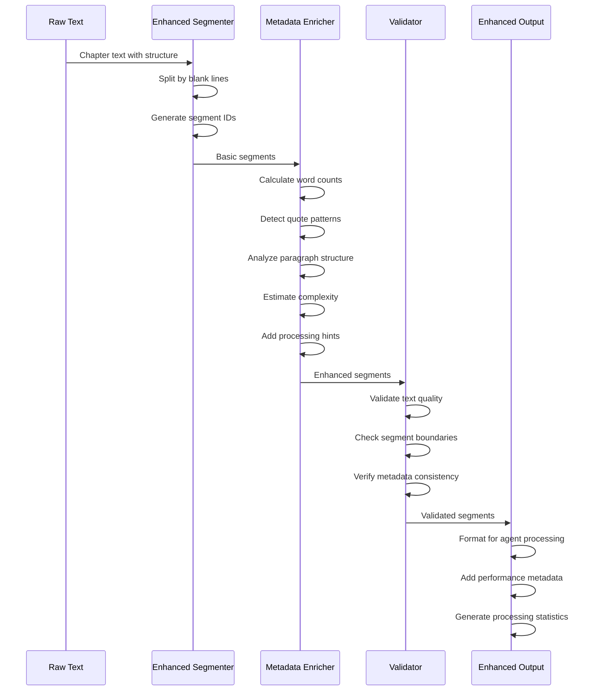

# [DEPRECATED] Supplementary Two-Agent System Diagrams

> Deprecated terminology. Retained as historical notes; not representative of the current spans-first two-stage implementation.

## Early Design Evolution Diagrams

This document captures specific diagrams and data models discussed during the design evolution of the two-agent system, including alternative approaches considered before the final PostgreSQL-based design.

## Proposed Character Data Model (File-Based Approach)

### Master Character Registry Structure

```mermaid
graph TB
    subgraph "File-Based Character Data Structure"
        A[data/characters/{book_id}/]
        A --> B[character_profiles.json]
        A --> C[dialogue_collection.jsonl]  
        A --> D[narration_context.jsonl]
        A --> E[casting_metadata.json]
    end

    subgraph "character_profiles.json Structure"
        B --> F[Character ID Mappings<br/>- canonical_name: string<br/>- display_name: string<br/>- aliases: array<br/>- character_type: string<br/>- first_appearance: string]
    end

    subgraph "dialogue_collection.jsonl Structure"
        C --> G[Per-Line Records<br/>- character_id: string<br/>- utterance_id: string<br/>- text: string<br/>- context_before: string<br/>- context_after: string<br/>- confidence: float]
    end

    subgraph "narration_context.jsonl Structure"
        D --> H[Context Records<br/>- character_id: string<br/>- segment_id: string<br/>- text: string<br/>- relationship: string<br/>- mention_type: string]
    end

    subgraph "casting_metadata.json Structure"
        E --> I[Voice Casting Data<br/>- character_id: string<br/>- estimated_age: string<br/>- gender_markers: array<br/>- speech_patterns: object<br/>- vocal_characteristics: array]
    end
```

### File-Based Data Flow



## Enhanced Agent 2: Speaker Attribution with DB Lookup

### Enhanced Character Database Schema (Early Design)



### Speaker vs Addressee Detection Logic



### Character Lookup Flow



## Data Loading Strategy for 5-Segment Context Windows

### Context Window Data Loading



### Database Query Strategy



### Memory-Efficient Data Structure



### Storage Optimization for Samsung 990 Pro



## Enhanced Segmentation Output Structure

### Segmentation Enhancement Metadata

```mermaid
graph TB
    subgraph "Enhanced Segment Structure"
        A[Base Segment] --> B[Metadata Enhancement]
        B --> C[Processing Hints]
        B --> D[Classification Preparation]
        B --> E[Context Markers]
        B --> F[Performance Metrics]
    end

    subgraph "Metadata Fields"
        G[segment_id: unique identifier]
        H[text: cleaned content]
        I[word_count: processing size]
        J[has_quotes: dialogue indicator]
        K[paragraph_type: structural hint]
        L[complexity_score: processing difficulty]
        M[context_importance: relevance weight]
        N[processing_priority: queue order]
    end

    B --> G
    B --> H
    B --> I
    B --> J
    B --> K
    B --> L
    B --> M
    B --> N

    subgraph "Enhanced Output Format"
        O[JSON Structure]
        P["segments": array of enhanced segments]
        Q["metadata": processing statistics]
        R["quality_indicators": validation results]
        S["optimization_hints": performance guidance]
    end

    A --> O
    O --> P
    O --> Q
    O --> R
    O --> S
```



### Processing Pipeline Enhancement



These diagrams capture the key design elements and data models discussed during our conversation evolution, showing both the file-based approach initially considered and the detailed processing flows that informed the final PostgreSQL-based design.
