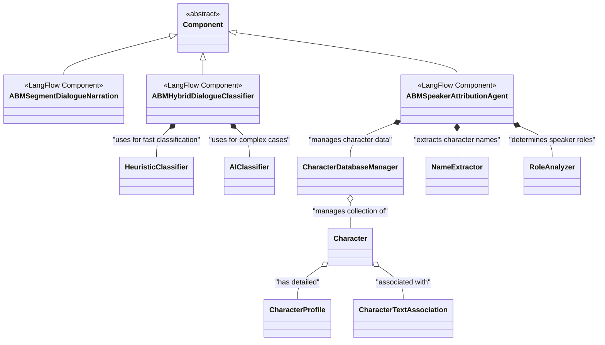

# \[DEPRECATED\] Two-Agent System UML Class Diagrams

> Deprecated terminology. Refer to spans-first two-stage UML where available;
> this page remains for historical context only.

## System Overview Class Diagram

```mermaid
classDiagram
    %% Core LangFlow Components
    class Component {
        <<abstract>>
        +display_name: String
        +description: String  
        +icon: String
        +name: String
        +inputs: List[Input]
        +outputs: List[Output]
        +status: String
        +build()* Data
    }
    
    %% Enhanced Segmentation Component
    class ABMSegmentDialogueNarration {
        +display_name: "Enhanced Segment Dialogue Narration"
        +description: "Advanced segmentation with metadata"
        +inputs: [DataInput chapters_data]
        +outputs: [Output segmented_data]
        -segment_id_counter: Integer
        +segment_chapters() Data
        -create_segment_metadata(text: String, position: Integer) Dict
        -generate_segment_id(chapter_id: Integer, position: Integer) String
        -estimate_processing_time(segments: List) Float
    }
    
    %% Agent 1: Hybrid Dialogue Classifier
    class ABMHybridDialogueClassifier {
        +display_name: "Hybrid Dialogue Classifier Agent"
        +description: "Two-stage dialogue classification with heuristics and AI"
        +inputs: [DataInput segmented_data, BoolInput use_ai_fallback, FloatInput confidence_threshold]
        +outputs: [Output classified_segments]
        -heuristic_rules: List[DialogueRule]
        -ai_model_config: Dict
        -context_window_size: Integer = 5
        +classify_segments() Data
        -apply_heuristic_classification(segment: Dict, context: List) ClassificationResult
        -apply_ai_classification(segment: Dict, context: List) ClassificationResult
        -build_context_window(segments: List, target_index: Integer) ContextWindow
        -should_use_ai(heuristic_result: ClassificationResult) Boolean
    }
    
    %% Agent 2: Speaker Attribution Agent  
    class ABMSpeakerAttributionAgent {
        +display_name: "Speaker Attribution Agent"
        +description: "Identifies speakers and manages character database"
        +inputs: [DataInput classified_segments, DataInput database_config]
        +outputs: [Output attributed_segments, Output character_updates]
        -db_manager: CharacterDatabaseManager
        -name_extractor: NameExtractor
        -role_analyzer: RoleAnalyzer
        +attribute_speakers() Data
        -extract_character_names(text: String) List[String]
        -lookup_characters(names: List, book_id: Integer) List[Character]
        -analyze_speaker_role(segment: Dict, characters: List) RoleAssignment
        -create_character_associations(segment: Dict, assignments: List) List[Association]
    }
    
    %% Character Database Manager
    class CharacterDatabaseManager {
        +connection_pool: ConnectionPool
        +cache: Dict[String, Character]
        +stats: DatabaseStats
        +connect(connection_string: String) Boolean
        +find_character(book_id: Integer, name: String) Optional[Character]
        +create_character(character_data: Dict) Character
        +update_character(character_id: Integer, updates: Dict) Boolean
        +create_text_association(character_id: Integer, segment_data: Dict) Boolean
        +update_character_profile(character_id: Integer, profile_updates: Dict) Boolean
        -normalize_name(name: String) String
        -search_aliases(book_id: Integer, name: String) List[Character]
        -execute_query(query: String, params: Dict) Any
    }
    
    %% Context Window Builder
    class ContextWindowBuilder {
        +window_size: Integer = 5
        +max_context_chars: Integer = 2000
        +build_window(segments: List, target_index: Integer) ContextWindow
        +extract_previous_context(segments: List, target_index: Integer, count: Integer) List[Segment]
        +extract_following_context(segments: List, target_index: Integer, count: Integer) List[Segment]
        -calculate_context_tokens(text: String) Integer
        -trim_context_to_limit(context: List, max_chars: Integer) List
    }
    
    %% Classification Engine Components
    class HeuristicClassifier {
        +dialogue_patterns: List[Pattern]
        +narration_patterns: List[Pattern]
        +confidence_threshold: Float = 0.85
        +classify(segment: Dict, context: List) ClassificationResult
        -check_dialogue_patterns(text: String) Float
        -check_narration_patterns(text: String) Float
        -analyze_quote_structure(text: String) QuoteAnalysis
        -check_dialogue_tags(text: String) List[DialogueTag]
    }
    
    class AIClassifier {
        +model_name: String
        +batch_size: Integer = 32
        +max_tokens: Integer = 1024
        +classify_batch(segments: List[ContextWindow]) List[ClassificationResult]
        +classify_single(segment: ContextWindow) ClassificationResult
        -prepare_prompt(segment: Dict, context: List) String
        -parse_ai_response(response: String) ClassificationResult
        -handle_ai_error(error: Exception) ClassificationResult
    }
    
    %% Character Management Components
    class Character {
        +id: Integer
        +book_id: Integer
        +name: String
        +canonical_name: String
        +display_name: String
        +character_type: String
        +aliases: List[Alias]
        +profile: CharacterProfile
        +first_appearance_segment_id: Optional[Integer]
        +dialogue_count: Integer = 0
        +mention_count: Integer = 0
        +created_at: DateTime
        +updated_at: DateTime
        +add_alias(name: String, alias_type: String, confidence: Float) Void
        +update_profile(updates: Dict) Void
        +get_profile_completeness() Float
        +to_dict() Dict
        +from_dict(data: Dict) Character
    }
    
    class CharacterProfile {
        +basic_info: BasicInfo
        +physical_description: PhysicalDescription
        +personality: Personality
        +speech_patterns: SpeechPatterns
        +dialogue_statistics: DialogueStatistics
        +scene_presence: ScenePresence
        +character_interactions: CharacterInteractions
        +voice_casting_data: VoiceCastingData
        +narrative_role: NarrativeRole
        +metadata: ProfileMetadata
        +update_dialogue_stats(word_count: Integer, emotional_tone: String) Void
        +add_scene_presence(chapter_id: Integer, segment_id: Integer) Void
        +record_interaction(other_character_id: Integer, interaction_type: String) Void
        +calculate_completeness() Float
    }
    
    class CharacterTextAssociation {
        +id: Integer
        +character_id: Integer
        +utterance_id: Integer
        +segment_type: String
        +relationship: String
        +context_before: String
        +context_after: String
        +confidence_score: Float
        +detection_method: String
        +reasoning: String
        +context_data: Dict
        +created_at: DateTime
        +validate() Boolean
        +to_dict() Dict
    }
    
    %% Analysis and Processing Components
    class NameExtractor {
        +named_entity_patterns: List[Pattern]
        +common_names: Set[String]
        +extract_names(text: String) List[ExtractedName]
        +normalize_name(name: String) String
        +filter_false_positives(names: List[ExtractedName], context: String) List[ExtractedName]
        -is_likely_name(token: String, context: String) Boolean
        -get_name_confidence(name: String, context: String) Float
    }
    
    class RoleAnalyzer {
        +dialogue_tag_patterns: List[Pattern]
        +addressing_patterns: List[Pattern]
        +analyze_role(segment: Dict, characters: List[Character]) List[RoleAssignment]
        +identify_speaker(text: String, characters: List[Character]) Optional[RoleAssignment]
        +identify_addressee(text: String, characters: List[Character]) Optional[RoleAssignment]
        -parse_dialogue_tags(text: String) List[DialogueTag]
        -find_addressing_patterns(text: String) List[AddressingPattern]
        -calculate_role_confidence(assignment: RoleAssignment, context: Dict) Float
    }
    
    %% Data Structure Classes
    class ContextWindow {
        +target_segment: Segment
        +context_before: List[Segment]
        +context_after: List[Segment]
        +window_metadata: Dict
        +estimated_tokens: Integer
        +build_prompt(template: String) String
        +get_character_context(character_name: String) List[Segment]
        +extract_conversation_flow() List[SpeakerTurn]
    }
    
    class Segment {
        +id: String
        +text: String
        +chapter_id: Integer
        +position_in_chapter: Integer
        +word_count: Integer
        +character_count: Integer
        +metadata: Dict
        +classification: Optional[String]
        +confidence: Optional[Float]
        +get_characters_mentioned() List[String]
        +has_quotes() Boolean
        +estimate_processing_time() Float
    }
    
    class ClassificationResult {
        +segment_id: String
        +classification: String
        +confidence: Float
        +method: String
        +reasoning: String
        +dialogue_portions: List[DialoguePortion]
        +metadata: Dict
        +created_at: DateTime
        +is_high_confidence() Boolean
        +requires_review() Boolean
    }
    
    class RoleAssignment {
        +character_id: Integer
        +character_name: String
        +role: String
        +confidence: Float
        +detection_method: String
        +text_evidence: String
        +context_support: List[String]
        +validate() Boolean
        +to_association() CharacterTextAssociation
    }
    
    %% Utility Classes
    class DialogueRule {
        +pattern: String
        +classification: String
        +weight: Float
        +requires_context: Boolean
        +apply(text: String, context: Optional[List]) RuleResult
        +get_confidence(match_result: Any) Float
    }
    
    class DatabaseStats {
        +total_characters: Integer
        +total_associations: Integer
        +average_confidence: Float
        +last_updated: DateTime
        +processing_errors: Integer
        +update_stats() Void
        +get_performance_metrics() Dict
    }
    
    class PerformanceMonitor {
        +processing_times: List[Float]
        +memory_usage: List[Integer]
        +gpu_utilization: List[Float]
        +error_count: Integer
        +start_monitoring() Void
        +stop_monitoring() Void
        +record_processing_time(duration: Float) Void
        +get_performance_report() Dict
        +should_throttle() Boolean
    }
    
    %% Relationships
    Component <|-- ABMSegmentDialogueNarration
    Component <|-- ABMHybridDialogueClassifier  
    Component <|-- ABMSpeakerAttributionAgent
    
    ABMHybridDialogueClassifier *-- HeuristicClassifier
    ABMHybridDialogueClassifier *-- AIClassifier
    ABMHybridDialogueClassifier *-- ContextWindowBuilder
    
    ABMSpeakerAttributionAgent *-- CharacterDatabaseManager
    ABMSpeakerAttributionAgent *-- NameExtractor
    ABMSpeakerAttributionAgent *-- RoleAnalyzer
    
    CharacterDatabaseManager *-- Character
    Character *-- CharacterProfile
    Character *-- CharacterTextAssociation
    
    ContextWindowBuilder --> ContextWindow
    ContextWindow *-- Segment
    
    HeuristicClassifier --> ClassificationResult
    AIClassifier --> ClassificationResult
    RoleAnalyzer --> RoleAssignment
    
    Character --> CharacterTextAssociation
    RoleAssignment --> CharacterTextAssociation
    
    ABMHybridDialogueClassifier --> PerformanceMonitor
    CharacterDatabaseManager --> DatabaseStats
```



## Detailed Component Class Diagrams

### Enhanced Segmentation Component

```mermaid
classDiagram
    class ABMSegmentDialogueNarration {
        +display_name: String = "Enhanced Segment Dialogue Narration"
        +description: String = "Advanced segmentation with metadata for two-agent processing"
        +icon: String = "message-square"
        +name: String = "abm_enhanced_segment_dialogue_narration"
        
        %% Inputs
        +chapters_data: DataInput
        
        %% Outputs  
        +segmented_data: Output
        
        %% Properties
        -segment_id_counter: Integer = 0
        -processing_stats: Dict = {}
        -segment_rules: List[SegmentRule] = []
        
        %% Methods
        +segment_chapters() Data
        +build() Data
        
        %% Private Methods
        -flush_segment(segments_list: List, buffer: List, metadata: Dict) Tuple[List, Dict]
        -create_segment_metadata(text: String, chapter_id: Integer, position: Integer) Dict
        -generate_segment_id(chapter_id: Integer, position: Integer) String
        -calculate_segment_stats(text: String) Dict
        -apply_text_filters(text: String) String
        -detect_paragraph_type(text: String) String
        -estimate_processing_complexity(text: String) Float
    }
    
    class SegmentRule {
        +name: String
        +pattern: String  
        +action: String
        +priority: Integer
        +apply(text: String) Boolean
        +get_metadata(match: Any) Dict
    }
    
    class SegmentMetadata {
        +segment_id: String
        +chapter_id: Integer
        +position_in_chapter: Integer
        +word_count: Integer
        +character_count: Integer
        +paragraph_count: Integer
        +has_quotes: Boolean
        +estimated_complexity: Float
        +paragraph_type: String
        +processing_hints: Dict
        +created_at: DateTime
        
        +to_dict() Dict
        +validate() Boolean
        +estimate_processing_time() Float
    }
    
    ABMSegmentDialogueNarration *-- SegmentRule
    ABMSegmentDialogueNarration --> SegmentMetadata
```

### Hybrid Dialogue Classifier Component

```mermaid
classDiagram
    class ABMHybridDialogueClassifier {
        +display_name: String = "Hybrid Dialogue Classifier Agent"
        +description: String = "Two-stage classification with heuristics and AI"
        +icon: String = "brain"
        +name: String = "abm_hybrid_dialogue_classifier"
        
        %% Inputs
        +segmented_data: DataInput
        +use_ai_fallback: BoolInput = True
        +confidence_threshold: FloatInput = 0.85
        +ai_batch_size: IntInput = 32
        
        %% Outputs
        +classified_segments: Output
        +classification_stats: Output
        
        %% Properties
        -heuristic_classifier: HeuristicClassifier
        -ai_classifier: AIClassifier
        -context_builder: ContextWindowBuilder
        -performance_monitor: PerformanceMonitor
        
        %% Configuration
        -context_window_size: Integer = 5
        -ai_model_config: Dict = {}
        -processing_batch_size: Integer = 100
        
        %% Methods
        +classify_segments() Data
        +build() Data
        
        %% Private Methods  
        -process_segment_batch(segments: List) List[ClassificationResult]
        -classify_single_segment(segment: Segment, context: ContextWindow) ClassificationResult
        -should_use_ai_classification(heuristic_result: ClassificationResult) Boolean
        -merge_classification_results(heuristic: ClassificationResult, ai: ClassificationResult) ClassificationResult
        -update_processing_stats(results: List[ClassificationResult]) Void
        -handle_classification_error(segment: Segment, error: Exception) ClassificationResult
    }
    
    class HeuristicClassifier {
        +dialogue_patterns: List[DialoguePattern]
        +narration_patterns: List[NarrationPattern]
        +mixed_content_patterns: List[MixedPattern]
        +confidence_threshold: Float = 0.85
        
        +classify(segment: Segment, context: ContextWindow) ClassificationResult
        +get_pattern_matches(text: String) List[PatternMatch]
        +calculate_confidence(matches: List[PatternMatch]) Float
        
        %% Private Methods
        -check_quote_structure(text: String) QuoteAnalysis
        -identify_dialogue_tags(text: String) List[DialogueTag]
        -analyze_sentence_structure(text: String) SentenceAnalysis
        -detect_narrative_indicators(text: String) List[NarrativeIndicator]
    }
    
    class AIClassifier {
        +model_name: String = "claude-3-sonnet"
        +batch_size: Integer = 32
        +max_tokens: Integer = 1024
        +temperature: Float = 0.1
        +timeout_seconds: Integer = 30
        
        +classify_batch(context_windows: List[ContextWindow]) List[ClassificationResult]
        +classify_single(context_window: ContextWindow) ClassificationResult
        
        %% Private Methods
        -prepare_classification_prompt(context_window: ContextWindow) String
        -parse_ai_response(response: String) ClassificationResult
        -handle_ai_timeout(context_window: ContextWindow) ClassificationResult
        -validate_ai_result(result: ClassificationResult) Boolean
    }
    
    ABMHybridDialogueClassifier *-- HeuristicClassifier
    ABMHybridDialogueClassifier *-- AIClassifier
    ABMHybridDialogueClassifier *-- ContextWindowBuilder
    ABMHybridDialogueClassifier *-- PerformanceMonitor
```

### Speaker Attribution Agent Component

```mermaid
classDiagram
    class ABMSpeakerAttributionAgent {
        +display_name: String = "Speaker Attribution Agent"
        +description: String = "Character identification and database management"
        +icon: String = "users"
        +name: String = "abm_speaker_attribution_agent"
        
        %% Inputs
        +classified_segments: DataInput
        +database_config: DataInput
        +character_confidence_threshold: FloatInput = 0.7
        
        %% Outputs
        +attributed_segments: Output
        +character_updates: Output
        +attribution_stats: Output
        
        %% Properties
        -db_manager: CharacterDatabaseManager
        -name_extractor: NameExtractor
        -role_analyzer: RoleAnalyzer
        -profile_builder: ProfileBuilder
        
        %% Configuration
        -max_new_characters_per_segment: Integer = 3
        -require_confirmation_for_new_characters: Boolean = False
        -enable_profile_auto_update: Boolean = True
        
        %% Methods
        +attribute_speakers() Data
        +build() Data
        
        %% Private Methods
        -process_dialogue_segments(segments: List[Segment]) List[AttributionResult]
        -process_narration_segments(segments: List[Segment]) List[ContextResult]
        -attribute_single_segment(segment: Segment) AttributionResult
        -extract_and_resolve_characters(segment: Segment) List[ResolvedCharacter]
        -create_character_associations(segment: Segment, characters: List[ResolvedCharacter]) List[CharacterTextAssociation]
        -update_character_profiles(associations: List[CharacterTextAssociation]) Void
    }
    
    class CharacterDatabaseManager {
        +connection_pool: ConnectionPool
        +character_cache: Dict[String, Character] = {}
        +alias_cache: Dict[String, List[Character]] = {}
        +stats: DatabaseStats
        
        %% Connection Management
        +connect(connection_string: String) Boolean
        +disconnect() Void
        +test_connection() Boolean
        
        %% Character Operations
        +find_character(book_id: Integer, name: String) Optional[Character]
        +find_characters_by_alias(book_id: Integer, alias: String) List[Character]
        +create_character(character_data: CharacterCreateData) Character
        +update_character(character_id: Integer, updates: Dict) Boolean
        +delete_character(character_id: Integer) Boolean
        
        %% Association Operations
        +create_text_association(association: CharacterTextAssociation) Boolean
        +update_character_profile(character_id: Integer, profile_updates: Dict) Boolean
        +get_character_associations(character_id: Integer) List[CharacterTextAssociation]
        
        %% Batch Operations
        +batch_create_associations(associations: List[CharacterTextAssociation]) List[Boolean]
        +batch_update_profiles(updates: List[Tuple[Integer, Dict]]) List[Boolean]
        
        %% Private Methods
        -normalize_character_name(name: String) String
        -build_character_query(filters: Dict) String
        -execute_query(query: String, params: Dict) Any
        -update_cache(character: Character) Void
        -invalidate_cache(character_id: Integer) Void
    }
    
    class NameExtractor {
        +named_entity_patterns: List[Pattern]
        +common_names_db: Set[String]
        +false_positive_filters: List[Pattern]
        +min_name_confidence: Float = 0.6
        
        +extract_names(text: String) List[ExtractedName]
        +extract_names_with_context(text: String, context: List[String]) List[ExtractedName]
        +validate_name_candidates(candidates: List[String], context: String) List[ExtractedName]
        
        %% Private Methods
        -tokenize_for_names(text: String) List[Token]
        -apply_name_patterns(tokens: List[Token]) List[NameMatch]
        -filter_false_positives(matches: List[NameMatch], context: String) List[NameMatch]
        -calculate_name_confidence(name: String, context: String) Float
        -is_likely_character_name(name: String, context: String) Boolean
    }
    
    class RoleAnalyzer {
        +dialogue_tag_patterns: List[Pattern]
        +addressing_patterns: List[Pattern]
        +contextual_clues: List[Pattern]
        +role_confidence_threshold: Float = 0.7
        
        +analyze_roles(segment: Segment, characters: List[Character]) List[RoleAssignment]
        +identify_speaker(text: String, characters: List[Character]) Optional[RoleAssignment]
        +identify_addressee(text: String, characters: List[Character]) Optional[RoleAssignment]
        +resolve_role_conflicts(assignments: List[RoleAssignment]) List[RoleAssignment]
        
        %% Private Methods
        -parse_dialogue_structure(text: String) DialogueStructure
        -find_speaker_indicators(text: String) List[SpeakerIndicator]
        -find_addressee_indicators(text: String) List[AddresseeIndicator]
        -calculate_role_confidence(assignment: RoleAssignment, context: Dict) Float
        -apply_contextual_rules(assignments: List[RoleAssignment], context: ContextWindow) List[RoleAssignment]
    }
    
    ABMSpeakerAttributionAgent *-- CharacterDatabaseManager
    ABMSpeakerAttributionAgent *-- NameExtractor
    ABMSpeakerAttributionAgent *-- RoleAnalyzer
```

### Character Management Classes

```mermaid
classDiagram
    class Character {
        %% Core Identity
        +id: Integer
        +book_id: Integer
        +name: String
        +canonical_name: String
        +display_name: Optional[String]
        
        %% Classification
        +character_type: String = "person"
        +importance_level: String = "unknown"
        
        %% Aliases and Names
        +aliases: List[Alias] = []
        
        %% Profile and Statistics
        +profile: CharacterProfile
        +first_appearance_segment_id: Optional[Integer]
        +dialogue_count: Integer = 0
        +mention_count: Integer = 0
        +total_word_count: Integer = 0
        
        %% Timestamps
        +created_at: DateTime
        +updated_at: DateTime
        
        %% Methods
        +add_alias(name: String, alias_type: String, confidence: Float) Void
        +remove_alias(name: String) Boolean
        +get_all_names() List[String]
        +update_profile(updates: Dict) Void
        +increment_dialogue_count(word_count: Integer) Void
        +increment_mention_count() Void
        +get_profile_completeness() Float
        +get_voice_casting_data() VoiceCastingData
        +to_dict() Dict
        +from_dict(data: Dict) Character
        +validate() Boolean
    }
    
    class Alias {
        +name: String
        +alias_type: String
        +confidence: Float
        +context: Optional[String]
        +first_used_segment: Optional[Integer]
        +usage_count: Integer = 0
        +created_at: DateTime
        
        +increment_usage() Void
        +update_confidence(new_confidence: Float) Void
        +is_high_confidence() Boolean
        +to_dict() Dict
    }
    
    class CharacterProfile {
        +basic_info: BasicInfo
        +physical_description: PhysicalDescription
        +personality: Personality
        +speech_patterns: SpeechPatterns
        +dialogue_statistics: DialogueStatistics
        +scene_presence: ScenePresence
        +character_interactions: CharacterInteractions
        +voice_casting_data: VoiceCastingData
        +narrative_role: NarrativeRole
        +metadata: ProfileMetadata
        
        %% Update Methods
        +update_basic_info(updates: Dict) Void
        +add_physical_trait(trait: String, confidence: Float) Void
        +add_personality_trait(trait: String, evidence: String) Void
        +update_speech_pattern(pattern: SpeechPattern) Void
        +record_dialogue_statistics(stats: DialogueStats) Void
        +add_scene_presence(chapter_id: Integer, segment_id: Integer) Void
        +record_character_interaction(other_id: Integer, interaction: Interaction) Void
        +update_voice_casting_hints(hints: Dict) Void
        +set_narrative_role(role: String, confidence: Float) Void
        
        %% Analysis Methods
        +calculate_completeness() Float
        +get_dominant_traits() List[String]
        +get_speech_style_summary() String
        +get_relationship_summary() Dict[Integer, String]
        +suggest_voice_characteristics() VoiceCharacteristics
        +to_dict() Dict
        +validate() Boolean
    }
    
    class CharacterTextAssociation {
        %% Identity
        +id: Integer
        +character_id: Integer
        +utterance_id: Integer
        
        %% Association Details
        +segment_type: String
        +relationship: String
        +confidence_score: Float
        +detection_method: String
        +reasoning: String
        
        %% Context
        +context_before: String
        +context_after: String
        +context_data: Dict
        
        %% Timestamps
        +created_at: DateTime
        +updated_at: DateTime
        
        %% Methods
        +validate() Boolean
        +is_high_confidence() Boolean
        +get_context_summary() String
        +update_confidence(new_score: Float, reason: String) Void
        +to_dict() Dict
        +from_dict(data: Dict) CharacterTextAssociation
    }
    
    %% Profile Component Classes
    class BasicInfo {
        +age: Optional[String]
        +gender: Optional[String]
        +occupation: List[String] = []
        +title: Optional[String]
        +family_status: Optional[String]
        +social_class: Optional[String]
        +update(field: String, value: Any, confidence: Float) Void
    }
    
    class SpeechPatterns {
        +vocabulary_level: String = "unknown"
        +common_phrases: List[String] = []
        +dialect_markers: List[String] = []
        +formality_level: String = "unknown"
        +emotional_range: List[String] = []
        +speech_tempo: String = "unknown"
        +add_phrase(phrase: String, frequency: Integer) Void
        +add_dialect_marker(marker: String, confidence: Float) Void
        +update_formality(level: String, evidence: String) Void
    }
    
    class DialogueStatistics {
        +total_words: Integer = 0
        +total_segments: Integer = 0
        +average_words_per_segment: Float = 0.0
        +vocabulary_richness: Float = 0.0
        +most_common_words: List[Tuple[String, Integer]] = []
        +emotional_tone_distribution: Dict[String, Integer] = {}
        +question_ratio: Float = 0.0
        +exclamation_ratio: Float = 0.0
        +update_statistics(segment_text: String, emotional_tone: String) Void
        +calculate_complexity_score() Float
    }
    
    Character *-- Alias
    Character *-- CharacterProfile
    CharacterProfile *-- BasicInfo
    CharacterProfile *-- SpeechPatterns  
    CharacterProfile *-- DialogueStatistics
    Character --> CharacterTextAssociation
```

### Processing Result Classes

```mermaid
classDiagram
    class ClassificationResult {
        %% Identity
        +segment_id: String
        +classification: String
        +confidence: Float
        +method: String
        
        %% Details
        +reasoning: String
        +dialogue_portions: List[DialoguePortion] = []
        +processing_time: Float
        +model_version: String
        
        %% Metadata
        +metadata: Dict = {}
        +created_at: DateTime
        
        %% Methods
        +is_high_confidence() Boolean
        +requires_review() Boolean
        +get_confidence_category() String
        +merge_with_ai_result(ai_result: ClassificationResult) ClassificationResult
        +to_dict() Dict
        +validate() Boolean
    }
    
    class DialoguePortion {
        +text: String
        +start_position: Integer
        +end_position: Integer
        +speaker_hint: Optional[String]
        +confidence: Float
        +contains_addressing() Boolean
        +extract_quoted_text() String
    }
    
    class RoleAssignment {
        %% Character and Role
        +character_id: Integer
        +character_name: String
        +role: String
        +confidence: Float
        
        %% Evidence
        +detection_method: String
        +text_evidence: String
        +context_support: List[String] = []
        +position_evidence: String
        
        %% Validation
        +reasoning: String
        +alternative_roles: List[String] = []
        
        %% Methods
        +validate() Boolean
        +is_high_confidence() Boolean
        +has_strong_evidence() Boolean
        +to_association(utterance_id: Integer) CharacterTextAssociation
        +merge_with_alternative(other: RoleAssignment) RoleAssignment
        +to_dict() Dict
    }
    
    class AttributionResult {
        +segment_id: String
        +attribution_success: Boolean
        +role_assignments: List[RoleAssignment] = []
        +new_characters_created: List[Integer] = []
        +processing_time: Float
        +error_message: Optional[String]
        +confidence_summary: Dict[String, Float]
        
        +get_primary_speaker() Optional[RoleAssignment]
        +get_addressees() List[RoleAssignment]
        +get_mentioned_characters() List[RoleAssignment]
        +has_ambiguous_assignments() Boolean
        +to_dict() Dict
    }
    
    class ContextWindow {
        %% Core Data
        +target_segment: Segment
        +context_before: List[Segment] = []
        +context_after: List[Segment] = []
        
        %% Metadata
        +window_metadata: Dict = {}
        +estimated_tokens: Integer
        +context_quality_score: Float
        
        %% Methods
        +build_classification_prompt(template: String) String
        +build_attribution_prompt(template: String) String
        +get_character_mentions() Set[String]
        +get_conversation_flow() List[ConversationTurn]
        +extract_scene_context() SceneContext
        +get_previous_classifications() List[String]
        +calculate_context_relevance() Float
        +to_dict() Dict
    }
    
    ClassificationResult *-- DialoguePortion
    AttributionResult *-- RoleAssignment
    ContextWindow *-- Segment
```

## Inheritance and Composition Relationships

### Component Hierarchy



This comprehensive UML class diagram specification provides detailed class structures for all components of the two-agent dialogue classification and speaker attribution system, showing clear relationships, dependencies, and interfaces between all system components.
