# High-Level Architecture

KISS today: local CLI + deterministic ingestion and simple annotation to files. Later: multi-agent enrichment, orchestration, TTS, and optional DB.

```mermaid
flowchart LR
  subgraph Dev["Local-first (KISS today)"]
    CLI["CLI (ingest, annotate)"]
    PDF[("PDF")]
    TXT[("Simple TXT")]
    JSONRaw[("JSON (per-chapter raw)")]
    JSONStruct[("Structured JSON (manifest + chapters)")]
    Annot["Annotation v1 (segmentation: dialogue/narration)"]
    Clean[("data/clean/<book>/<chapter>.json\n<pdf_stem>_volume.json")]
    Annos[("data/annotations/<book>/<chapter>.jsonl")]
  end

  CLI --> PDF --> TXT --> JSONRaw --> JSONStruct --> Clean
  Clean --> Annot --> Annos

  subgraph Later["Later (roadmap)"]
    Casting["Casting (character bible)"]
    SSML["SSML Assembly"]
    TTS["TTS (XTTS/Piper)"]
    Stems[("data/stems/…")]
    Renders[("data/renders/<book>/<chapter>.wav")]
    Master[("book_master.wav")]
    Orchestrator["Dagster / LangGraph"]
    DB[("Postgres (JSONB)")]
  end

  Annos -.-> Casting -.-> SSML -.-> TTS --> Stems --> Renders --> Master
  Orchestrator -.controls.-> Ingest
  Orchestrator -.controls.-> Annot
  Orchestrator -.controls.-> TTS

  Clean -.sync.-> DB
  Annos -.sync.-> DB
  Renders -.sync.-> DB
```

Legend

- Solid nodes/edges: implemented in the KISS slice (today)
- Dashed edges/nodes: future roadmap components
