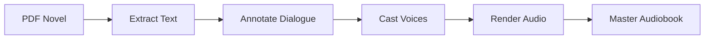

# Getting Started with Agent Audiobook Maker

Welcome! This guide will help you understand and contribute to the Agent Audiobook Maker project.

## What This Project Does

Agent Audiobook Maker transforms long-form PDFs (like novels) into high-quality, multi-voice audiobooks using a local-first, multi-agent pipeline.



## Current Status

We're in **Phase 1** of development:

- ✅ **Phase 0**: PDF ingestion with deterministic chapter extraction (COMPLETE)
- 🚧 **Phase 1**: LangFlow prototype for dialogue/narration segmentation (IN PROGRESS)
- ⏳ **Phase 2**: Multi-agent speaker attribution and emotion analysis (PLANNED)
- ⏳ **Phase 3**: TTS rendering with voice casting (PLANNED)

## Quick Setup (KISS Approach)

This project follows KISS principles - Keep It Simple, Simple. You only need:

1. **Python 3.11** and a local virtual environment
1. **Basic dev tools** for testing and linting
1. **No heavy dependencies** until you need them

```bash
# Clone and setup
git clone https://github.com/jwardwell7077/agent-audiobook-maker.git
cd agent-audiobook-maker

# Create virtual environment
python3.11 -m venv .venv || python3 -m venv .venv
source .venv/bin/activate

# Install dev dependencies
pip install -U pip
pip install -r requirements-dev.txt

# Verify setup
make test
```

## Understanding the Architecture

Start with these documents in order:

1. **[Project Tenets](01-project-overview/KISS.md)** - Core principles (KISS, local-first, deterministic)
1. **[System Context](01-project-overview/CONTEXT.md)** - Technical constraints and goals
1. **[High-Level Architecture](01-project-overview/ARCHITECTURE.md)** - System overview
1. **[Current Implementation](03-implementation/langflow/README.md)** - What's working now

## Key Concepts

### Local-First

- Files on disk are the source of truth
- Works offline by default
- No cloud dependencies required

### Deterministic

- Same input always produces identical output
- Content-addressed hashing for reproducibility
- Essential for testing and validation

### Multi-Agent

- Different AI agents handle specific tasks
- Speaker identification, emotion analysis, quality assurance
- Currently prototyping with LangFlow, evolving to CrewAI

## Development Workflow

1. **Read the specs** - We follow spec-first development
1. **Write tests first** - TDD approach with pytest
1. **Implement incrementally** - Small, verifiable changes
1. **Pass quality gates** - Ruff, mypy, pytest must all pass

## Common Tasks

### Running the Ingestion Pipeline

```bash
# Ingest a PDF → raw + well-done text (+ optional DB insert)
python -m abm.ingestion.ingest_pdf input.pdf --mode both
# To also generate JSONL and insert to Postgres if DATABASE_URL is Postgres:
python -m abm.ingestion.ingest_pdf input.pdf --mode both --insert-pg
```

### Working with LangFlow Components

```bash
# Install LangFlow (optional - only for visual prototyping)
pip install langflow

# Run LangFlow with custom components
./scripts/run_langflow.sh
```

### Testing

```bash
# Run all tests
make test

# Run with coverage  
make test_coverage

# Run quality checks
make quality_gate
```

## Project Structure

```text
agent-audiobook-maker/
├── src/abm/                  # Main package
│   ├── ingestion/           # PDF → text extraction
│   ├── classifier/          # Section classification  
│   ├── structuring/         # Chapter organization
│   └── lf_components/       # LangFlow components
├── tests/                   # Test suite
├── docs/                    # Documentation (you are here)
├── data/                    # Working directory (gitignored)
└── scripts/                 # Helper scripts
```

## Getting Help

- **Documentation**: Start with this index and follow the links
- **Issues**: Check existing GitHub issues or create a new one
- **Questions**: Read the Development Journey summaries:
  - [Documentation Cleanup Summary](05-development/journey/DOCUMENTATION_CLEANUP_SUMMARY.md)
  - [LangFlow Lessons Learned](05-development/journey/LANGFLOW_LESSONS_LEARNED.md)

## Next Steps

Choose your path:

- **📖 Learn More**: [Project Overview](01-project-overview/README.md)
- **🛠️ Start Coding**: [Implementation Guide](03-implementation/README.md)
- **🎨 See Visuals**: [Architecture Diagrams](04-diagrams/README.md)
- **📈 Follow Progress**: See journey updates in [progress-updates](05-development/journey/progress-updates/)

______________________________________________________________________

*New to the project? Start with [Project Overview](01-project-overview/README.md)*
