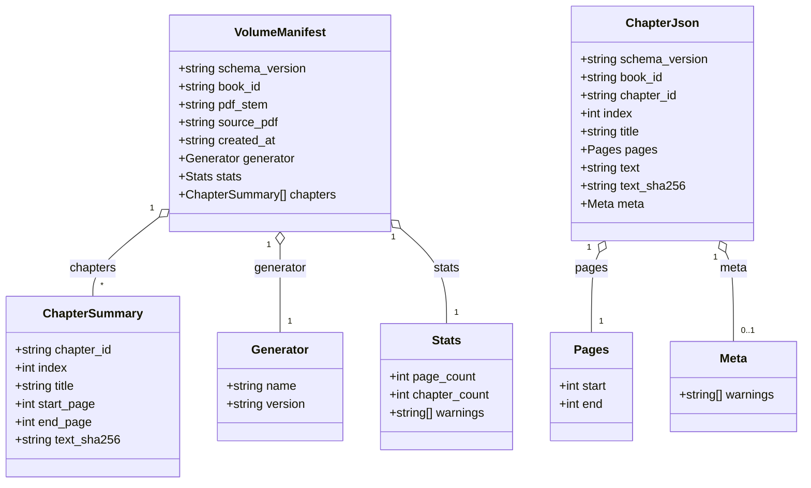

# Structured JSON Schema (Ingestion Artifacts)

Last updated: 2025-08-21

This defines the "Structured JSON" produced by the ingestion pipeline. It consists of:

- Volume Manifest: `data/clean/<book_id>/<pdf_stem>_volume.json`
- Per‑Chapter JSON: `data/clean/<book_id>/<chapter_id>.json`

Versioning: `schema_version` is a string. Backward-compatible additions bump the patch/minor (e.g., 1.0 → 1.1). Breaking changes bump the major.

## Diagram

Source: `docs/diagrams/structured_json_schema.mmd`



## Volume Manifest (v1.0)

Contract

- Inputs: one PDF (identified by `<book_id>` and `<pdf_stem>`)
- Output: manifest JSON describing chapters and basic stats
- Determinism: `text_sha256` hashes for each chapter reference the corresponding per‑chapter text; no embedded full text in the manifest

Fields

- schema_version: "1.0"
- book_id: string
- pdf_stem: string (filename stem of the source PDF)
- source_pdf: string (relative path) – optional, informational
- created_at: ISO8601 string
- generator: { name: string, version: string } – optional
- stats: { page_count: int, chapter_count: int, warnings: string[] }
- chapters: ChapterSummary[]

ChapterSummary

- chapter_id: string (stable id, e.g., `<BOOK>_CH0001`)
- index: int (0‑based order)
- title: string
- start_page: int
- end_page: int
- text_sha256: string (hex)

Example

```jsonc
{
  "schema_version": "1.0",
  "book_id": "SAMPLE_BOOK",
  "pdf_stem": "sample_book_v1",
  "source_pdf": "data/books/SAMPLE_BOOK/source_pdfs/sample_book_v1.pdf",
  "created_at": "2025-08-21T12:00:00Z",
  "generator": { "name": "ingest-cli", "version": "0.1.0" },
  "stats": { "page_count": 212, "chapter_count": 11, "warnings": [] },
  "chapters": [
    {
      "chapter_id": "SAMPLE_BOOK_CH0000",
      "index": 0,
      "title": "Introduction",
      "start_page": 1,
      "end_page": 6,
      "text_sha256": "f2c7..."
    },
    {
      "chapter_id": "SAMPLE_BOOK_CH0001",
      "index": 1,
      "title": "Chapter 1",
      "start_page": 7,
      "end_page": 23,
      "text_sha256": "ab91..."
    }
  ]
}
```

## Per‑Chapter JSON (v1.0)

Contract

- Inputs: extracted chapter text and minimal metadata
- Output: a single JSON file per chapter containing text and identifiers
- Determinism: `text_sha256` is the SHA‑256 of the exact `text` field bytes (UTF‑8)

Fields

- schema_version: "1.0"
- book_id: string
- chapter_id: string
- index: int (0‑based order)
- title: string
- pages: { start: int, end: int }
- text: string (full chapter text)
- text_sha256: string (hex hash of `text`)
- meta: { warnings?: string[] } – optional

Example

```jsonc
{
  "schema_version": "1.0",
  "book_id": "SAMPLE_BOOK",
  "chapter_id": "SAMPLE_BOOK_CH0001",
  "index": 1,
  "title": "Chapter 1",
  "pages": { "start": 7, "end": 23 },
  "text": "...full chapter text...",
  "text_sha256": "ab91...",
  "meta": { "warnings": [] }
}
```

## Hashing Notes

- `text_sha256` = SHA‑256 over UTF‑8 bytes of `text` exactly as written to file.
- The manifest does not duplicate chapter text; it references per‑chapter files via `text_sha256` and implicit `<chapter_id>` mapping.

## Backward Compatibility

- Additive fields are allowed in minor/patch updates.
- Removing or renaming fields requires a major version bump and migration.

## Related

- Annotation records: `docs/ANNOTATION_SCHEMA.md`
- Architecture overview: `docs/ARCHITECTURE.md`
