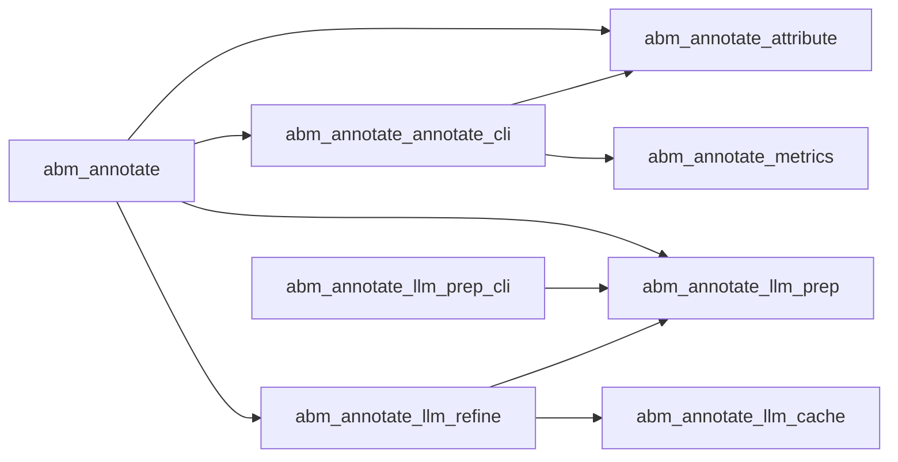

# Chat Seed

## Primer
This project seed pack provides context for a GPT-5 subject-matter expert.

## Pipeline

## Top Modules
- **abm.annotate**: Auto-generated module summary.
- **abm.audio**: Auto-generated module summary.
- **abm.audit**: Auto-generated module summary.
- **abm.classifier**: Auto-generated module summary.
- **abm.ingestion**: Auto-generated module summary.
- **abm.llm**: Auto-generated module summary.
- **abm.parse**: Auto-generated module summary.
- **abm.profiles**: Auto-generated module summary.
- **abm.sidecar**: Auto-generated module summary.
- **abm.voice**: Auto-generated module summary.

## CLI Tools
- `python -m abm.annotate.annotate_cli` --in --out-json --out-md
- `python -m abm.annotate.bnlp_refine` --tagged --out --verbose
- `python -m abm.annotate.llm_prep_cli` --in --out --conf-threshold
- `python -m abm.annotate.llm_refine` --tagged --out-json --out-md
- `python -m abm.audio.render_book` --scripts-dir --out-dir --engine-workers
- `python -m abm.audio.render_chapter` --script --profiles --out-dir
- `python -m abm.audio.synthesis_export` --tagged --profiles --out-dir
- `python -m abm.audit.__main__` 

## Schemas
- chapter: seed_pack/schemas/chapter.schema.json
- segment: seed_pack/schemas/segment.schema.json
- casting_plan: seed_pack/schemas/casting_plan.schema.json
- book_config: seed_pack/schemas/book_config.schema.json

## Decisions
- TBD
- TBD
- TBD
- TBD
- TBD
- TBD

## Open Issues
- TBD
- TBD
- TBD
- TBD
- TBD
